# Helix — Master Technical Design Document

**A multi-tenant application deployment platform built on OCI images, Firecracker microVMs, and WebAssembly**

| | |
|---|---|
| Document version | 1.0 (design baseline) |
| Status | Design — not yet implemented |
| Audience | Founding engineering team, security reviewers |
| Working name | **Helix** (placeholder — rename freely) |

---

## 0. How to read this document

### 0.1 What this document is

This is the master technical design for a general-purpose Linux application deployment platform: developers push source code, the platform builds it, packages it as an OCI image, runs it inside a hardware-virtualized sandbox, exposes it over HTTPS, autoscales it including to zero, and meters it.

It is written to be implementable. Every major decision follows the same structure: **problem → candidate solutions → comparison → decision → why → tradeoffs → operational implications**. Where a decision is genuinely open, it is marked as such rather than resolved by fiat.

### 0.2 Maturity labels

Every component in this document carries a maturity label. This is the most important convention in the document, because the single biggest failure mode for a project of this scope is building the Future Scale version of everything on day one.

| Label | Meaning |
|---|---|
| **[MVP]** | Required to demonstrate the core loop end-to-end on one machine. If it is not needed to get `git push` → live URL working, it is not MVP. |
| **[V1]** | Required before untrusted third-party code runs on shared infrastructure with paying customers. This is the real production bar. |
| **[SCALE]** | Required only beyond roughly 10k tenants / multi-region. Design for it, do not build it. |

A design is only good if the MVP version is small. Throughout, the MVP version of each subsystem is called out explicitly, and it is usually much less impressive than the V1 version. That is deliberate.

### 0.3 A calibration note on scope

An honest statement before the technical content, because it changes how you should sequence the work:

The system described here is, at V1 completeness, roughly the scope of a 15–30 engineer product built over 2–4 years. Fly.io, Railway, Northflank, Koyeb and Vercel's own compute layer each represent that order of investment. Firecracker itself exists because AWS staffed a team against exactly this problem.

That is not an argument against building it. It is an argument for three things that shape the rest of this document:

1. **The phased roadmap in §30 is the real plan**; sections 1–29 are the target architecture that the roadmap converges on. Do not attempt sections 1–29 in order.
2. **The hard parts are not the parts that look hard.** Firecracker integration is a few thousand lines of Rust and is largely a solved, well-documented problem. The parts that will consume your calendar are: the build system's security boundary, the rootfs/image pipeline, the request-path activator for scale-to-zero, snapshot restore correctness, and the operational burden of running bare metal.
3. **Every feature you add multiplies the security surface**, because your entire product is "run arbitrary untrusted code." §39 is a separate adversarial review written specifically to be read before you let a stranger deploy to your infrastructure.

### 0.4 Section map

| # | Section | Primary reader |
|---|---|---|
| 1 | Core abstraction and system overview | Everyone |
| 2 | Control plane | Backend |
| 3 | Compute plane | Systems |
| 4 | Deployment pipeline | Backend |
| 5 | Build system | Backend / Security |
| 6 | Runtime isolation and threat model | Security |
| 7 | Firecracker architecture | Systems |
| 8 | WASM architecture | Systems |
| 9 | Universal runtime specification | Backend / DX |
| 10 | Custom runtimes | Backend / Security |
| 11 | HTTP routing | Networking |
| 12 | Serverless scheduling | Distributed systems |
| 13 | Cold start optimization | Systems |
| 14 | Storage architecture | Backend |
| 15 | Database schema | Backend |
| 16 | API design | Backend / DX |
| 17 | Git integration and preview deployments | Backend / DX |
| 18 | Multi-tenancy | Everyone |
| 19 | Autoscaling | Distributed systems |
| 20 | High availability | SRE |
| 21 | Disaster recovery | SRE |
| 22 | Observability | SRE |
| 23 | Security architecture | Security |
| 24 | Abuse prevention | Security / Trust & Safety |
| 25 | Billing and metering | Backend / Finance |
| 26 | Developer experience and CLI | DX |
| 27 | Deployment configuration format | DX |
| 28 | Internal service inventory | Everyone |
| 29 | Repository structure | Everyone |
| 30 | Implementation roadmap | Everyone |
| 31 | Local development environment | Everyone |
| 32 | Production infrastructure sizing | SRE / Finance |
| 33 | Cost model | Finance |
| 34 | Technology decision matrices | Everyone |
| 35 | Sequence diagrams | Everyone |
| 36 | Architecture diagrams | Everyone |
| 37 | Failure scenarios | SRE |
| 38 | Distributed systems concerns | Distributed systems |
| 39 | Production security review | Security |
| 40 | Final recommended architecture | Everyone |
| 41 | Testing strategy | Everyone |
| 42 | Production readiness checklist | SRE |

### 0.5 Glossary

| Term | Meaning in this document |
|---|---|
| **Tenant** | An organization. The billing and isolation boundary. |
| **Project** | A deployable unit owned by a tenant, roughly one repository. |
| **Deployment** | One immutable attempt to build and run a specific commit with a specific config. |
| **Release** | A deployment that a routing alias currently points at. |
| **Instance** | One running microVM or one WASM instance serving a release. |
| **Worker** | A bare-metal (or metal-class) host that runs instances. |
| **Agent** | `helix-agent`, the Rust daemon on every worker. |
| **Router** | The request-path data plane: Envoy plus the activator. |
| **Activator** | The component that holds requests while a scaled-to-zero release is started. |
| **Artifact** | An OCI image (Linux path) or a precompiled `.cwasm` (WASM path). |
| **Rootfs** | An ext4 block image derived from an OCI image, attached to a microVM. |

---
## 1. Core abstraction and system overview

### 1.1 The central design decision: what is the platform's unit of work?

**Problem.** A platform that wants to support Java, Go, Rust, Python, PHP, Elixir, Swift, .NET and "whatever a customer invents next year" cannot special-case languages. If adding Bun requires a PR to the scheduler, the architecture has already failed. We need one abstraction that everything reduces to.

**Candidate abstractions.**

| Option | What the platform stores and schedules | Consequence |
|---|---|---|
| A. Language-specific bundles (`.zip` of source + a runtime family, Lambda-style) | Per-language packaging, per-language base runtime | Every language is core-platform work. AWS needed a whole "custom runtime API" bolt-on to escape this. Rejected. |
| B. Process + declarative build (Heroku buildpacks / Cloud Native Buildpacks) | A buildpack-produced image | Better, but buildpacks are themselves a large ecosystem to own or vendor, and they constrain users who want full control. Useful *on top of* option C, not instead of it. |
| C. **OCI image** | A content-addressed, layered filesystem + config (entrypoint, env, user, ports) | Universal. Every language already has a first-class story for producing one. Tooling (BuildKit, registries, signing, SBOM, scanning) exists and is mature. |
| D. WASM component | A `.wasm` component with WIT interfaces | Wonderful properties, but does not support the majority of the required language list today. Cannot be *the* abstraction. |

**Decision: OCI image is the universal packaging abstraction. [MVP]**

Everything a customer can deploy — a Spring Boot fat jar, a Go binary, a PHP app behind FrankenPHP, a Rust axum server, a hand-written Dockerfile — becomes an OCI image. The platform never knows or cares which language produced it. Language support becomes **data** (a runtime definition file), not **code**.

WASM is a **second, parallel packaging abstraction** for a deliberately narrower workload class (§8), not a replacement.

**Tradeoffs of choosing OCI.**

- *Cost:* An OCI image is not directly bootable by a VM. You must convert layers → block device. That conversion is real engineering (§7.4) and is the piece most people underestimate.
- *Cost:* Image size directly drives cold start. A 900 MB Spring Boot image is a materially worse product than a 40 MB Go image, and customers will blame you, not their Dockerfile.
- *Benefit:* You inherit the entire container ecosystem for free: registries, `docker pull` compatibility, cosign, syft, trivy, layer dedup, and the ability for customers to bring images built elsewhere.
- *Benefit:* Debuggability. "Pull the exact image and run it locally" is a support answer you can actually give.

**Operational implication.** The registry becomes a tier-0 dependency. If the registry is down, no new instance can start anywhere. §20.7 and §13.4 (aggressive worker-local caching) exist specifically to blunt this.

### 1.2 The pipeline, stated precisely

```text
Source Code           git ref | tarball | prebuilt image reference
      │
      ▼
Build Definition      helix.yaml → resolved against a Runtime Definition
      │
      ▼
Build Environment     BuildKit inside a per-build Firecracker microVM
      │
      ▼
OCI Artifact          image pushed to internal registry, signed, SBOM'd, scanned
      │
      ▼
Execution Definition  immutable ReleaseSpec (image digest + resources + env + health)
      │
      ▼
Runtime               Firecracker microVM  |  Wasmtime instance
      │
      ▼
HTTP/HTTPS            Envoy edge → activator → worker → guest :PORT
```

The critical property: **the Execution Definition is an immutable, fully-resolved document**. No step after it does template expansion, no step after it reads the user's repository, and no step after it needs the control-plane database to make a routing decision for an already-running instance. This is what makes rollback trivial (§4.7) and what keeps the data plane alive when the control plane is down (§20.4).

### 1.3 Three planes

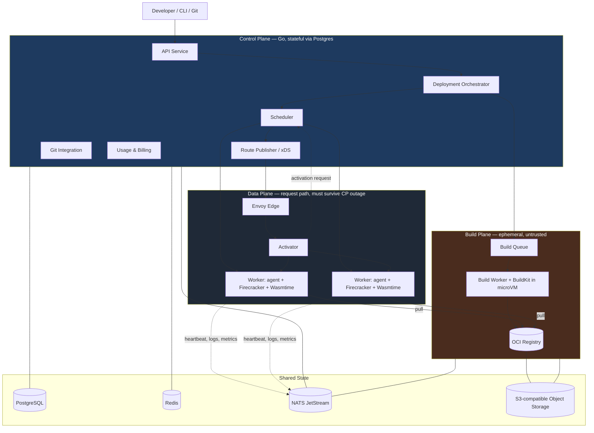
```mermaid
graph TB
    subgraph CP["Control Plane — Go, stateful via Postgres"]
        API[API Service]
        ORCH[Deployment Orchestrator]
        SCHED[Scheduler]
        ROUTE[Route Publisher / xDS]
        GIT[Git Integration]
        USAGE[Usage &amp; Billing]
    end

    subgraph BP["Build Plane — ephemeral, untrusted"]
        BQ[Build Queue]
        BW1[Build Worker + BuildKit in microVM]
        REG[(OCI Registry)]
    end

    subgraph DP["Data Plane — request path, must survive CP outage"]
        EDGE[Envoy Edge]
        ACT[Activator]
        W1[Worker: agent + Firecracker + Wasmtime]
        W2[Worker: agent + Firecracker + Wasmtime]
    end

    subgraph STATE["Shared State"]
        PG[(PostgreSQL)]
        RD[(Redis)]
        NATS[(NATS JetStream)]
        S3[(S3-compatible Object Storage)]
    end

    DEV[Developer / CLI / Git] --> API
    API --> ORCH --> BQ --> BW1 --> REG
    ORCH --> SCHED --> W1 & W2
    W1 & W2 -->|pull| REG
    SCHED --> ROUTE --> EDGE
    EDGE --> ACT --> W1 & W2
    ACT -.->|activation request| SCHED
    CP --- PG & RD & NATS
    BP --- NATS & S3
    W1 & W2 -.->|heartbeat, logs, metrics| NATS
    REG --- S3

    style DP fill:#1f2937,color:#fff
    style CP fill:#1e3a5f,color:#fff
    style BP fill:#4a2c1e,color:#fff
```

**The separation rule that matters:** the data plane may *read* state that the control plane publishes, but must never *synchronously depend* on the control plane to serve a warm request. A control plane outage should degrade the platform to "no new deployments, no scale-up," not "site down."

### 1.4 Trust boundaries

There are exactly four, and confusing them is how platforms get owned.

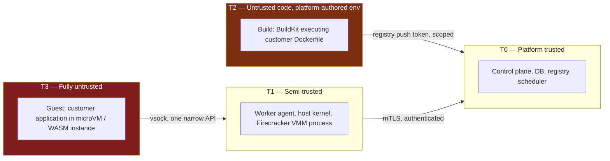
```mermaid
graph LR
    subgraph T0["T0 — Platform trusted"]
        CP2[Control plane, DB, registry, scheduler]
    end
    subgraph T1["T1 — Semi-trusted"]
        AG[Worker agent, host kernel, Firecracker VMM process]
    end
    subgraph T2["T2 — Untrusted code, platform-authored env"]
        BK[Build: BuildKit executing customer Dockerfile]
    end
    subgraph T3["T3 — Fully untrusted"]
        GV[Guest: customer application in microVM / WASM instance]
    end
    T3 -->|vsock, one narrow API| T1
    T2 -->|registry push token, scoped| T0
    T1 -->|mTLS, authenticated| T0
    style T3 fill:#7f1d1d,color:#fff
    style T2 fill:#7c2d12,color:#fff
```

- **T3 → T1** is the boundary Firecracker + KVM + seccomp + jailer defends. It is strong but not absolute (§6.3).
- **T2 → T0** is the boundary that is most often *under*-defended in real platforms. A customer's `RUN` line executes arbitrary code with network access and a registry credential nearby. Treat build workers as hostile (§5).
- **T1 → T0** assumes the worker host is not compromised. If it is, that worker's tenants are compromised; the design goal is that the *blast radius stops at that worker* (§18.5).

### 1.5 Design principles (used to settle later arguments)

1. **Postgres is the source of truth. Everything else is a cache or a transport.** If a state transition is not in Postgres, it did not happen.
2. **Every state change is a state-machine transition with an explicit guard** (§38.8). No boolean flags that accrete meaning.
3. **Reconciliation over commands.** The scheduler writes desired state; agents converge actual state and report. Never "fire and forget an RPC and assume it worked."
4. **Idempotency keys on every mutating API and every queue message.** Assume at-least-once delivery everywhere (§38.1).
5. **The data plane degrades, it does not fail.** Stale routes beat no routes.
6. **Security boundaries are physical where possible.** A separate process, a separate VM, a separate host — in that order of preference — beats a separate goroutine.
7. **Build a boring MVP.** Snapshots, multi-region, WASM, and lazy image loading are all V1+ optimizations that are meaningless before the basic loop works.

---

## 2. Control Plane

### 2.1 Architecture decision: monolith or services?

**Problem.** The requirement list names 14 candidate services. Naively implementing them as 14 deployables on day one buys distributed-systems pain in exchange for organizational benefits you do not yet have (you do not have 14 teams).

**Candidates.**

| Option | Pros | Cons |
|---|---|---|
| A. 14 microservices | Independent scaling and deploys; clear ownership | 14× the ops; distributed transactions across project/deployment/domain; enormous latency budget spent on internal hops; unusable for a small team |
| B. **Modular monolith + a small number of genuinely separate processes** | One DB transaction covers most business operations; fast local dev; refactorable module boundaries; still splits things that have different *resource and trust* profiles | Requires discipline to keep module boundaries clean; one deploy unit for control-plane changes |
| C. Single process for everything including workers and router | Simplest | Violates trust boundaries and resource isolation. Non-starter. |

**Decision: Option B. [MVP → V1]**

The split rule is not "one service per noun." It is: **split only when two components differ in trust level, resource profile, scaling axis, or availability requirement.**

By that rule, the separate deployables are:

| Deployable | Language | Why separate |
|---|---|---|
| `helix-control` (modular monolith: API, auth, projects, deployments, domains, env/secrets, orchestrator, scheduler, route publisher, git, usage) | Go | — |
| `helix-gateway` (activator + route cache; Envoy sits in front) | Go (Rust at SCALE) | Different availability requirement (must survive CP outage), different scaling axis (requests/sec not API calls), different latency budget |
| `helix-builder` | Go | Different trust level (drives untrusted builds), different resource profile (CPU/disk heavy, bursty) |
| `helix-agent` | Rust | Runs on every worker, different trust level, no network path to the DB |
| `helix-logd` / telemetry ingestion | Go | Very different write volume; must not be able to stall the API's DB pool |
| `helix-registry` (Distribution/Zot) | vendored | Off-the-shelf |

Six deployables, not fourteen. Inside `helix-control`, the modules are compile-time packages with explicit interfaces and **no cross-module DB access** — module A calls module B's Go interface, it does not `SELECT` from B's tables. That single rule is what makes a future extraction to a separate service a mechanical refactor rather than a rewrite.

When to split further **[SCALE]**: extract the Scheduler when placement decisions exceed ~1k/s or when you need a scheduler per region with independent leader election; extract Usage/Metering when ingest volume forces a separate datastore; extract Auth when you sell SSO/SCIM to enterprises.

### 2.2 Control plane component responsibilities

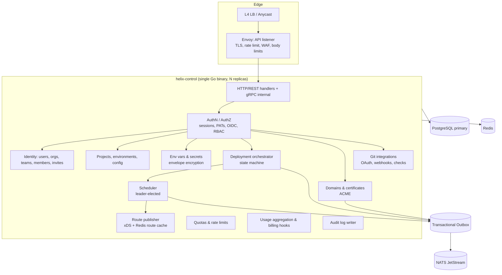
```mermaid
graph TB
    subgraph EDGE2["Edge"]
        LB[L4 LB / Anycast] --> APIGW[Envoy: API listener<br/>TLS, rate limit, WAF, body limits]
    end

    subgraph MONO["helix-control (single Go binary, N replicas)"]
        direction TB
        HTTPAPI[HTTP/REST handlers + gRPC internal]
        AUTHZ[AuthN / AuthZ<br/>sessions, PATs, OIDC, RBAC]
        IDENT[Identity: users, orgs, teams, members, invites]
        PROJ[Projects, environments, config]
        SEC[Env vars &amp; secrets<br/>envelope encryption]
        DEPLOY[Deployment orchestrator<br/>state machine]
        SCHEDM[Scheduler<br/>leader-elected]
        ROUTEP[Route publisher<br/>xDS + Redis route cache]
        DOM[Domains &amp; certificates<br/>ACME]
        GITM[Git integrations<br/>OAuth, webhooks, checks]
        QUOTA[Quotas &amp; rate limits]
        USG[Usage aggregation &amp; billing hooks]
        AUD[Audit log writer]
    end

    APIGW --> HTTPAPI --> AUTHZ
    AUTHZ --> IDENT & PROJ & SEC & DEPLOY & DOM & GITM
    DEPLOY --> SCHEDM --> ROUTEP
    DEPLOY & SCHEDM & DOM --> OUTBOX[(Transactional Outbox)]
    OUTBOX --> NATS2[(NATS JetStream)]
    MONO --> PG2[(PostgreSQL primary)]
    MONO --> RD2[(Redis)]
```

| Component | Responsibility | Notes |
|---|---|---|
| **API Gateway** (Envoy) | TLS termination for the API, global rate limiting, request body size caps, IP reputation, routing `/v1/*` to control replicas | Deliberately *not* doing authentication — authz needs business context |
| **AuthN** | Session cookies (dashboard), PATs (CLI/CI), OIDC/SAML [SCALE], GitHub App installation tokens, worker mTLS/SPIFFE | §23.1 |
| **AuthZ** | RBAC: `org → role → permission`, scoped to `project`/`environment`. Deny-by-default. Evaluated in one place, never in handlers ad hoc | §16.8 |
| **Identity** | Users, organizations, teams, memberships, invitations | |
| **Projects** | Project CRUD, environments (production/preview/custom), linked repo, build/run config defaults | |
| **Secrets** | Envelope encryption: per-org DEK wrapped by KMS CMK; ciphertext in Postgres; plaintext never logged; decryption only at deploy-materialization time | §23.4 |
| **Deployment orchestrator** | Owns the deployment state machine (§38.8). Drives build → schedule → health → promote. Idempotent, resumable, crash-safe | The heart of the system |
| **Scheduler** | Placement decisions, desired-instance-count per release, scale-to-zero decisions, worker selection | Leader-elected per region (§12) |
| **Route publisher** | Translates "release R is ready on workers X,Y with instance endpoints" into Envoy xDS snapshots and a Redis route table | §11.3 |
| **Domains** | Custom domain verification, ACME DNS-01/HTTP-01, cert storage and renewal, wildcard certs | §11.5 |
| **Git** | OAuth app + GitHub App/GitLab/Bitbucket, webhook ingestion + signature verification, commit status, PR comments | §17 |
| **Quotas** | Hard limits (max concurrent builds, max instances, max image size) checked at admission; soft limits reported | §18.4 |
| **Usage** | Aggregates metering events into billable rollups, emits to billing provider | §25 |
| **Audit** | Append-only record of every mutating action with actor, IP, before/after | §23.7 |

### 2.3 Stateless vs stateful — the explicit inventory

This was asked for directly, and the distinction matters for how you deploy and recover each piece.

| Component | Classification | Where its state actually lives | Failure behavior |
|---|---|---|---|
| Envoy (API listener) | **Stateless** | xDS snapshot in memory, sourced from control plane | Restart freely; falls back to last-known config on CP outage |
| `helix-control` API handlers | **Stateless** | Postgres, Redis | Kill any replica; N+2 replicas behind LB |
| AuthN session verification | **Stateless** (sessions in Redis) | Redis + Postgres | Redis loss = forced re-login, not data loss |
| Deployment orchestrator | **Stateful logic, stateless process** | Postgres (`deployments` table = the state machine) | Any replica can resume any deployment by reading the row. Crash mid-transition is safe because transitions are single transactions with guards |
| Scheduler | **Singleton-per-region, stateless process** | Postgres (desired state) + Redis (worker liveness) | Leader election via Postgres advisory lock or NATS KV. Loss of leader = no new placements for a few seconds; running instances unaffected |
| Route publisher | **Stateless** | Derives from Postgres + agent reports | Restart re-derives full snapshot |
| `helix-gateway` / activator | **Soft state** | In-memory route cache + in-flight request queue; backed by Redis | Restart drops in-flight requests on that replica (clients retry); cache repopulates from Redis in <1s |
| `helix-builder` coordinator | **Stateless** | Postgres (`builds`) + NATS work queue | Build in progress is orphaned and retried (§5.11) |
| `helix-agent` | **Stateful — authoritative for its own node** | Local BoltDB/sqlite + the actual running VMs | This is the one place where local state is the truth. Agent restart must re-adopt running VMs, not kill them (§3.9) |
| PostgreSQL | **Stateful** | Disk | Primary + sync standby + async replica (§20.2) |
| Redis | **Stateful, but reconstructible** | Memory + AOF | Designed so that total Redis loss degrades but does not corrupt |
| NATS JetStream | **Stateful** | Disk, R3 | Message loss = delayed/retried work, never lost billing data (dual-write to Postgres outbox) |
| OCI Registry | **Stateful** | S3 + Postgres metadata | §20.7 |
| Object storage | **Stateful** | The durability floor of the whole system | |

**Rule of thumb applied throughout:** the only components allowed to hold non-reconstructible state are Postgres, object storage, and (transiently) the worker agent. Everything else must be able to rebuild its state from those three.

### 2.4 Redis: what it is and is not allowed to do

Redis is easy to misuse into becoming a second source of truth. Explicit allowed uses:

| Allowed | Why |
|---|---|
| Session store | Loss = re-login |
| Rate limit counters (sliding window) | Loss = brief over-permissiveness |
| Worker heartbeat / liveness (`SETEX worker:{id} 15s`) | Loss = workers re-register within one heartbeat |
| Hot route table cache for the gateway | Loss = gateway falls back to gRPC fetch from control plane |
| Warm-instance index (`release:{id}:instances` sorted set) | Loss = treated as cold, scheduler re-populates |
| Short-lived distributed locks (with fencing tokens, §38.3) | Never the *only* guard — Postgres constraints are the real guard |
| Activation coalescing (single-flight per release) | Loss = duplicate cold starts, wasteful not incorrect |

**Forbidden:** billing/metering data, deployment state, secrets, anything where loss requires human intervention.

**Deployment [V1]:** Redis Sentinel or a managed Redis with automatic failover. Redis Cluster only at [SCALE], and only after you have measured that a single primary is actually the bottleneck.

### 2.5 Idempotency and API-level correctness

Every mutating endpoint accepts `Idempotency-Key`. Implementation:

```sql
CREATE TABLE idempotency_keys (
  key            text        NOT NULL,
  org_id         uuid        NOT NULL,
  endpoint       text        NOT NULL,
  request_hash   bytea       NOT NULL,
  response_code  int,
  response_body  jsonb,
  state          text        NOT NULL,  -- in_progress | complete
  created_at     timestamptz NOT NULL DEFAULT now(),
  PRIMARY KEY (org_id, key, endpoint)
);
```

Flow: `INSERT ... ON CONFLICT DO NOTHING`. If inserted, you own the operation. If not inserted and `state = complete` and `request_hash` matches, replay the stored response. If hash differs → `409 Conflict`. If `in_progress` → `409` with `Retry-After`. Rows expire after 24h.

This is boring and it is the difference between "customer's CI double-fired the webhook and created two deployments" and a correct system.

---
## 3. Compute Plane

### 3.1 Worker node anatomy

A worker is a bare-metal Linux host (or a metal-class cloud instance) with KVM. It runs exactly one privileged daemon, `helix-agent`, plus the per-VM Firecracker processes that the agent spawns.

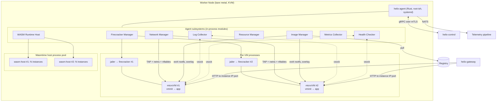
```mermaid
graph TB
    subgraph WORKER["Worker Node (bare metal, KVM)"]
        direction TB
        AGENT["helix-agent (Rust, root-ish, systemd)"]

        subgraph SUB["Agent subsystems (in-process modules)"]
            FCM[Firecracker Manager]
            WASM[WASM Runtime Host]
            IMG[Image Manager]
            NET[Network Manager]
            RES[Resource Manager]
            LOG[Log Collector]
            MET[Metrics Collector]
            HC[Health Checker]
        end

        AGENT --- SUB

        subgraph VMS["Per-VM processes"]
            J1["jailer → firecracker #1"] --- V1["microVM #1<br/>vminit → app"]
            J2["jailer → firecracker #2"] --- V2["microVM #2<br/>vminit → app"]
        end

        subgraph WPOOL["Wasmtime host process pool"]
            WP1["wasm-host #1: N instances"]
            WP2["wasm-host #2: N instances"]
        end

        FCM --> J1 & J2
        WASM --> WP1 & WP2
        NET -->|TAP + netns + nftables| V1 & V2
        IMG -->|ext4 rootfs, overlay| V1 & V2
        LOG <-.->|vsock| V1 & V2
        HC <-.->|vsock| V1 & V2
    end

    AGENT <-->|gRPC over mTLS| CTRL[helix-control]
    AGENT -->|NATS| TEL[Telemetry pipeline]
    IMG -->|pull| REG[(Registry)]
    GW[helix-gateway] -->|HTTP to instance IP:port| V1 & V2
```

### 3.2 Why Rust for the agent

**Problem.** The agent manipulates block devices, network namespaces, cgroup files, seccomp filters, `vsock` sockets, and spawns processes with dropped privileges. It is long-lived, privileged, and parses data that originates from untrusted guests (log streams, health responses).

**Candidates:** Go, Rust, C.

| Criterion | Go | Rust | C |
|---|---|---|---|
| Memory safety at a privileged trust boundary | GC'd, safe, but `cgo` needed for several syscalls | Safe, no GC, direct `nix`/`libc` access | Unsafe |
| Syscall surface (`clone`, `setns`, `unshare`, `mount`, `pivot_root`, seccomp BPF) | Painful: goroutines + `setns` interact badly (namespace is per-*thread*; Go's scheduler moves goroutines between threads). Requires `runtime.LockOSThread` gymnastics or a C constructor trick | Natural. Threads are explicit | Natural |
| Predictable latency / no GC pause during VM boot | GC pauses are small but real at 1000s of VMs | No GC | No GC |
| Ecosystem | Excellent general, weak on VMM | `firecracker` itself is Rust; `rust-vmm` crates, `tokio`, `nix`, `seccompiler` reusable | — |
| Hiring / team familiarity | Easier | Harder | Hardest |

**Decision: Rust for `helix-agent`. [MVP]**

The deciding argument is not performance, it is the **namespace-per-thread problem**. Go's runtime multiplexes goroutines across OS threads, and Linux namespaces are a per-thread property. Every container runtime written in Go (runc, containerd) deals with this by re-executing itself as a helper process (`runc init`) or using a C constructor that runs before the Go runtime starts. That is a known, survivable workaround — but you are going to be doing namespace work constantly, and Rust removes an entire class of subtle bug from your most privileged component. Sharing `rust-vmm` crates and being able to read Firecracker's source in the same language is a secondary but real benefit.

**Tradeoff:** slower initial velocity, smaller hiring pool, and you will write more code by hand (Go's stdlib does more for you). Mitigation: keep the agent *small*. It should be a few thousand lines with a narrow surface; all business logic stays in Go.

### 3.3 Agent subsystem responsibilities

#### Firecracker Manager
Owns microVM lifecycle. For each instance:
1. Allocate a VM ID, a cgroup, a network slot, and a jail directory (`/srv/jail/{vm_id}`).
2. Hard-link/bind the kernel image and rootfs into the jail.
3. Exec `jailer` with `--uid/--gid` (unprivileged), `--chroot-base-dir`, `--cgroup` settings, `--netns`, and `--` firecracker args.
4. Configure the VM over the Firecracker HTTP API on a unix socket inside the jail (§7.6), or supply a pre-baked JSON config.
5. `InstanceStart` (or `LoadSnapshot` for snapshot restore).
6. Drive health checks over vsock, then mark Ready.
7. On stop: send `SendCtrlAltDel` for graceful shutdown, wait `grace_period`, then SIGKILL the firecracker process; tear down net + block devices; scrub or discard the overlay.

It also maintains the **warm pool** (§13.2) and the **snapshot cache** (§13.1).

#### WASM Runtime Host
Manages a pool of `helix-wasm-host` processes (each a Wasmtime embedder). Responsibilities: load precompiled `.cwasm` modules, maintain instance pools per release, enforce fuel/epoch deadlines and store memory limits, route HTTP requests into `wasi:http/incoming-handler`, recycle instances. Runs as a *separate process from the agent* so a Wasmtime bug cannot compromise the agent directly, and itself sits in a seccomp+namespace sandbox (§8.5).

#### Image Manager
- Resolves an image **digest** (never a tag) to a local rootfs.
- Pulls layers from the registry with a worker-local content-addressed cache (`/var/lib/helix/blobs`, GC'd by LRU with a disk watermark).
- Converts OCI layers → an ext4 image. Two strategies, §7.4.
- Maintains the "rootfs library": `sha256:<config-digest> → /var/lib/helix/rootfs/<digest>.ext4` (read-only, shared by all VMs of that release on this worker).
- Enforces per-image size limits and reports pull duration to metrics.
- **[V1]** Lazy loading via an on-demand block device (§13.5).

#### Network Manager
- Allocates a `/30` (or `/31`) from the node's instance subnet, creates a network namespace per VM, creates a TAP device inside it, wires it to the host bridge or a routed veth pair.
- Installs per-VM nftables rules: egress allowlist/denylist, drop RFC1918 except explicitly allowed, **drop 169.254.0.0/16 unconditionally**, per-VM rate limits via `tc`/HTB, conntrack limits.
- Programs the host-side DNAT so the gateway can reach `worker_ip:assigned_port → 172.16.0.2:app_port`.
- Uses **identical guest-side addressing in every VM** (guest always sees `172.16.0.2/30`, gateway `172.16.0.1`). This is essential for snapshot restore: a restored snapshot has a baked-in IP configuration, so every VM must see the same one. Uniqueness is achieved on the host side, outside the guest's view.

#### Resource Manager
- Creates the cgroup v2 hierarchy: `/sys/fs/cgroup/helix/{org}/{release}/{vm}` with `cpu.max`, `cpu.weight`, `memory.max`, `memory.high`, `pids.max`, `io.max`.
- Enforces node-level overcommit policy and admission (§3.6).
- Pins vCPU threads to physical cores per tenant-isolation policy (§6.6 — SMT / core scheduling).
- Tracks and publishes node capacity to the scheduler.

#### Log Collector
- Reads the guest's stdout/stderr from a dedicated vsock port (guest `vminit` multiplexes them with a framed protocol).
- Applies per-instance rate limiting (e.g. 10k lines/s, 1 MB/s burst) and drops with a visible `[helix] log rate limit exceeded, N lines dropped` marker — never blocks the guest's write, because a blocked log write hangs the customer's app.
- Batches, compresses, and ships to the log pipeline (NATS → Loki). Buffers to local disk with a bounded ring on backpressure.
- Never parses guest content as structured data in the agent process; treat as opaque bytes plus a length prefix.

#### Metrics Collector
- Per-VM: CPU time (cgroup `cpu.stat`), memory (`memory.current`, `memory.peak`), network bytes (nftables counters or tc stats), block I/O, VM start duration, in-flight requests (from gateway, correlated).
- Node: utilization, Firecracker process count, pull latency, snapshot restore latency, free memory, thermal/steal.
- Exposes a Prometheus endpoint for node-level scraping **and** publishes per-instance billing events to NATS (§25.3).

#### Health Checker
- Drives the configured health probe (§9.4) over vsock to the guest agent (preferred) or over TCP/HTTP to the instance IP.
- Distinguishes **startup probe** (long deadline, gates Ready) from **liveness** (restarts instance) from **readiness** (removes from routing without killing).

### 3.4 The guest side: `vminit`

Underrated component. Every microVM boots a platform-authored PID 1 written in Rust, statically linked, ~1–2 MB.

Responsibilities:
1. Mount `/proc`, `/sys`, `/dev`, `/tmp` (tmpfs, size-limited), and the writable overlay.
2. Read its configuration from a **vsock handshake** or from the Firecracker MMDS (metadata service) — *not* from the kernel command line, because the cmdline is visible in `/proc/cmdline` to the app and to anyone who gets the rootfs. Secrets must not go on the cmdline.
3. Set hostname, resolv.conf, and the fixed network config.
4. Set up the log pipe: create a pty/pipe pair, connect to host vsock port 10000.
5. Drop privileges to the image's configured `USER` (default `nobody`-equivalent uid 65534 unless the image specifies otherwise and policy allows).
6. Apply an in-guest seccomp profile and `no_new_privs` (defense in depth — this is about limiting what a compromised app can do to *the guest kernel*, which is the VM-escape prerequisite).
7. `exec` the entrypoint. Reap zombies. Forward signals.
8. Serve a control channel on vsock port 10001: `health`, `shutdown`, `snapshot-prepare`, `post-restore`.

**Snapshot hooks are why this component must exist.** After a snapshot restore, the guest has stale entropy, a stale clock, and a stale process-level view of time. `vminit` must, on `post-restore`: re-seed `/dev/urandom` from a host-provided nonce (or rely on VMGenID where the kernel supports it), force an `adjtimex`/PTP clock resync, and notify the app via a well-known hook (e.g. `SIGUSR2` or an in-guest HTTP callback) so language runtimes can reseed their own PRNGs. **Skipping this produces duplicate TLS session keys and duplicate UUIDs across restored VMs** — a genuine security vulnerability, not a cosmetic bug.

### 3.5 Agent ↔ control plane protocol

**Problem.** Thousands of agents need to (a) learn desired state, (b) report actual state, (c) stream logs/metrics, (d) survive control-plane restarts, (e) not stampede.

**Candidates.**

| Option | Assessment |
|---|---|
| REST polling | Simple, but 2k workers × 1s poll = 2k rps of mostly-empty responses, and slow to react |
| **gRPC bidirectional streaming** | Long-lived connection, server pushes desired state, client pushes status; HTTP/2 flow control; native mTLS; codegen for Go server + Rust client (`tonic`) |
| NATS request/reply + subjects | Great for fan-out, but makes the agent depend on NATS availability for control, and adds a broker to the critical path |
| Custom protocol over TLS | No |

**Decision: gRPC bidirectional streaming over mTLS for control; NATS for telemetry. [MVP]**

The split matters: control traffic is low-volume, needs strict ordering and delivery guarantees, and benefits from a connection whose liveness *is* the heartbeat. Telemetry is high-volume, lossy-tolerant, and must never back-pressure the control channel.

```protobuf
service WorkerService {
  // Single long-lived stream. Server pushes Assignments; client pushes Reports.
  rpc Session(stream WorkerMessage) returns (stream ControlMessage);

  // Out-of-band, non-blocking
  rpc Register(RegisterRequest) returns (RegisterResponse);
}

message WorkerMessage {
  oneof msg {
    NodeStatus     node_status = 1;   // every 5s: capacity, pressure
    InstanceReport instance    = 2;   // on every state change
    ActivationAck  ack         = 3;
    EventBatch     events      = 4;   // start durations, failures
  }
}

message ControlMessage {
  oneof msg {
    AssignInstance  assign   = 1;   // desired: run release R, N replicas
    StopInstance    stop     = 2;
    DrainNode       drain    = 3;
    PrewarmRequest  prewarm  = 4;
    ReconcileSync   sync     = 5;   // full desired-state snapshot
    ConfigUpdate    config   = 6;
  }
}

message AssignInstance {
  string  instance_id   = 1;   // control-plane-generated, idempotency key
  string  release_id    = 2;
  string  image_digest  = 3;   // sha256:..., never a tag
  Resources resources   = 4;
  repeated EnvVar env   = 5;   // secrets already decrypted, short-lived
  HealthCheck health    = 6;
  RuntimeKind kind      = 7;   // FIRECRACKER | WASM
  int64   deadline_unix = 8;   // give up if not started by then
}
```

**Reconciliation semantics.** `AssignInstance` is a *declaration*, not a command. The agent stores it in local durable state, converges, and reports. On reconnect, the control plane sends `ReconcileSync` with the full desired set; the agent diffs against actual and converges, reporting any instances it holds that the control plane does not know about (orphans → reported, then stopped after a grace period so a control-plane bug does not instantly kill production).

**Backpressure and stampede control.** Each agent has a jittered reconnect (`exp backoff, base 1s, cap 30s, ±30% jitter`). `ReconcileSync` is chunked. The control plane rate-limits assignment fan-out per release to avoid 500 workers simultaneously pulling one image (also mitigated by §13.4 peer caching).

**Security.** Agent identity is an mTLS client certificate issued at node provisioning, short-lived (24h) and auto-renewed via a SPIFFE-style workload API or a bootstrap token. The control plane authorizes by node identity: a worker can only report about instances assigned to it. A compromised worker cannot read another tenant's secrets because it is never sent them.

### 3.6 Node admission and overcommit

**Problem.** A worker with 256 GB RAM must decide how many 512 MB instances to accept. Accepting exactly 512 wastes the fact that most instances are idle. Accepting 2000 risks OOM cascade.

**Policy [V1]:**

| Resource | Policy |
|---|---|
| Memory | **No overcommit for the guest's configured maximum.** Sum of `memory.max` ≤ (physical − host reserve − page cache floor). Firecracker memory is backed by anonymous mmap, so the guest only touches what it uses; but a VM that touches its full allocation must not OOM the node. Use `memory.high` below `memory.max` for soft pressure, and **ballooning [V1]** to reclaim from idle guests. |
| CPU | **Overcommit aggressively**, 4–10× vCPU:pCPU is normal for request-driven serverless. Enforce with `cpu.max` (hard ceiling for the tenant's purchased rate) plus `cpu.weight` (fair share under contention). Monitor steal time; if p99 steal > 5%, reduce the ratio. |
| Disk | Rootfs is shared read-only per release; per-VM overlay is a sparse file with an enforced size (`ext4` on a loop device sized at `ephemeral_storage`, or a thin-LVM volume). Node-level watermark triggers eviction of cold rootfs images. |
| PIDs | `pids.max` per VM is irrelevant (the guest has its own PID space); enforce inside the guest via `vminit` setting `RLIMIT_NPROC` and a guest cgroup. Host-side `pids.max` still caps the Firecracker process's own threads. |
| Network | Per-VM `tc` HTB class with a rate and a burst; conntrack entry cap per VM. |

**Host reserve:** never allocate the last ~8 GB / 10% of RAM and ~2 cores. The host needs page cache for rootfs images (which is a *huge* cold-start lever — a cached rootfs boots from page cache, not disk).

### 3.7 Worker sizing

| Class | Spec | Rough instance capacity @512 MB | Use |
|---|---|---|---|
| Dev | 8 core / 32 GB / NVMe | ~40 | Local / Phase 1 |
| Standard | AMD EPYC 32c/64t, 256 GB, 2×2 TB NVMe, 10 GbE | ~450 | Default V1 worker |
| Dense | EPYC 64c/128t, 512–768 GB, 4×3.84 TB NVMe, 25 GbE | ~1000–1400 | SCALE |
| Build | 32c, 128 GB, 4 TB NVMe (cache), 10 GbE | 8–16 concurrent builds | Build plane |

Firecracker's own published numbers (≈125 ms boot, ≈5 MiB VMM overhead per VM, thousands of VMs per host) are the basis for the density figures. Assume you will do worse initially — budget 3–5 MiB VMM overhead plus your rootfs page-cache footprint, and validate empirically before selling density.

### 3.8 Worker lifecycle

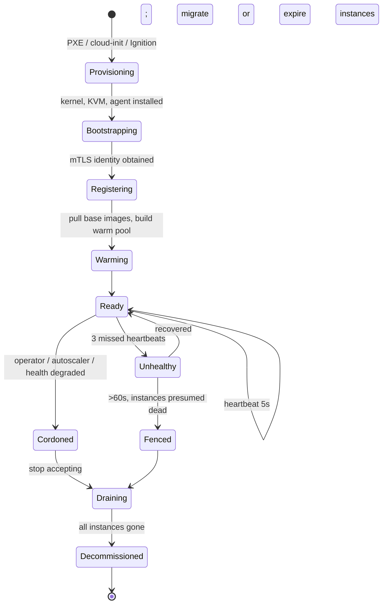
```mermaid
stateDiagram-v2
    [*] --> Provisioning: PXE / cloud-init / Ignition
    Provisioning --> Bootstrapping: kernel, KVM, agent installed
    Bootstrapping --> Registering: mTLS identity obtained
    Registering --> Warming: pull base images, build warm pool
    Warming --> Ready
    Ready --> Ready: heartbeat 5s
    Ready --> Cordoned: operator / autoscaler / health degraded
    Cordoned --> Draining: stop accepting; migrate or expire instances
    Draining --> Decommissioned: all instances gone
    Decommissioned --> [*]
    Ready --> Unhealthy: 3 missed heartbeats
    Unhealthy --> Ready: recovered
    Unhealthy --> Fenced: >60s, instances presumed dead
    Fenced --> Draining
```

**Draining** is deliberately not "migrate live VMs." Live migration of Firecracker VMs is possible in principle via snapshots but is fragile with active TCP connections. Instead: mark cordoned → route new requests elsewhere → wait for in-flight requests to complete (max `drain_timeout`, default 90s, capped by `request_timeout`) → for min-instance releases, start replacements elsewhere *first*, then stop here.

### 3.9 Agent restart and VM adoption

If the agent crashes or is upgraded, **running microVMs must survive**. This requires:

- Firecracker processes are children of `systemd`, not of the agent — the agent uses `systemd-run --scope` or a small supervisor shim so that agent death does not reap VMs. (Alternative: `PR_SET_CHILD_SUBREAPER` plus double-fork; systemd scopes are cleaner.)
- Agent persists per-VM state (jail path, API socket path, pid, netns, cgroup, instance metadata) to a local embedded DB (`redb`/`sled`/sqlite) *before* starting the VM.
- On start, the agent enumerates persisted VMs, verifies the pid is alive and is a Firecracker process for that jail, re-attaches the vsock log/health connections, and resumes reporting. Anything not adoptable is cleaned up.
- Agent upgrades are therefore a plain `systemctl restart` with a brief (<2s) reporting gap, not a node drain. This matters enormously operationally — otherwise every agent bugfix costs you a full fleet drain.

---
## 4. Deployment Pipeline

### 4.1 End-to-end flow

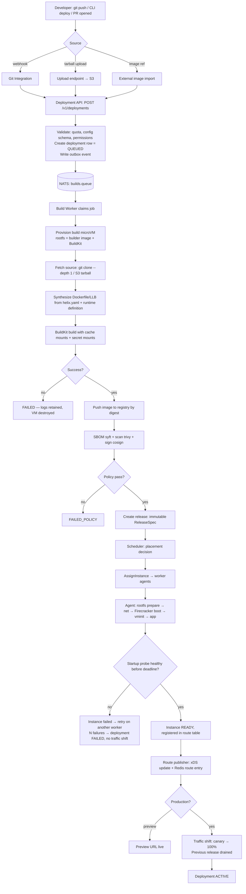
```mermaid
graph TB
    A[Developer: git push / CLI deploy / PR opened] --> B{Source}
    B -->|webhook| C[Git Integration]
    B -->|tarball upload| D[Upload endpoint → S3]
    B -->|image ref| E[External image import]
    C --> F[Deployment API: POST /v1/deployments]
    D --> F
    E --> F
    F --> G[Validate: quota, config schema, permissions<br/>Create deployment row = QUEUED<br/>Write outbox event]
    G --> H[(NATS: builds.queue)]
    H --> I[Build Worker claims job]
    I --> J[Provision build microVM<br/>rootfs = builder image + BuildKit]
    J --> K[Fetch source: git clone --depth 1 / S3 tarball]
    K --> L[Synthesize Dockerfile/LLB from helix.yaml + runtime definition]
    L --> M[BuildKit build with cache mounts + secret mounts]
    M --> N{Success?}
    N -->|no| N1[FAILED — logs retained, VM destroyed]
    N -->|yes| O[Push image to registry by digest]
    O --> P[SBOM syft + scan trivy + sign cosign]
    P --> Q{Policy pass?}
    Q -->|no| Q1[FAILED_POLICY]
    Q -->|yes| R[Create release: immutable ReleaseSpec]
    R --> S[Scheduler: placement decision]
    S --> T[AssignInstance → worker agents]
    T --> U[Agent: rootfs prepare → net → Firecracker boot → vminit → app]
    U --> V{Startup probe healthy before deadline?}
    V -->|no| V1[Instance failed → retry on another worker<br/>N failures → deployment FAILED, no traffic shift]
    V -->|yes| W[Instance READY, registered in route table]
    W --> X[Route publisher: xDS update + Redis route entry]
    X --> Y{Production?}
    Y -->|preview| Y1[Preview URL live]
    Y -->|yes| Z[Traffic shift: canary → 100%<br/>Previous release drained]
    Z --> AA[Deployment ACTIVE]
```

### 4.2 Step-by-step, with failure handling

#### Step 1 — Trigger and admission

**Inputs accepted:**
- Git webhook (push to tracked branch, PR opened/synchronized).
- `helix deploy` from CLI: creates a tarball of the working tree honoring `.helixignore`/`.gitignore`, uploads to a presigned S3 URL.
- Direct image reference (`helix deploy --image registry.example/foo@sha256:...`) — skips build entirely.

**Admission checks, all inside one transaction:**
- Caller has `deployment:create` on the project.
- Org is not suspended, is under its concurrent-build quota and its total-deployment quota.
- `helix.yaml` parses and validates against the schema (§9), including *resource ceilings the org's plan permits*.
- Idempotency: `(project_id, source_ref, config_hash, trigger_id)` — a re-delivered webhook does not create a second deployment.

**Failure modes:**

| Failure | Handling |
|---|---|
| Webhook replay / duplicate | Idempotency key → return existing deployment, `200` |
| Invalid `helix.yaml` | Fail fast at API time with a precise line/column error. Never create a build for a config that cannot run |
| Quota exceeded | `429` with quota detail; for git-triggered, post a failed commit status with the reason |
| Git provider unreachable | Deployment created as `QUEUED`, source fetch retried with backoff; after 5 attempts → `FAILED` with a clear message |

#### Step 2 — Enqueue (transactional outbox)

**Problem.** "Insert deployment row" and "publish build job to NATS" must not diverge. If you `INSERT` then publish and crash between, the deployment hangs forever. If you publish then `INSERT` and crash, you build something that does not exist.

**Solution: transactional outbox.**

```sql
BEGIN;
  INSERT INTO deployments (...) VALUES (...) RETURNING id;
  INSERT INTO outbox (aggregate_id, topic, payload, created_at)
    VALUES ($1, 'builds.queue', $2, now());
COMMIT;
```

A relay goroutine (leader-elected, or per-replica with `FOR UPDATE SKIP LOCKED`) reads unpublished outbox rows, publishes to NATS, marks published. At-least-once; consumers are idempotent. A janitor also sweeps deployments stuck in `QUEUED` beyond a threshold and re-publishes, which covers relay bugs.

**[MVP simplification]:** you can skip NATS entirely at MVP and poll the `deployments` table with `SELECT ... FOR UPDATE SKIP LOCKED`. Postgres as a queue is perfectly adequate below ~1000 jobs/minute and removes a moving part. Introduce NATS in Phase 3.

#### Step 3 — Build worker claim

A build worker pulls from the JetStream work queue with an explicit ack and a long ack-wait (equal to max build timeout + slack). Claiming writes `builds.state = RUNNING, builds.worker_id = ..., builds.lease_expires_at = now() + interval`.

**Failure modes:**

| Failure | Handling |
|---|---|
| Build worker dies mid-build | Lease expires → reaper transitions build to `QUEUED` with `attempt+1`; NATS redelivers. Max 2 automatic retries, and only for *infrastructure* failures — never for a build that failed because the user's code does not compile |
| Build worker hangs | Build timeout (default 15 min, max 60) enforced both in-VM (hard VM kill) and control-side (lease) |
| Duplicate delivery | `builds.attempt` + `ON CONFLICT` guard; the image is pushed to a digest-addressed location so a duplicate build is wasteful, not incorrect |

#### Step 4 — Source acquisition

Inside the build VM (already isolated), fetch source:
- Git: `git clone --depth 1 --branch <ref>` using a **short-lived, read-only, repo-scoped token** minted per build (GitHub App installation token, ~1h). Never a long-lived PAT, never an org-wide token.
- Tarball: download from S3 presigned URL, extract with path traversal protection and a decompressed-size cap (zip bomb defense: cap at e.g. 2 GB uncompressed, `--no-same-owner`, reject symlinks pointing outside the tree).
- Submodules: opt-in only, and disabled by default (a malicious submodule URL is an SSRF vector).

#### Step 5 — Build plan synthesis

The platform converts `helix.yaml` + the selected **Runtime Definition** into a BuildKit build.

Three modes:

| Mode | Trigger | Behavior |
|---|---|---|
| **Managed runtime** | `runtime.type: java` etc. | Platform-authored multi-stage Dockerfile template rendered from the runtime definition. User supplies only `build.command` and `run.command` |
| **Dockerfile** | `build.dockerfile: ./Dockerfile` | User's Dockerfile, built under the same sandbox and policy. Base image must pass policy (§10.7) |
| **Prebuilt image** | `image: registry/x@sha256:..` | No build; validate, re-sign, copy into internal registry |

Managed template (illustrative — this is data in `runtime-definitions/java/21.yaml`, not code):

```dockerfile
# syntax=docker/dockerfile:1.7
FROM ghcr.io/helix/build-java:21 AS build
WORKDIR /src
COPY . .
RUN --mount=type=cache,id=${CACHE_ID},target=/root/.m2,sharing=locked \
    --mount=type=secret,id=build_env,target=/run/secrets/build_env \
    set -a && . /run/secrets/build_env 2>/dev/null; set +a; \
    ${BUILD_COMMAND}

FROM ghcr.io/helix/run-java:21 AS run
WORKDIR /app
COPY --from=build /src/${OUTPUT_PATH} /app/
USER 65534:65534
ENV PORT=${PORT}
CMD ${RUN_COMMAND}
```

Note `sharing=locked` on the cache mount and `CACHE_ID` scoped per project (§5.3) — sharing a cache across tenants is a cache-poisoning vulnerability.

#### Step 6 — Build execution

See §5 in full. Outputs: image pushed by digest, build log stream, cache export, exit status.

#### Step 7 — Artifact hardening

Sequential, all failures block the release:
1. **SBOM** — `syft` over the final image → SPDX JSON → object storage, referenced by digest.
2. **Vulnerability scan** — `trivy`/`grype` against the image. Policy is **advisory by default, blocking on opt-in** (blocking by default makes the platform unusable — every Debian base has open CVEs). Critical+fixable vulns surface prominently in the UI.
3. **Signature** — `cosign sign` with a platform key (KMS-backed), plus an in-toto/SLSA provenance attestation recording: source repo + commit, build config hash, builder image digest, build start/end, and build VM identity.
4. **Admission policy** — the agent verifies the cosign signature before *ever* running an image. This is the control that stops "attacker with registry write access runs arbitrary images on the fleet."

#### Step 8 — Release creation

An immutable `ReleaseSpec`, hashed and stored:

```json
{
  "release_id": "rel_01J8...",
  "project_id": "prj_...",
  "environment": "production",
  "image": "registry.helix.internal/org_x/prj_y@sha256:ab12...",
  "runtime": { "kind": "firecracker", "arch": "amd64" },
  "resources": { "vcpu": 1, "memory_mib": 512, "ephemeral_mib": 1024 },
  "command": ["java","-jar","/app/app.jar"],
  "http": { "port": 8080, "protocol": "http1" },
  "health": { "startup": {"path":"/healthz","timeout_s":60},
              "readiness": {"path":"/healthz","period_s":10} },
  "scaling": { "min": 0, "max": 10, "target_concurrency": 50 },
  "env_ref": "envset_01J8...",
  "secret_refs": ["sec_a","sec_b"],
  "spec_hash": "sha256:...",
  "created_at": "2026-09-13T04:00:00Z"
}
```

The spec references secrets, it does not contain them. Secrets are materialized at instance-start time and delivered over the agent's mTLS channel, never persisted to disk on the worker in plaintext.

#### Step 9 — Scheduling and start

§12 covers the algorithm. Failure handling:

| Failure | Handling |
|---|---|
| No worker has capacity | Deployment waits in `SCHEDULING` with a deadline; triggers worker autoscaling (§19.2); fails after `scheduling_timeout` (default 5 min) |
| Image pull fails on worker | Retry 3× with backoff; then mark the *instance* failed, scheduler picks a different worker; 3 workers failing → deployment `FAILED` with the pull error surfaced |
| VM boots but startup probe never passes | Instance killed at `startup_timeout`; logs captured and shown to user (this is the #1 user-facing failure — the error message quality here is a product feature) |
| App crashes immediately (crashloop) | Exponential backoff on restart; after `max_start_failures` (default 3) the deployment fails. **Crucially, traffic is never shifted** — the previous release keeps serving |

#### Step 10 — Traffic shift

Only after `min(ready_instances) ≥ required_ready`:

- **[MVP]** Atomic switch: alias `production` → new release; old release drained after `drain_timeout`.
- **[V1]** Canary: 5% → 25% → 100% with automatic rollback on error-rate or latency regression measured at the gateway over a sliding window. Weighted routing is a route-table weight, evaluated in the gateway.
- Old release instances go to `DRAINING`: removed from new-request routing, existing requests allowed to finish, then stopped. For scale-to-zero releases, previous release keeps its snapshot cached for `rollback_window` (default 24h) so rollback is instant.

**Failure:** if the shift is partially applied (some gateways updated, some not), that is *acceptable* — both releases are healthy and serving. The route table is versioned with a monotonic generation number; gateways apply only higher generations, so the system converges and never flaps backwards.

### 4.3 Deployment state machine

See §38.8 for the complete machine including failure states. Summary path:

```text
QUEUED → BUILDING → BUILT → SCHEDULING → STARTING → READY → ACTIVE → SUPERSEDED → STOPPED
```

### 4.4 What happens to the old version

Nothing destructive, for `rollback_window`:
- The image stays in the registry (GC excludes any image referenced by a release younger than the retention window, or referenced by any alias).
- The `ReleaseSpec` row stays.
- The Firecracker snapshot, if any, stays in the worker's snapshot cache and in object storage.

This is what makes rollback a routing change rather than a rebuild.

### 4.5 Rollback

```text
POST /v1/projects/{id}/rollback   { "to_release": "rel_abc", "environment": "production" }
```

1. Validate the target release exists, belongs to the project/environment, and its image digest is still present in the registry.
2. If the target has ≥1 ready instance (common within the drain window) → **routing change only**, sub-second.
3. Otherwise → schedule instances from the stored `ReleaseSpec` (no rebuild, no config re-resolution), wait for health, then shift.
4. Emit an audit event, post commit status back to git, notify.

**Important subtlety: environment variables.** If the user changed an env var between releases, does rollback restore the old env? Options: (a) pin env to the release (fully immutable, surprising when rolling back also reverts a fixed API key), (b) always use current env (surprising when the old code cannot handle the new env). **Decision: pin the *env set version* to the release, but display a prominent diff at rollback time and allow `--use-current-env`.** Silent divergence here causes real outages; make it explicit.

### 4.6 Failure scenario catalogue for the pipeline

| Scenario | Detection | Response | Data loss risk |
|---|---|---|---|
| Control plane dies between `QUEUED` and enqueue | Janitor sweeps stale `QUEUED` | Re-publish from outbox | None |
| Build worker OOM | cgroup OOM event, exit 137 | Surface "build exceeded memory limit" (not a generic crash); do not auto-retry | None |
| Registry unavailable during push | Push error | Retry with backoff; build result cached locally for up to 10 min so retry does not rebuild | None |
| Registry unavailable during pull on worker | Pull error | Use local cache if digest present; else try peer workers (§13.4); else fail instance | None |
| Scheduler leader lost mid-deployment | Lease expiry | New leader reads deployment rows and resumes; transitions are idempotent | None |
| Agent dies after VM start but before report | Missing report | On reconnect, agent adopts and reports; control plane reconciles | Brief route staleness |
| Two orchestrator replicas process the same deployment | — | Prevented by `SELECT ... FOR UPDATE` on the deployment row + state guards in the `UPDATE ... WHERE state = expected` | None |
| Network partition between control plane and a worker | Heartbeat loss | Worker fenced after 60s; instances presumed unhealthy and removed from routing; **worker self-fences** by stopping instances if it cannot reach control for >5 min (prevents split-brain double-serving) | In-flight requests |

---
## 5. Build System

This is the most commonly under-secured part of a deployment platform, because it *feels* like CI rather than like running untrusted code. It is running untrusted code, with network access, with credentials nearby, at high privilege.

### 5.1 Build isolation: the core decision

**Problem.** A customer's `RUN` line executes arbitrary commands. BuildKit's default execution uses containers (namespaces + seccomp). Is that enough?

**Candidates.**

| Option | Isolation strength | Performance | Notes |
|---|---|---|---|
| A. Shared BuildKit daemon, container isolation, multi-tenant | Weak | Best (shared cache, no boot) | One container escape or one BuildKit bug = full daemon compromise = all tenants' source, caches, and registry credentials. **Rejected.** |
| B. BuildKit rootless, one daemon per build, container isolation | Medium | Good | Rootless removes a lot of escape surface but still shares the host kernel. A kernel LPE in the build container is game over |
| C. **BuildKit inside a per-build Firecracker microVM** | Strong | ~1–2 s VM boot overhead + cache warm-up | Same isolation primitive as the runtime. Build VM is disposable |
| D. Per-build dedicated bare-metal host | Strongest | Terrible utilization | Only for enterprise "dedicated build" tier |

**Decision: Option C. One Firecracker microVM per build, destroyed after. [V1] — Option B is acceptable for [MVP] single-tenant/self-serve-off.**

Rationale: the build environment executes untrusted code with *more* capability than the runtime (network egress to package registries, large disk, long duration). It deserves *at least* the runtime's isolation. Using the same primitive also means you build and harden one sandbox, not two.

**Tradeoffs.**
- Build cache must live outside the VM and be attached per build → a cache volume (block device) mounted into the build VM, snapshotted/restored per project.
- +1–3 s per build for VM lifecycle and cache attach. Irrelevant against a 90 s Maven build; noticeable against a 3 s Go build. Mitigate with a warm build-VM pool (§13.2), same mechanism as runtime warm pools.
- The build VM needs a larger, more capable rootfs (git, BuildKit, package tools) — a bigger attack surface *inside* the VM, but the VM boundary is what matters.

**Operational implication.** Build workers are physically separate hosts from runtime workers. They have different disk profiles (huge NVMe for cache), different network policy (must reach npm/PyPI/Maven Central; must *not* reach the control plane DB or other tenants), and different scaling (bursty).

### 5.2 Build sandbox layers

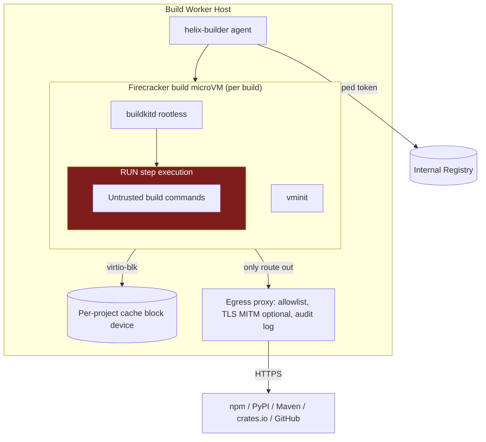
```mermaid
graph TB
    subgraph HOST["Build Worker Host"]
        BA[helix-builder agent]
        subgraph VM["Firecracker build microVM (per build)"]
            direction TB
            INIT[vminit]
            BK[buildkitd rootless]
            subgraph EXEC["RUN step execution"]
                UC[Untrusted build commands]
            end
            BK --> EXEC
        end
        CACHEV[(Per-project cache block device)]
        PROXY[Egress proxy: allowlist, TLS MITM optional, audit log]
    end
    BA --> VM
    VM -->|virtio-blk| CACHEV
    VM -->|only route out| PROXY
    PROXY -->|HTTPS| INET[npm / PyPI / Maven / crates.io / GitHub]
    BA -->|push, scoped token| REG[(Internal Registry)]
    style EXEC fill:#7f1d1d,color:#fff
```

Layers, outermost first:
1. **Firecracker + KVM** — hardware virtualization boundary.
2. **jailer** — chroot, unprivileged uid/gid, cgroup, netns, seccomp on the VMM.
3. **Network namespace + nftables** — the build VM's *only* egress route is the local egress proxy. No direct internet.
4. **Egress proxy** — HTTP CONNECT proxy with a domain allowlist, per-build audit log, bandwidth cap. Denies by default.
5. **cgroup limits** — CPU, memory, I/O, and a hard wall-clock timeout.
6. **Rootless BuildKit inside the guest** — defense in depth; a BuildKit escape lands you in an unprivileged guest process, not guest root.
7. **No credentials in the VM** — the registry push happens *outside* the VM, by the builder agent, from an exported image tarball/OCI layout. The build VM never holds a registry credential.

That last point deserves emphasis. **The single highest-value target for a malicious build is your registry credential.** If the build VM can push arbitrary images, an attacker can overwrite another tenant's image (if scoping is wrong) or plant a backdoored base image. Architecture: BuildKit exports to a local OCI layout on the cache device; the builder agent, outside the VM, reads that layout, validates it (size, layer count, no absurd whiteouts), and pushes with a **single-use token scoped to exactly `org_x/prj_y` and exactly this digest namespace**.

### 5.3 Build cache

**Problem.** Without cache, every Maven/npm/cargo build re-downloads the world. With a naive shared cache, tenant A poisons tenant B.

**Design:**

| Cache layer | Scope | Backing | Eviction |
|---|---|---|---|
| BuildKit layer cache (LLB results) | **Per project** | Registry-backed cache export (`type=registry,ref=.../cache:prj_y`) or a per-project block device | LRU by project, 30-day TTL, size cap per plan |
| Package manager cache (`~/.m2`, `~/.npm`, `~/.cargo`, `pip`) | **Per project** | Block device attached at `/cache`, mounted as BuildKit cache mounts | Size cap; user can `helix cache purge` |
| Upstream package mirror | **Global, read-only, platform-controlled** | Pull-through proxy (Artifactory/Nexus/`verdaccio`/`devpi` or just a caching HTTP proxy) | Standard |
| Base image layers | **Global, platform-controlled** | Registry + worker local blob cache | LRU |

**The hard rule:** the only *shared* caches are ones the platform writes and tenants can only read. Anything a tenant's build can write is scoped to that project.

**Why per-project rather than per-org?** Two projects in an org usually have unrelated dependency trees, and per-project scoping also contains damage if one repo is compromised. Per-org sharing is an optional optimization users can enable.

**Concurrency:** `sharing=locked` on cache mounts serializes concurrent builds of the same project against the same cache. Alternative `sharing=shared` risks corrupting e.g. the Maven local repo. Accept the serialization; it is correct.

### 5.4 Build secrets

Requirements: available during build, never in the image, never in logs, never on disk after build.

- Delivered via BuildKit `--secret` → mounted as a tmpfs file at `/run/secrets/<id>` for the duration of a single `RUN`. Never `ARG`/`ENV` (those land in image history, which is readable by anyone who can pull the image).
- The secret set for a build is decrypted by the control plane, sent to the builder agent over mTLS, held in memory, and passed to BuildKit's secret provider over a local socket. Never written to the build VM's persistent disk.
- **Log redaction:** the builder agent maintains the set of secret *values* for the build and scrubs them from the log stream before shipping. This is imperfect (base64, split across lines) but catches the common accidental `echo $TOKEN`. Document that it is best-effort.
- Build secrets and runtime secrets are **separate sets**. A `DATABASE_URL` should not be present at build time; an `NPM_TOKEN` should not be present at runtime.

### 5.5 Network access during build

**Problem.** Builds need `npm install`. Unrestricted egress means your build fleet is a free proxy, a spam relay, a port scanner, and an SSRF launchpad into your own VPC.

**Policy [V1]:**

| Destination | Default |
|---|---|
| Known package ecosystems (registry.npmjs.org, pypi.org + files.pythonhosted.org, repo.maven.apache.org, crates.io + static.crates.io, proxy.golang.org, rubygems.org, packagist.org, nuget.org, hex.pm, pub.dev, apt/deb & rpm mirrors, Docker Hub/GHCR for base images) | **Allow** via egress proxy |
| github.com / gitlab.com / bitbucket.org (HTTPS, for git deps) | **Allow** |
| Everything else | **Deny**, with a clear build-log message naming the blocked host |
| RFC1918, link-local `169.254.0.0/16`, platform VPC ranges, cloud metadata | **Deny always, no override** |
| Outbound SMTP (25/465/587), IRC, common C2 ports | **Deny always** |
| Inbound connections | **Deny** — the build VM has no inbound path at all |

Users can request additional allowlist entries per project (self-serve with review, or auto-approve well-known hosts). Offer `build.network: none` for fully vendored builds, which is both faster and more secure, and reward it in the UI.

**Operational note:** run your own pull-through mirrors for the top ecosystems. It cuts build time substantially, removes a dependency on npm's availability, and gives you a natural place to enforce policy and detect dependency-confusion attacks.

### 5.6 Resource limits

| Limit | Default | Max (plan-dependent) | Enforcement |
|---|---|---|---|
| vCPU | 2 | 16 | VM config + `cpu.max` |
| Memory | 4 GiB | 32 GiB | VM memory size (hard — guest OOM kills the build, reported clearly) |
| Disk (workspace) | 20 GiB | 100 GiB | Sized block device |
| Disk (cache) | 10 GiB | 50 GiB | Sized block device, enforced at attach |
| Wall clock | 15 min | 60 min | In-VM watchdog **and** host-side kill |
| Egress bandwidth | 100 Mbit | 1 Gbit | `tc` on the TAP |
| Egress bytes total | 10 GiB | 50 GiB | Proxy accounting; kill on exceed |
| Log output | 50 MB | 200 MB | Truncate with marker |
| Concurrent builds per org | 2 | 20 | Control-plane admission |
| Max image size | 2 GiB | 10 GiB | Checked post-build before push |

Every limit produces a **specific, actionable error message**. "Build failed" is a product defect.

### 5.7 Build logs

- `vminit` in the build VM forwards BuildKit's output over vsock, framed with `(step_id, stream, ts, bytes)`.
- Builder agent streams to: (a) NATS subject `logs.build.{build_id}` for live tailing by the CLI/dashboard, and (b) batched to Loki/object storage for retention.
- Live tail: CLI opens `GET /v1/builds/{id}/logs?follow=true` (SSE or WebSocket), control plane subscribes to the NATS subject and relays. Backfill from Loki for the portion already elapsed, then switch to live — with a sequence number so the handoff does not duplicate or drop lines.
- Retention: 30 days hot (Loki), then object storage; logs for failed builds retained longer by default because that is when people look.

### 5.8 Cancellation

`POST /v1/builds/{id}/cancel` →
1. Set `builds.cancel_requested = true` (this is the durable signal).
2. Publish `builds.cancel.{build_id}` on NATS.
3. Builder agent receives it, sends `SendCtrlAltDel` then kills the VM, marks `CANCELLED`.
4. If the agent never receives it, the periodic reconcile (agent polls its active builds' cancel flags every 2 s) catches it. **Never rely solely on a pub/sub message for cancellation** — always have a pulled signal as backstop.
5. Partial artifacts are discarded; cache exports from a cancelled build are *not* committed (a cancelled build's cache may be inconsistent).

### 5.9 Retries and reproducibility

**Retry policy.** Distinguish rigorously:

| Class | Examples | Auto-retry? |
|---|---|---|
| Infrastructure | VM failed to boot, worker died, registry 5xx, proxy error | Yes, up to 2, different worker |
| Transient external | npm 503, git timeout | Yes, 1 retry, with backoff |
| User error | compile error, test failure, missing file, OOM from user's own build | **No.** Retrying wastes money and confuses users |

Distinguish by exit code and by structured error from the builder, not by string matching on logs.

**Reproducibility.** Full bit-for-bit reproducibility is not a realistic V1 goal (timestamps, dependency resolution drift, non-deterministic compilers). Aim for **verifiable provenance** instead, which is what actually delivers the security value:

- Pin the builder image by digest in the runtime definition.
- Record in SLSA provenance: source commit, `helix.yaml` hash, builder image digest, resolved runtime definition version, all build args.
- Set `SOURCE_DATE_EPOCH` and normalize timestamps where the toolchain honors it.
- Encourage (and, for managed runtimes, require) lockfiles. Warn loudly when a build has no lockfile — it is both non-reproducible and a supply-chain risk.

Offer opt-in "strict reproducible" mode later that uses a fully vendored dependency snapshot and `build.network: none`.

### 5.10 Artifact storage and the registry

**Decision: run your own OCI registry. [MVP]**

| Option | Assessment |
|---|---|
| **CNCF Distribution** (`registry:3`) | Reference implementation, S3 backend, simple, battle-tested. **Choose this for MVP/V1.** |
| **Zot** | OCI-native, built-in cosign/notation verification, sync, good for edge/regional mirrors. Strong candidate at V1 for regional replicas |
| Harbor | Full product: RBAC, scanning, replication, quotas — but heavyweight (Postgres + Redis + several services) and its RBAC will fight yours |
| Cloud registry (ECR/GCR) | Fast start, but per-tenant scoping, egress cost, and cross-cloud portability become problems. Also you want *your* auth model |

Layout: `registry.helix.internal/{org_slug}/{project_slug}@sha256:...`. Always reference by digest. Tags exist only for human convenience and are never used for scheduling.

**GC:** an image is retained if referenced by any release that is (a) currently routed, (b) within `rollback_window`, or (c) the N most recent releases of the project. Mark-and-sweep runs off-peak with a safety delay; never delete a blob referenced in the last 24h.

**Storage:** S3-compatible. Use MinIO on your own disks if you are on bare metal (§33), or the cloud provider's S3. Registry metadata in Postgres (Distribution can use S3 alone; for scale and for GC sanity, prefer a metadata DB).

### 5.11 Attack tree: malicious build


```mermaid
graph TD
    G["GOAL: compromise the platform via a build"] --> A1[Escape the build sandbox]
    G --> A2[Steal credentials]
    G --> A3[Poison artifacts]
    G --> A4[Abuse resources]
    G --> A5[Attack the network]

    A1 --> A1a[Kernel LPE in guest → guest root]
    A1 --> A1b[Firecracker/virtio device 0-day → host]
    A1 --> A1c[BuildKit daemon vuln → daemon privileges]
    A1 --> A1d[Escape via shared mount / cache device]

    A2 --> A2a[Read registry push credential]
    A2 --> A2b[Read another tenant's build secret from shared cache]
    A2 --> A2c[Query cloud metadata service for host IAM role]
    A2 --> A2d[Read git token and pivot to the customer's other repos]

    A3 --> A3a[Write into a shared cache consumed by another tenant]
    A3 --> A3b[Push an image outside own namespace]
    A3 --> A3c[Dependency confusion via internal package names]
    A3 --> A3d[Tamper with SBOM/provenance]

    A4 --> A4a[Crypto mining during long build]
    A4 --> A4b[Fork bomb / disk fill to DoS the worker]
    A4 --> A4c[Infinite build to hold capacity]

    A5 --> A5a[Scan platform internal network]
    A5 --> A5b[SSRF to control plane / DB / metadata]
    A5 --> A5c[Use build fleet as spam or DDoS source]
    A5 --> A5d[Exfiltrate stolen data over DNS]

    style G fill:#7f1d1d,color:#fff
```

**Mitigations, mapped:**

| Attack | Mitigation |
|---|---|
| A1a guest kernel LPE | Assume it succeeds. Guest root is still inside the VM. This is exactly why builds run in a VM, not a container |
| A1b Firecracker 0-day | Minimal device model; jailer (chroot + unpriv uid + seccomp); host kernel hardened and patched; build workers physically separate from runtime workers so a build escape does not reach customer runtime data; per-host blast radius accepted and monitored |
| A1c BuildKit vuln | Rootless BuildKit; BuildKit is *inside* the VM so a full compromise still yields only the VM |
| A1d shared mounts | Only the per-project cache device is attached; no host paths bind-mounted into the build VM; cache device is a block device (not a shared filesystem) so no cross-VM concurrent mount |
| A2a registry credential | **Not present in the VM.** Push happens outside, from an exported OCI layout, with a single-use scoped token |
| A2b other tenants' secrets | Caches are per-project; VM is destroyed after; no shared tmp |
| A2c metadata service | nftables drops `169.254.0.0/16` unconditionally; build workers run with **no cloud instance IAM role** (or IMDSv2 with hop-limit 1 and an empty role); credentials come from the control plane over mTLS instead |
| A2d git token | Token is repo-scoped, read-only, ~1h TTL, minted per build |
| A3a cache poisoning | Per-project caches only; platform-global caches are read-only to builds |
| A3b out-of-namespace push | Push is done by the agent with a token scoped to one repository path; registry enforces path scoping independently |
| A3c dependency confusion | Pull-through mirror with an explicit policy: internal package namespaces are never resolved from public registries; warn on newly-appearing public packages matching internal names |
| A3d provenance tampering | SBOM/scan/sign are computed **outside** the build VM by the builder agent over the exported artifact |
| A4a mining | CPU is metered and billed; anomaly detection on sustained 100% CPU with near-zero egress-to-package-registries and low disk write (§24.2); build timeout caps it |
| A4b fork bomb / disk fill | Guest cgroup `pids.max`, fixed VM memory, fixed-size disks; host is unaffected because all resources are VM-scoped |
| A4c infinite build | Hard wall-clock timeout, both in-VM and host-side |
| A5a/b network scanning & SSRF | Only route out is the egress proxy; proxy denies non-allowlisted hosts and all RFC1918/link-local; no inbound path; conntrack limits |
| A5c spam/DDoS | SMTP ports blocked; bandwidth and total-bytes caps; egress destination anomaly detection; per-org reputation scoring |
| A5d DNS exfiltration | DNS resolution goes through a platform resolver that only answers allowlisted domains, logs QPS, and rate-limits; raw UDP/53 egress blocked |

**Residual risks you must accept and monitor:** a Firecracker or KVM 0-day; CPU microarchitectural side channels between concurrent builds on the same physical core (mitigate with core scheduling / SMT policy, §6.6); a compromised upstream package (this is the customer's supply chain, but your SBOM makes it detectable); and an insider with registry write access (mitigate with signing + admission).

---
## 6. Runtime Isolation and Threat Model

### 6.1 Threat model

**Assets, in priority order:**
1. Other tenants' source code, secrets, and running data.
2. Platform credentials (registry keys, KMS keys, DB credentials, cloud IAM).
3. Platform control-plane integrity (ability to deploy on someone else's behalf).
4. Platform availability.
5. Platform reputation / IP address reputation.

**Adversaries:**

| Adversary | Capability | Motivation |
|---|---|---|
| A1. Opportunistic abuser | Signs up with a stolen card, deploys mining/proxy/spam | Money |
| A2. Skilled tenant | Deploys a deliberately malicious workload to escape or pivot | Data theft, ransom |
| A3. External attacker | No account; attacks the edge, API, or a tenant's app | Varies |
| A4. Compromised dependency | Attacker controls an npm/PyPI package a tenant uses | Broad |
| A5. Malicious insider | Platform employee with production access | Data theft |
| A6. Nation-state | 0-days in KVM/Firecracker, hardware side channels | Targeted |

**Explicit assumptions (and their risk):**
- Untrusted code will run with full root privilege *inside its own guest*. Design accordingly. Never treat "the app runs as non-root in the container" as a security control against the tenant themselves — it is a control against *their* app's vulnerabilities, which is still valuable.
- The host kernel and Firecracker are trusted but not invulnerable. A single VM escape is a P0 but must not be a total-platform compromise.
- Multi-tenancy on a single physical host is accepted for cost reasons. This inherently accepts microarchitectural side-channel risk (§6.6). A "dedicated host" tier exists for customers who cannot accept it.

### 6.2 Defense layers for the Linux (Firecracker) path

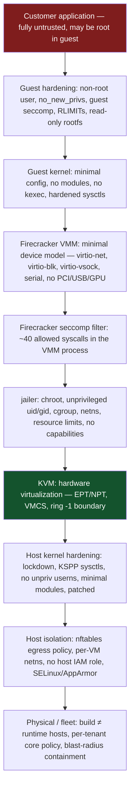
```mermaid
graph TB
    APP["Customer application — fully untrusted, may be root in guest"]
    L1["Guest hardening: non-root user, no_new_privs, guest seccomp, RLIMITs, read-only rootfs"]
    L2["Guest kernel: minimal config, no modules, no kexec, hardened sysctls"]
    L3["Firecracker VMM: minimal device model — virtio-net, virtio-blk, virtio-vsock, serial, no PCI/USB/GPU"]
    L4["Firecracker seccomp filter: ~40 allowed syscalls in the VMM process"]
    L5["jailer: chroot, unprivileged uid/gid, cgroup, netns, resource limits, no capabilities"]
    L6["KVM: hardware virtualization — EPT/NPT, VMCS, ring -1 boundary"]
    L7["Host kernel hardening: lockdown, KSPP sysctls, no unpriv userns, minimal modules, patched"]
    L8["Host isolation: nftables egress policy, per-VM netns, no host IAM role, SELinux/AppArmor"]
    L9["Physical / fleet: build ≠ runtime hosts, per-tenant core policy, blast-radius containment"]

    APP --> L1 --> L2 --> L3 --> L4 --> L5 --> L6 --> L7 --> L8 --> L9
    style APP fill:#7f1d1d,color:#fff
    style L6 fill:#14532d,color:#fff
```

The load-bearing layer is **L6 (KVM)**. Everything above it reduces the probability of reaching a KVM bug; everything below it reduces the damage if one is found.

### 6.3 What Firecracker does and does not solve

This deserves to be stated flatly, because "we use Firecracker so we're secure" is the most common and most dangerous claim in this space.

**Firecracker meaningfully mitigates:**

| Threat | How |
|---|---|
| Container escape via shared kernel (`runc` CVEs, `/proc` tricks, cgroup escapes, `CAP_SYS_ADMIN` abuse) | There is no shared kernel. The guest has its own |
| Guest→host via device emulation | Minimal device model: no PCI passthrough, no USB, no GPU, no legacy devices, no SCSI, no VGA. Roughly two orders of magnitude less device code than QEMU |
| VMM process compromise → host | jailer: unprivileged uid, chroot, dropped caps, cgroups, netns; plus a seccomp allowlist on the VMM itself. A fully compromised Firecracker process is an unprivileged, jailed, syscall-restricted process |
| Guest kernel exploitation mattering | Guest root is already assumed. Guest kernel compromise does not cross the VM boundary |
| Noisy neighbors (coarse) | Fixed vCPU and memory allocation, cgroup enforcement |
| Filesystem tampering | Read-only rootfs block device shared across VMs; writes go to a per-VM overlay |

**Firecracker does NOT solve:**

| Threat | Why not | Your mitigation |
|---|---|---|
| **KVM / host kernel 0-day** | KVM is a large, privileged codebase. `CVE-2024-…`-class bugs in KVM exist | Patch cadence with live-patching where possible; host kernel hardening; blast-radius containment; detection (§24.4) |
| **Firecracker 0-day** | Small but non-zero surface (virtio-net/blk/vsock, MMIO, snapshot deserialization) | Keep current; jailer + seccomp as second layer; **never load an untrusted snapshot** (§7.11) |
| **CPU side channels** (Spectre/MDS/L1TF/Downfall/Zenbleed class) | Hardware, not software. SMT sharing lets a guest observe a sibling thread | §6.6: microcode current, mitigations *on* (do not disable for perf), SMT policy, core scheduling |
| **Resource abuse** (mining, DDoS source, spam) | Perfectly legal use of purchased CPU from the VMM's perspective | §24 |
| **Malicious network behavior / SSRF / metadata theft** | Firecracker happily forwards packets | §6.5 network isolation is a separate, equally important control |
| **Supply-chain compromise** | Attack is in the artifact, which Firecracker faithfully runs | §5, §10, signing + SBOM + scanning |
| **Application-layer vulnerabilities** | Not a VM concern | Customer's responsibility; platform provides WAF and secrets hygiene |
| **Data exfiltration by the tenant of their own data** | They own it | N/A |
| **Control-plane compromise** | Entirely outside the VM boundary | §23 |
| **Denial of service on the host** (memory pressure, I/O saturation) | Requires explicit cgroup/quota work | §3.6, §6.7 |
| **Snapshot-related secret reuse** | Restored VMs share entropy/keys | §7.11, §3.4 post-restore hooks |

**Conclusion to carry forward:** Firecracker is necessary and it is the right choice. It is roughly *half* the security story. The other half is network isolation, resource policy, supply chain, and abuse detection — all of which are ordinary engineering work that must be budgeted.

### 6.4 Guest configuration

**Kernel.** Build your own minimal guest kernel. Do not ship a distro kernel.

- Base on a current LTS. Config from Firecracker's recommended microVM config as a starting point.
- Enable only: virtio-net, virtio-blk, virtio-vsock, virtio-mmio, ext4, overlayfs, tmpfs, cgroup v2, seccomp, the required arch bits.
- Disable: modules entirely (`CONFIG_MODULES=n` — removes an entire LPE class), kexec, /dev/mem, /dev/kmem, ftrace for non-root, BPF JIT for unprivileged, `CONFIG_DEVMEM`, ACPI, PCI, USB, sound, graphics, most filesystems, most network protocols (no SCTP/DCCP/RDS/TIPC — historically vulnerable and nobody needs them).
- Enable hardening: `CONFIG_SLAB_FREELIST_RANDOM`, `CONFIG_HARDENED_USERCOPY`, `CONFIG_FORTIFY_SOURCE`, `CONFIG_STACKPROTECTOR_STRONG`, `CONFIG_RANDOMIZE_BASE`, `CONFIG_STRICT_KERNEL_RWX`, `CONFIG_INIT_ON_ALLOC_DEFAULT_ON`.
- Boot args: `reboot=k panic=1 pci=off i8042.noaux i8042.nomux i8042.nopnp i8042.dumbkbd random.trust_cpu=on tsc=reliable quiet`. `panic=1` means a guest kernel panic halts the VM immediately, which the agent detects.
- Result: ~2–5 MB kernel, boots in tens of milliseconds.

**Rootfs.**
- Read-only ext4 block device (`virtio-blk`, `ro`), shared by every VM of the same image digest on that worker. Page cache is therefore shared across hundreds of VMs — a major memory and cold-start win.
- Per-VM writable overlay: a second, small, sparse block device with `overlayfs` upper, or `tmpfs` upper if `ephemeral_storage` is small. Destroyed on VM stop.
- `/tmp` is `tmpfs` with an explicit size.
- **[V1]** `dm-verity` over the read-only rootfs with the root hash passed by the host: the guest kernel then rejects any tampered block. Protects against a rootfs corrupted on disk and gives a strong integrity statement.

**Guest userspace.** `vminit` (§3.4) applies:
- `prctl(PR_SET_NO_NEW_PRIVS)`.
- Drop to the image's `USER`, defaulting to uid 65534. Drop all capabilities.
- A default seccomp allowlist that permits normal server workloads but blocks the historically dangerous, rarely-needed set: `kexec_load`, `init_module`, `finit_module`, `delete_module`, `bpf`, `perf_event_open`, `userfaultfd`, `process_vm_readv/writev`, `ptrace` (configurable — some runtimes need it), `mount`, `pivot_root`, `swapon`, `add_key`, `keyctl`, `open_by_handle_at`, `unshare`/`setns` with `CLONE_NEWUSER`. Users can opt out per-project with justification; opting out is logged and does not weaken the VM boundary, only the in-guest boundary.
- `RLIMIT_NPROC`, `RLIMIT_NOFILE`, `RLIMIT_CORE=0`, `RLIMIT_FSIZE`.

Yes, this is defense-in-depth against an attacker who already controls the app. It matters because most compromises are *not* deliberately malicious tenants — they are a tenant's app getting popped by A4 (compromised dependency), and these controls slow the attacker down and generate detectable signals.

### 6.5 Network isolation

This is co-equal with the VM boundary in importance and is frequently neglected.

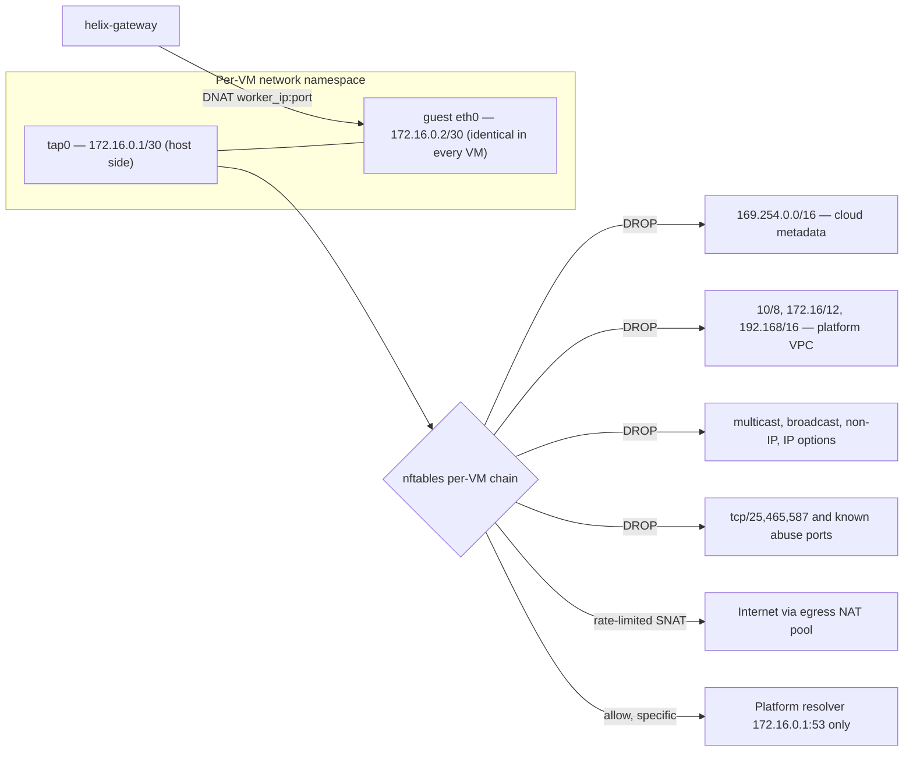
```mermaid
graph LR
    subgraph NETNS["Per-VM network namespace"]
        TAP["tap0 — 172.16.0.1/30 (host side)"]
        GUEST["guest eth0 — 172.16.0.2/30 (identical in every VM)"]
        TAP --- GUEST
    end
    TAP --> NFT{nftables per-VM chain}
    NFT -->|DROP| META["169.254.0.0/16 — cloud metadata"]
    NFT -->|DROP| PRIV["10/8, 172.16/12, 192.168/16 — platform VPC"]
    NFT -->|DROP| MC["multicast, broadcast, non-IP, IP options"]
    NFT -->|DROP| SMTP["tcp/25,465,587 and known abuse ports"]
    NFT -->|rate-limited SNAT| INET["Internet via egress NAT pool"]
    NFT -->|allow, specific| DNS["Platform resolver 172.16.0.1:53 only"]
    GW["helix-gateway"] -->|DNAT worker_ip:port| GUEST
```

Rules, all default-deny:
1. **Identical guest addressing.** Every guest sees `172.16.0.2/30`, gateway `172.16.0.1`, resolver `172.16.0.1`. Uniqueness lives in the host's netns + DNAT, not in the guest. Required for snapshot restore to work at all.
2. **No guest-to-guest traffic**, ever, including same-tenant, unless the tenant explicitly enables a private network feature. There is no bridge that guests share; each is in its own netns with a routed point-to-point link.
3. **Metadata service is dropped unconditionally.** Additionally, the *host* should either have no cloud IAM role or use IMDSv2 with `http-put-response-hop-limit=1`. Belt and braces — this specific attack (SSRF from a customer app → cloud metadata → platform's IAM role) has taken down real platforms.
4. **Platform internals are unreachable.** Control plane, Postgres, Redis, NATS, registry, agent's own ports — all in address ranges the guest cannot route to. The guest's only inbound path is the gateway's DNAT to its app port.
5. **Egress NAT from a dedicated IP pool**, separate from platform IPs, with per-tenant IP assignment at higher tiers so one abuser's reputation damage is contained.
6. **Rate limits:** `tc` HTB on the TAP for bandwidth; nftables `limit` for new connections/sec; conntrack max entries per VM (stops connection-table exhaustion attacks and slows port scanning).
7. **Egress ports:** block 25/465/587 by default (spam), block 445/139 (SMB), 3389; allow 80/443 and general outbound otherwise. Consider default-deny outbound with an allowlist for free-tier accounts (dramatically reduces abuse; upsell paid users to open egress).
8. **DNS through a platform resolver** that logs, rate-limits, blocks known-malicious domains, and prevents DNS-tunneling exfiltration (entropy/QPS heuristics). Block direct UDP/TCP 53 to arbitrary resolvers and block DoH endpoints where feasible.

### 6.6 CPU side channels and SMT policy

**Problem.** Spectre-v2, MDS, L1TF, Downfall, Zenbleed, and successors allow a guest to read data from a sibling hyperthread or from a previously-running context.

**Options:**

| Option | Security | Cost |
|---|---|---|
| Ignore; rely on microcode mitigations | Medium — mitigations handle cross-privilege but SMT co-residency remains a risk | Free |
| **Disable SMT entirely** | High | ~15–30% throughput loss. Expensive at scale |
| **Core scheduling** (Linux `sched_core`, `CLONE_NEWCGROUP`+ `prctl(PR_SCHED_CORE)`), cookie = tenant | High for SMT co-residency | Small scheduling loss; requires kernel 5.14+ and careful setup |
| Dedicated hosts per tenant | Highest | Only viable as a paid tier |

**Decision [V1]: core scheduling with a per-*tenant* cookie**, so two VMs from different orgs never share a physical core's sibling threads. Keep all microcode and kernel mitigations enabled (do not chase benchmark numbers by disabling them). Offer SMT-disabled and dedicated-host tiers for customers with compliance requirements. **[MVP]:** disable SMT on the small initial fleet — it is one line of config and you have capacity to spare.

Also: flush L1D on VM entry where the CPU supports it, keep `spectre_v2=on`, `mds=full,nosmt` semantics via core scheduling, and enable `kvm.nx_huge_pages=auto`.

### 6.7 Resource abuse and DoS containment

| Attack | Containment |
|---|---|
| **Fork bomb** | Inside the guest it exhausts *the guest's* PID space and memory only. `vminit` sets `RLIMIT_NPROC` and a guest cgroup `pids.max`. Host is unaffected. Guest OOM → instance unhealthy → restarted. This is a scenario Firecracker genuinely solves cleanly |
| **Memory bomb** | VM memory is a fixed allocation. Guest OOM killer fires inside the guest; the host never sees pressure — provided you do not overcommit memory (§3.6) |
| **Disk fill** | Overlay is a fixed-size device; `tmpfs` has an explicit size. Guest gets ENOSPC |
| **I/O saturation** | cgroup `io.max` on the backing device per VM; separate NVMe namespaces for rootfs cache vs overlays if needed |
| **CPU burn / mining** | Allowed by `cpu.max` up to what is purchased. Detection and billing handle it (§24.2) |
| **Network flood outbound** | `tc` rate limit, conntrack cap, new-connection rate limit, bandwidth billing, anomaly detection |
| **Request flood inbound** | Gateway-level per-project rate limits and concurrency caps; the tenant's own instances are protected by their `max_instances` |
| **Slowloris against the gateway** | Envoy connection limits, idle timeouts, `max_concurrent_streams`, request-header timeouts |
| **vsock flood** (guest → agent) | Per-VM vsock rate limits in the agent; the log path drops rather than blocks |
| **Deliberate guest kernel panic loop** | `panic=1` halts; agent restart backoff prevents a restart storm |

### 6.8 Isolation for the WASM path

WASM has a *different* threat model and it is important not to assume it is strictly better.

| Layer | Control |
|---|---|
| Wasm linear memory | Bounds-checked by the runtime; no raw pointers to host memory. This is a strong, formally-reasoned boundary |
| Host function surface | WASI preview 2 / `wasi:http`. **Explicitly deny-list:** no `wasi:filesystem` by default, no `wasi:sockets` by default, restricted `wasi:clocks` precision, no `wasi:random` weirdness |
| CPU time | Wasmtime epoch interruption (preferred: cheap) or fuel metering (precise, ~10–30% slower) |
| Memory | `StoreLimits` with a hard `memory_size` cap; pooling allocator with a fixed max instance memory |
| Compilation | **Never compile untrusted wasm on a serving host.** Cranelift is a compiler processing attacker-controlled input. Precompile to `.cwasm` in the build sandbox, sign it, and have the host `deserialize` only signed artifacts |
| Process isolation | `helix-wasm-host` runs as a separate, unprivileged process under seccomp + namespaces, one process per **tenant** (not per instance), so a Wasmtime escape is contained to one tenant |
| Host process compromise | Accepted risk: a Wasmtime sandbox escape gives you one tenant's host process. Mitigated by per-tenant process separation and, at [V1], by running the wasm host pool *inside* a Firecracker VM for high-risk tiers |

**Key honest point:** Wasmtime's sandbox is a software boundary in a large JIT compiler. It has had CVEs. It is excellent, but it is not equivalent to hardware virtualization. The right framing is: *WASM gives you cheap isolation between many small workloads; Firecracker gives you strong isolation between untrusted workloads*. For maximum safety, nest them.

---

## 7. Firecracker Architecture

### 7.1 Component map

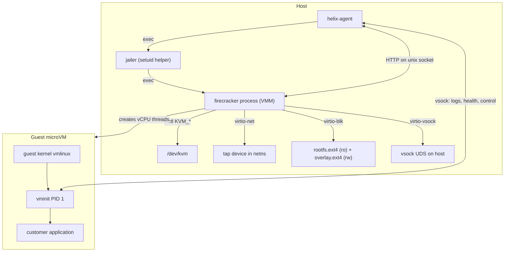
```mermaid
graph TB
    subgraph HOSTK["Host"]
        AGENT2[helix-agent]
        JAIL["jailer (setuid helper)"]
        FC["firecracker process (VMM)"]
        KVM["/dev/kvm"]
        TAPD[tap device in netns]
        BLK["rootfs.ext4 (ro) + overlay.ext4 (rw)"]
        VSOCK[vsock UDS on host]
    end
    subgraph GUEST2["Guest microVM"]
        GK[guest kernel vmlinux]
        VI[vminit PID 1]
        APP2[customer application]
        GK --> VI --> APP2
    end
    AGENT2 -->|exec| JAIL -->|exec| FC
    FC -->|ioctl KVM_*| KVM
    FC -->|virtio-net| TAPD
    FC -->|virtio-blk| BLK
    FC -->|virtio-vsock| VSOCK
    FC -->|creates vCPU threads| GUEST2
    AGENT2 <-->|HTTP on unix socket| FC
    AGENT2 <-->|vsock: logs, health, control| VI
```

### 7.2 The pieces, explained

**KVM** — the Linux kernel module that exposes hardware virtualization (Intel VT-x / AMD-V) through `/dev/kvm`. It handles VM exits, second-level address translation (EPT/NPT), and vCPU scheduling. It is the actual isolation boundary. Requires bare metal or a cloud instance with nested virtualization / metal access.

**VMM (Firecracker)** — a ~50k-line Rust userspace process that owns one microVM. It sets up guest memory (an anonymous `mmap`), creates vCPU threads, loads the kernel, emulates a deliberately tiny device set (virtio-net, virtio-blk, virtio-vsock, virtio-balloon, a serial console, a minimal i8042 for reset), and exposes a control API over a Unix socket. One process per VM — no shared daemon, so a crash kills one VM.

**Guest kernel** — a platform-built `vmlinux` (uncompressed ELF, not bzImage) loaded directly by Firecracker. No bootloader, no BIOS, no UEFI. This is why boot is ~125 ms instead of ~30 s.

**Rootfs** — an ext4 image on a `virtio-blk` device. Read-only base + per-VM writable overlay.

**vCPU** — each vCPU is a host thread running `KVM_RUN`. Pinned by the Resource Manager. `cpu.max` in the cgroup bounds it.

**Memory** — a single anonymous `mmap` of the configured size, faulted in lazily. Hence a 512 MiB VM that uses 80 MiB costs ~80 MiB of host RAM plus ~3–5 MiB VMM overhead. With `virtio-balloon` + free-page-reporting, memory an idle guest frees can be returned to the host.

**TAP networking** — one TAP device per VM inside a per-VM netns (§6.5).

**vsock** — a socket family for host↔guest communication that requires no network configuration and cannot be firewalled away by the guest's network stack. Used for logs, health, and control. The host side is a Unix socket; the guest side is `AF_VSOCK` with a port. Critically, **vsock works before the network is up and after it is torn down**, which makes it the right channel for lifecycle control.

**jailer** — Firecracker's setuid helper. It: creates a chroot at `/srv/jail/<id>/root`, moves into a new mount/pid/net namespace, sets uid/gid to an unprivileged per-VM identity, applies a cgroup, drops all capabilities, closes extraneous fds, and then execs `firecracker`. **Always use it.** Running Firecracker directly as root in production is a serious misconfiguration.

**seccomp** — Firecracker installs a default filter on itself restricting the VMM to a few dozen syscalls. Use the default; only write a custom filter if you have a measured need, and review it as security-critical code.

**Snapshots** — Firecracker can pause a VM and serialize (a) device+vCPU state to a small file and (b) guest memory to a file, then restore into a new VM. Restore can be <10 ms with UFFD-backed lazy memory loading. This is the single biggest cold-start lever, and also the biggest correctness trap (§7.11).

### 7.3 VM lifecycle

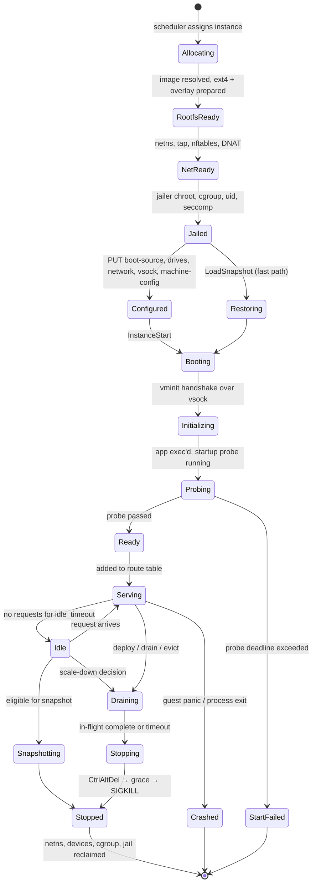
```mermaid
stateDiagram-v2
    [*] --> Allocating: scheduler assigns instance
    Allocating --> RootfsReady: image resolved, ext4 + overlay prepared
    RootfsReady --> NetReady: netns, tap, nftables, DNAT
    NetReady --> Jailed: jailer chroot, cgroup, uid, seccomp
    Jailed --> Configured: PUT boot-source, drives, network, vsock, machine-config
    Configured --> Booting: InstanceStart
    Jailed --> Restoring: LoadSnapshot (fast path)
    Restoring --> Booting
    Booting --> Initializing: vminit handshake over vsock
    Initializing --> Probing: app exec'd, startup probe running
    Probing --> Ready: probe passed
    Probing --> StartFailed: probe deadline exceeded
    Ready --> Serving: added to route table
    Serving --> Idle: no requests for idle_timeout
    Idle --> Serving: request arrives
    Idle --> Snapshotting: eligible for snapshot
    Snapshotting --> Stopped
    Idle --> Draining: scale-down decision
    Serving --> Draining: deploy / drain / evict
    Draining --> Stopping: in-flight complete or timeout
    Stopping --> Stopped: CtrlAltDel → grace → SIGKILL
    Stopped --> [*]: netns, devices, cgroup, jail reclaimed
    Serving --> Crashed: guest panic / process exit
    Crashed --> [*]
    StartFailed --> [*]
```

### 7.4 OCI image → bootable rootfs

**Problem.** Firecracker needs a block device. OCI gives you tar layers. This conversion is the least-discussed and most time-consuming part of building this kind of platform.

**Candidates:**

| Approach | How | Pros | Cons |
|---|---|---|---|
| A. **Flatten to ext4 at pull time** | Pull layers, apply them to a directory, `mkfs.ext4 -d` into a file sized to content + slack | Simple; one artifact per image digest; shared read-only across all VMs of that release; page cache shared | Conversion cost per image per worker (seconds to a minute for large images); disk for both blobs and ext4 |
| B. **devmapper thin snapshots** (what `firecracker-containerd` does) | containerd devmapper snapshotter; each layer is a thin device; VM gets a snapshot device | Incremental, fast per-VM clone, no flattening | devmapper thin-pool operations are a known source of production pain; complex; pool sizing/GC is fiddly |
| C. **Lazy-loading image format** (Nydus / eStargz / SOCI) over a FUSE or NBD-backed block device | Guest reads blocks on demand, fetched from registry/cache | Near-zero time-to-first-byte for huge images; only the ~5% of bytes actually used are fetched | Significant complexity; requires a converted image format; a stall in the backing store stalls the guest; needs a robust local cache |
| D. Virtio-fs passthrough of a host directory | Share a host dir into the guest | No conversion | Much larger host-side attack surface (a filesystem server processing guest requests). **Rejected on security grounds** for untrusted tenants |

**Decision:**
- **[MVP] Option A.** Flatten to ext4. Cache `sha256(image_config) → rootfs.ext4` on each worker. Simple, correct, debuggable.
- **[V1] Option A + aggressive caching + prefetch** (§13.4), which gets you most of the way.
- **[SCALE] Option C** for large images, as an optimization layered on top, not a replacement. Nydus is the most mature choice; budget it as a quarter of work, not a sprint.

Implementation sketch for A (run in the agent, in a mount namespace, never with the guest's content touching host `/`):

```text
1. Resolve digest → manifest → layer descriptors.
2. Pull missing layers into /var/lib/helix/blobs (content-addressed, deduped).
3. mkdir /var/lib/helix/stage/<digest>; untar layers in order with
   whiteout handling, --no-same-owner rejected paths outside root,
   xattr/capability stripping, and a size watchdog.
4. Overlay the platform's guest additions: /sbin/vminit, /etc/resolv.conf
   template, /etc/nsswitch.conf, CA bundle.  (Keep these OUTSIDE the image
   so tenants cannot shadow them — mount vminit from a separate tiny
   read-only device at /helix, and boot init=/helix/vminit.)
5. mkfs.ext4 -F -O ^has_journal -b 4096 -d <stage> -N <inodes> rootfs.ext4
   sized to du + 10% (read-only, so no journal needed, no free-space need).
6. Optionally compute dm-verity hash tree; store root hash alongside.
7. fsync, rename into place, record in the local rootfs index.
```

**Critical detail in step 4:** put `vminit` on a *separate* read-only device, not inside the customer's rootfs. If it lives in the customer's filesystem, a customer image can contain a file at that path and hijack PID 1's identity, and any customer can read the platform's init binary. A separate 2 MB device mounted at `/helix` with `init=/helix/vminit` is clean and unspoofable.

Per-VM overlay creation must be O(1): pre-create a pool of sparse overlay files of standard sizes, or create with `fallocate` + `mkfs.ext4` lazily. Do not `dd` a gigabyte per VM start.

### 7.5 Networking implementation detail

```bash
# Per VM, executed by the Network Manager (illustrative; do it via netlink in Rust)
ip netns add ns-$VMID
ip netns exec ns-$VMID ip tuntap add tap0 mode tap
ip netns exec ns-$VMID ip addr add 172.16.0.1/30 dev tap0
ip netns exec ns-$VMID ip link set tap0 up
# veth pair to host routing namespace
ip link add veth-$VMID type veth peer name veth-h-$VMID netns ns-$VMID   # (naming simplified)
# host side gets a unique /31 from the node pool; guest side stays constant
```

The guest always configures `172.16.0.2/30` with gateway `172.16.0.1`. Uniqueness is on the host side. Host-side nftables does SNAT for egress and DNAT for the gateway's inbound connection to `172.16.0.2:<app_port>`.

MAC addresses are derived deterministically from the VM ID so that snapshot restore does not confuse the guest's ARP cache.

### 7.6 Firecracker API usage

Firecracker exposes a REST API on a Unix socket. Two ways to configure:

| Method | When |
|---|---|
| Sequence of `PUT` calls (`/boot-source`, `/drives/rootfs`, `/drives/overlay`, `/network-interfaces/eth0`, `/vsock`, `/machine-config`, then `PUT /actions {InstanceStart}`) | Dynamic, allows per-VM variation. Slightly slower (several round trips on a UDS — still sub-millisecond) |
| `--config-file` at exec | One-shot, fewer moving parts, good for a fixed template |

**Decision:** use `--config-file` for the common path (the config is fully determined by the ReleaseSpec, so generate JSON and hand it over), and the API socket for runtime operations: `PATCH /machine-config` is not available post-boot, but `PATCH /drives`, `PATCH /balloon`, `PUT /snapshot/create`, and `PUT /actions` are. Keep the API socket open for the VM's lifetime for snapshot and metrics operations.

MMDS (Firecracker's in-VM metadata service at `169.254.169.254` inside the guest): **do not use it for secrets** and consider disabling it entirely, since it collides conceptually with the cloud metadata service you are teaching everyone to block. Use vsock instead — it is unambiguous and cannot be reached by a confused-deputy HTTP client in the app.

### 7.7 Boot budget

Rough target breakdown for a warm-cached, non-snapshot boot:

| Phase | Target |
|---|---|
| Rootfs + overlay + netns + jail setup | 5–15 ms (all cached; no image pull) |
| `jailer` + `firecracker` exec + config | 5–10 ms |
| Guest kernel boot to init | 20–50 ms |
| `vminit` setup + exec app | 3–10 ms |
| **Platform total before app code runs** | **~40–90 ms** |
| Application startup | 5 ms (Go) → 3000+ ms (Spring Boot) |

The platform's share is small and roughly constant. **Application startup dominates**, which is why §13 focuses there.

### 7.8 Managing thousands of microVMs per host

Practical constraints and how to handle them:

| Constraint | Issue at scale | Mitigation |
|---|---|---|
| File descriptors | Each VM: API socket, vsock, tap, 2 block devices, log pipes ≈ 10–15 fds | `LimitNOFILE=1048576`; monitor |
| Threads | 1 VMM thread + N vCPU threads + device threads per VM. 2000 VMs × 3 ≈ 6000 threads | `kernel.threads-max`, `pids.max` on the agent's slice; use async I/O in the agent, not thread-per-VM |
| Processes | 2000 firecracker + 2000 jailer-spawned | `kernel.pid_max` raised; systemd slice limits |
| cgroups | 2000+ cgroups | v2 with a shallow hierarchy: `helix.slice/org-<id>.slice/vm-<id>.scope`. Deep hierarchies hurt scheduler performance |
| netns | 2000 network namespaces | Real cost: each is ~100 KB kernel memory plus per-ns conntrack. Consider a shared netns with per-VM nftables rules at very high density, trading isolation strictness — **do not do this for untrusted multi-tenant**; instead cap VMs/host |
| ARP/route tables | Fine with /30 routed links |
| Memory | VMM overhead ~3–5 MiB × 2000 = 6–10 GiB before any guest memory | Budget it explicitly in capacity planning |
| Agent bookkeeping | O(n) scans become hot | Index everything; event-driven not polling; batch reports |
| Teardown storms | Deploy of a 500-instance app | Rate-limit VM stop/start operations per node (e.g. 20 concurrent lifecycle ops), queue the rest |

**Practical density guidance:** plan for 300–800 microVMs per standard worker at 512 MiB configured memory, not 4000. Firecracker's headline density numbers come from tiny VMs with tiny workloads. Measure your own.

### 7.9 Snapshots

**How it works:** `PUT /snapshot/create {snapshot_type: Full|Diff, snapshot_path, mem_file_path}` after `PUT /vm {state: Paused}`. Restore: start a fresh Firecracker with `PUT /snapshot/load {snapshot_path, mem_backend: {backend_type: Uffd, backend_path: ...}, resume_vm: true}`.

With a **UFFD (userfaultfd) memory backend**, the restoring VM does not read the whole memory file up front; the agent serves page faults from a memory-mapped snapshot file (ideally in page cache), so restore latency is ~5–20 ms and memory is faulted in on demand.

**When to snapshot:** after the application has fully started and passed its readiness probe, ideally after a synthetic warmup request or two (so JIT has warmed and lazy initialization has happened). Snapshot once per release per worker, store locally and in object storage.

### 7.10 Snapshot storage economics

A snapshot's memory file is the size of the VM's *touched* memory — for a warmed Spring Boot app, 300–450 MiB. One per release per architecture. With 10k active releases that is multiple TB. Policy:

- Snapshot only releases that are (a) scale-to-zero enabled and (b) have had ≥N cold starts in the last hour, or (c) explicitly opted in.
- Store compressed (zstd) in object storage; keep uncompressed on worker NVMe with LRU.
- Dedupe: memory files of instances of the same release are near-identical; consider a content-defined-chunking store at [SCALE].
- Expire with the rollback window.

### 7.11 Snapshot correctness hazards — read this before shipping snapshots

These are real and have bitten real platforms.

| Hazard | Consequence | Mitigation |
|---|---|---|
| **Entropy reuse** | All VMs restored from one snapshot have identical `/dev/urandom` state → identical session keys, UUIDs, CSRF tokens, TLS randoms. A cross-tenant-observable security bug | Use a guest kernel with VMGenID support (Firecracker exposes a VM generation ID device); on restore, the guest kernel reseeds. Additionally `vminit` writes fresh host-provided entropy to `/dev/urandom` and signals the app to reseed. **Test this explicitly.** |
| **Clock skew** | Restored VM believes it is the snapshot time. TLS cert validation fails, tokens appear expired, logs are wrong | On restore, `vminit` sets time from the host via vsock and triggers a PTP/kvm-clock resync. Firecracker snapshot docs require this |
| **Stale TCP connections** | Sockets open at snapshot time are dead after restore | Snapshot only *before* the instance receives real traffic; close all external connections at snapshot-prepare. Apps with pooled DB connections must reconnect — signal them via the post-restore hook |
| **CPU feature mismatch** | Restoring on a different CPU model than the snapshot was taken on can crash the guest (illegal instruction) | Tag snapshots with the CPU template/model; only restore on matching hosts. Use Firecracker CPU templates to normalize features across your fleet — do this from day one or you will repeatedly hit this |
| **Untrusted snapshot loading** | Snapshot files are deserialized by the VMM. A malicious snapshot is an attack on Firecracker | **Never load a snapshot that did not originate from your own platform.** Sign/HMAC snapshot files and verify before load. Never expose "upload your snapshot" as a feature |
| **Secrets baked into memory** | The snapshot memory image contains the env vars and any secret the app loaded | Encrypt snapshots at rest; treat a snapshot file as equivalent in sensitivity to the tenant's secrets; never share snapshots across tenants; invalidate snapshots on secret rotation |
| **Diff snapshot chains** | Long chains slow restore and complicate GC | Cap chain depth; periodically re-base to a full snapshot |

### 7.12 MVP vs V1 vs Scale for Firecracker

| Capability | MVP | V1 | Scale |
|---|---|---|---|
| Boot from ext4 rootfs | ✅ | ✅ | ✅ |
| jailer + seccomp | ✅ (do not skip) | ✅ | ✅ |
| Per-VM netns + nftables | basic | full policy | full |
| vsock control + logs | ✅ | ✅ | ✅ |
| Warm pool | ❌ | ✅ | ✅ |
| Snapshots + UFFD | ❌ | ✅ | ✅ |
| CPU templates | ❌ | ✅ | ✅ |
| Balloon / free-page reporting | ❌ | ✅ | ✅ |
| dm-verity | ❌ | optional | ✅ |
| Lazy image loading (Nydus) | ❌ | ❌ | ✅ |
| Core scheduling | SMT off | ✅ | ✅ |
| arm64 workers | ❌ | optional | ✅ |

---
## 8. WASM Architecture

### 8.1 The positioning question, answered first

You asked whether WASM should be a first-class runtime, an optimization, or a separate deployment type. The answer changes the whole design, so it goes first.

**Decision: a separate deployment type that is first-class in the product, and never an automatic optimization. [V1]**

Why not an optimization: you cannot transparently convert a Spring Boot app or a Python app with C extensions into a WASM component. Any system that tries to "automatically use WASM when possible" will succeed for a small subset, fail confusingly for the rest, and produce a product where users cannot predict behavior. The failure mode ("my app works on Firecracker but breaks when the platform decided to use WASM") is unacceptable.

Why not just a niche feature: the workloads WASM serves well — middleware, edge logic, webhooks, transformations, per-request auth, tiny APIs — are genuinely better served by it (sub-millisecond cold start, ~1 MB per instance, thousands per host), and that is a real product differentiator.

So: `runtime.kind: wasm` is a deliberate user choice with clearly documented constraints, surfaced in the CLI as a distinct project type.

**Dogfood first.** Before selling WASM to customers, use it for the platform's own edge middleware (custom headers, redirects, A/B splits, auth checks, request rewriting) in the gateway. That gets the runtime hardened on workloads you control.

### 8.2 When to use WASM instead of Firecracker

| Use WASM when | Use Firecracker when |
|---|---|
| Cold start must be < 5 ms | Cold start of 100–3000 ms is acceptable |
| Workload is request-scoped and mostly stateless | App holds state, background threads, connection pools, schedulers |
| Density matters enormously (10k+ tiny tenants) | Instances are substantial (100 MiB+) |
| Language compiles cleanly to `wasm32-wasip2`: Rust, Go (with TinyGo or Go 1.24+ wasip1/wasip2 support), C/C++, Zig, AssemblyScript, .NET (NativeAOT-LLVM, experimental), JS via a wrapped engine (StarlingMonkey/Javy), Python via componentize-py (large, slow-ish) | Java, Kotlin, Scala, Elixir, Erlang, Ruby, PHP, Swift, Dart, any app with native deps, anything needing threads, `fork`, raw sockets, or a real filesystem |
| Execution is short (< a few hundred ms) | Long-lived processes, WebSockets, streaming, background work |
| You want per-request instance isolation (fresh instance per request) | You want process-level warm state |
| Edge/PoP deployment where per-instance memory is at a premium | Regional deployment |

**Be explicit with users:** "Not every language compiles to WASM" is a documented product constraint, not a bug. A compatibility matrix in the docs with honest status (`supported` / `experimental` / `not supported`) prevents most support load.

### 8.3 Architecture

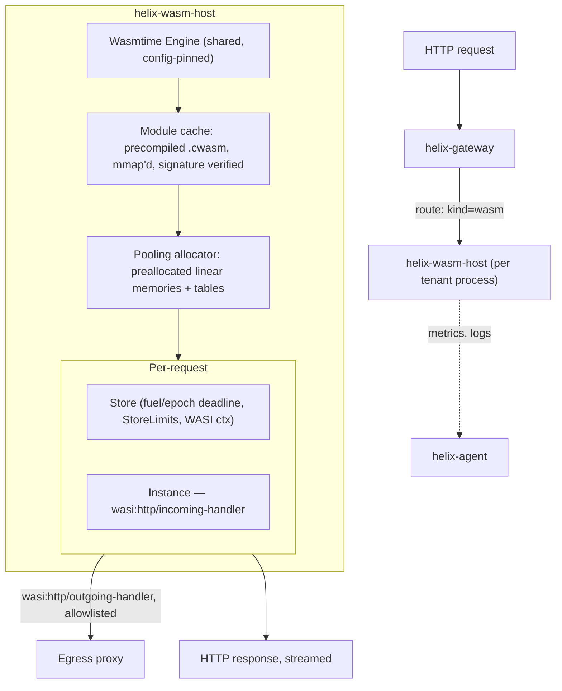
```mermaid
graph TB
    REQ[HTTP request] --> GW2[helix-gateway]
    GW2 -->|route: kind=wasm| WH["helix-wasm-host (per tenant process)"]
    subgraph WH2["helix-wasm-host"]
        ENG["Wasmtime Engine (shared, config-pinned)"]
        MOD["Module cache: precompiled .cwasm, mmap'd, signature verified"]
        POOL["Pooling allocator: preallocated linear memories + tables"]
        subgraph INST["Per-request"]
            ST["Store (fuel/epoch deadline, StoreLimits, WASI ctx)"]
            IN["Instance — wasi:http/incoming-handler"]
        end
        ENG --> MOD --> POOL --> INST
    end
    INST -->|wasi:http/outgoing-handler, allowlisted| EGRESS[Egress proxy]
    INST --> RESP[HTTP response, streamed]
    WH -.->|metrics, logs| AGENT3[helix-agent]
```

### 8.4 Key mechanics

**Component Model + WIT.** Target WASI Preview 2 and the component model, not raw core modules with ad-hoc imports. The contract for an HTTP app is `wasi:http/incoming-handler@0.2.x`, which means:

```wit
// Conceptually, what the platform requires of a wasm deployment
world helix-http {
  import wasi:http/outgoing-handler@0.2.3;   // gated by policy
  import wasi:cli/environment@0.2.3;
  import wasi:clocks/wall-clock@0.2.3;
  import wasi:random/random@0.2.3;
  import wasi:logging/logging;               // platform log sink
  import helix:kv/store;                     // optional platform KV
  export wasi:http/incoming-handler@0.2.3;
}
```

Defining a `world` is what makes this extensible without core changes: a new language is supported the moment its toolchain can produce a component satisfying this world. The platform's ABI is a WIT file in `runtime-definitions/`, versioned.

**Precompilation.** `wasmtime compile` (or `Engine::precompile_component`) produces a `.cwasm` — native code for a specific CPU/OS/Wasmtime version. Do this **in the build sandbox**, not on the serving host, then sign it. At serve time the host uses `Component::deserialize_file` on a signature-verified artifact, which is fast (mmap) and does not run Cranelift on untrusted input.

Consequences you must design for:
- `.cwasm` is tied to `(wasmtime_version, target_triple, cpu_features, engine_config)`. Encode all of that in the artifact key. A Wasmtime upgrade invalidates every `.cwasm` → you need a recompile pipeline and a fallback to JIT-compiling in a sandbox during the transition.
- Build once per target architecture you serve (x86-64-v3, aarch64).

**Pre-initialization (Wizer).** For languages with expensive startup (a JS engine parsing your bundle, a Python interpreter importing modules), run initialization at build time and snapshot the resulting linear memory into the module. This routinely turns a 100 ms JS cold start into ~1 ms. Apply it as a build step in the WASM runtime definition.

**CPU limits.** Two mechanisms:
- *Epoch interruption* (recommended default): a background thread bumps an epoch counter; the guest yields at safe points. ~Free at runtime. Granularity is coarse but adequate for a request deadline.
- *Fuel*: exact instruction accounting, enables precise metering and billing by "work done," but costs ~10–30% throughput.

Use epochs for timeouts, and fuel only for a metered tier where you want to bill per-instruction.

**Memory limits.** `StoreLimitsBuilder::memory_size(n)` plus the pooling allocator's fixed per-instance memory reservation. The pooling allocator preallocates a slab of linear memories with guard pages and reuses them — this is what makes instantiation microsecond-scale. Configure `PoolingAllocationConfig` with explicit `total_memories`, `max_memory_size`, `total_core_instances`; these are hard caps and are your density knob.

**Concurrency model.** One `Store` per request (or per short-lived session). Stores are not `Sync`; run N worker threads, each pulling requests and creating stores. Async host functions (`Config::async_support(true)`) + epoch-based yielding lets a thread multiplex many in-flight requests that are blocked on I/O.

**Filesystem.** Deny by default. Optionally grant a read-only preopen of a bundled assets directory, and a small writable `tmpfs`-like in-memory FS. Never a host path.

**Networking.** `wasi:sockets` denied by default. Outbound HTTP only via `wasi:http/outgoing-handler`, which the host implements — meaning every outbound request passes through your code and your allowlist. This is a *better* egress control point than nftables, because it is at the semantic layer.

**Instance recycling.** Three modes, per-project configurable:
| Mode | Isolation | Perf |
|---|---|---|
| Fresh instance per request (default) | Strongest — no state leaks between requests | Microsecond instantiation makes this cheap |
| Reuse instance for N requests | Weaker; app must not leak state | Slightly faster, keeps app-level caches |
| Long-lived instance | Weakest | Only for trusted / platform middleware |

Default to fresh-per-request. It is the property that makes WASM safe for dense multi-tenancy and it is what customers will get wrong if you let them.

### 8.5 Hardening the WASM host

- One `helix-wasm-host` process **per tenant**, not per instance and not global. A Wasmtime escape then lands in a process that only ever ran that tenant's code.
- That process runs unprivileged, under seccomp, in its own netns and mount ns, with no filesystem access beyond its module cache (read-only, `O_PATH` opened before sandboxing).
- **[V1]** For a "high isolation" tier, run the wasm host pool inside a Firecracker microVM. You lose a little density and gain hardware isolation. This is the right place to land for untrusted public workloads; the density is still far better than one VM per app because one VM hosts thousands of wasm instances of *one tenant*.
- Wasmtime config: enable the pooling allocator, disable features you do not need (`wasm_threads(false)` unless required — shared memory complicates isolation), keep `wasm_bulk_memory`, `wasm_simd` as appropriate, and pin the exact Wasmtime version per artifact.
- Patch Wasmtime aggressively. Subscribe to its security advisories. Its CVE history is short but real, and you are running a JIT-compiled sandbox as your only boundary in the non-nested configuration.

### 8.6 Cold start and density expectations

| Metric | WASM (precompiled, pooled) | Firecracker (no snapshot) | Firecracker (snapshot) |
|---|---|---|---|
| Time to first byte, cold | 0.1–2 ms | 120–400 ms + app startup | 10–60 ms + post-restore hooks |
| Memory per idle instance | 1–10 MiB | 40–500 MiB | same |
| Instances per 256 GiB host | 10,000–50,000 | 300–800 | 300–800 |
| Max request duration | Seconds (design for short) | Unbounded | Unbounded |
| Language coverage | Narrow | Complete | Complete |

### 8.7 WASM vs Firecracker vs Containers

| Dimension | Containers (runc/gVisor) | Firecracker microVM | WASM (Wasmtime) |
|---|---|---|---|
| Isolation boundary | Shared host kernel + namespaces/seccomp (gVisor: userspace kernel) | Hardware virtualization (KVM) | Software sandbox in a JIT runtime |
| Isolation strength for untrusted multi-tenant | Weak (runc) / medium (gVisor) | **Strong** | Medium-strong for memory safety; single-runtime-bug risk |
| Cold start | 50–200 ms | 120–400 ms (10–60 ms w/ snapshot) | **0.1–2 ms** |
| Memory overhead per instance | ~1–5 MiB | ~3–5 MiB VMM + guest kernel + guest userspace | **~1 MiB** |
| Density per host | High | Medium | **Very high** |
| Language support | **Everything** | **Everything** | Subset, growing |
| Syscall/OS compatibility | Full Linux | Full Linux | WASI subset only |
| Threads / async | Full | Full | Limited (threads proposal immature) |
| Long-running processes | Yes | Yes | Awkward |
| Filesystem | Full | Full | Capability-scoped, virtual |
| Native dependencies | Yes | Yes | Only if compiled to wasm |
| Snapshot/restore | Checkpoint/restore (CRIU, fragile) | **First-class** | Wizer pre-init at build time |
| GPU / special hardware | Yes | Not practically (no PCI passthrough in Firecracker) | No |
| Operational maturity | Highest | High | Medium |
| Where it wins | Trusted internal workloads; CI | **Untrusted general-purpose apps** | **Untrusted tiny, short, dense workloads** |

**Why containers are rejected as the primary untrusted runtime:** the shared-kernel boundary has a long history of escapes (`runc` CVE-2019-5736, CVE-2024-21626, cgroup release_agent, `/proc/self/exe`), and the Linux kernel's syscall surface is ~350 syscalls of attack surface no seccomp profile fully tames for general workloads. gVisor is a credible middle ground with a smaller escape surface but costs 15–50% on syscall-heavy workloads and has its own compatibility gaps. For a business whose entire premise is running strangers' code, hardware virtualization is worth its cost.

**Note:** containers still appear inside your architecture — as the *packaging format* (OCI) and inside build VMs. The rejection is specifically of container-as-isolation-boundary-for-untrusted-tenants.

---
## 9. Universal Runtime Specification

### 9.1 The two documents

There is a critical separation that makes "add a language without touching the core" actually work:

| Document | Owned by | Lives in | Purpose |
|---|---|---|---|
| **Runtime Definition** | The platform (or a community contribution) | `runtime-definitions/<name>/<version>.yaml`, versioned and signed | Describes *how to build and run* a language: build image, run image, default commands, detection heuristics, cache paths, health defaults |
| **Project Configuration** (`helix.yaml`) | The user | The user's repository | Selects a runtime and overrides specifics for their app |

Adding Bun = adding one YAML file and two container images to a registry. It requires no code change, no deploy of the control plane, no scheduler change. That is the test of whether the abstraction is right.

### 9.2 Runtime Definition schema

```yaml
# runtime-definitions/java/21.yaml
apiVersion: helix.dev/v1
kind: RuntimeDefinition

metadata:
  name: java
  version: "21"
  aliases: ["java21", "jdk21"]
  display_name: "Java 21 (Temurin)"
  status: ga                 # ga | beta | experimental | deprecated
  deprecated_after: null
  maintainer: "platform-team"

detect:                       # used by `helix init` to autodetect; never at deploy time
  files: ["pom.xml", "build.gradle", "build.gradle.kts"]
  priority: 50

build:
  image: "ghcr.io/helix/build-java@sha256:5f2c..."    # ALWAYS pinned by digest
  default_command: |
    if [ -f mvnw ]; then ./mvnw -B -DskipTests package;
    elif [ -f gradlew ]; then ./gradlew --no-daemon build -x test;
    else mvn -B -DskipTests package; fi
  workdir: /src
  cache_paths:                # become BuildKit cache mounts, scoped per project
    - /root/.m2
    - /root/.gradle
  env:
    JAVA_TOOL_OPTIONS: "-XX:+UseSerialGC -Xshare:auto"
    MAVEN_OPTS: "-Dmaven.repo.local=/root/.m2/repository"
  output:
    # glob(s) copied into the run stage
    artifacts: ["target/*.jar", "build/libs/*.jar"]
    dest: /app

run:
  image: "ghcr.io/helix/run-java@sha256:9b41..."      # JRE only, distroless-ish
  default_command: ["sh","-c","exec java $JAVA_OPTS -jar /app/app.jar"]
  workdir: /app
  user: "65534:65534"
  env:
    JAVA_OPTS: "-XX:MaxRAMPercentage=75 -XX:+UseSerialGC -XX:TieredStopAtLevel=1 -XX:+UseContainerSupport"
  # signals the platform uses for graceful shutdown
  stop_signal: SIGTERM
  stop_grace_period: 30s

defaults:
  http:
    port: 8080
    port_env: PORT            # platform injects PORT; runtime tells us the convention
  resources:
    vcpu: 1
    memory: 512Mi
    ephemeral_storage: 1Gi
  health:
    startup:  { type: tcp, timeout: 90s, initial_delay: 2s }
    readiness: { type: tcp, period: 10s, failures: 3 }
  scaling:
    target_concurrency: 40

capabilities:
  wasm_compatible: false
  supports_snapshot: true
  snapshot_warmup_requests: 3     # hit the health endpoint N times before snapshotting
  architectures: ["amd64", "arm64"]

limits:
  max_build_memory: 8Gi
  max_image_size: 2Gi
```

**Why every field exists:**
- `build.image` / `run.image` pinned **by digest** — a tag-based reference means the platform's behavior changes silently under users, and it is a supply-chain hole.
- `cache_paths` — the platform knows where each ecosystem caches; users should not have to.
- `output.artifacts` — enables a two-stage build without users writing a Dockerfile, which is where most of the image-size win comes from.
- `port_env` — some ecosystems read `PORT`, some need a flag. The definition encodes it.
- `snapshot_warmup_requests` — JVM/`.NET` need warm-up before snapshotting or the snapshot captures a cold JIT.
- `status` / `deprecated_after` — you will need to sunset language versions; design for it now.

### 9.3 Project configuration (`helix.yaml`) — complete schema

```yaml
# helix.yaml — the "vercel.json" of this platform
version: 1                                   # config schema version, required

name: my-api                                  # project name; [a-z0-9-]{1,40}

runtime:
  kind: firecracker                           # firecracker | wasm    (default: firecracker)
  type: java                                  # runtime definition name
  version: "21"                               # resolved against available definitions
  architecture: amd64                         # amd64 | arm64 | auto

build:
  # Mode A: managed runtime (default)
  command: ./mvnw -B -DskipTests package
  output: target/app.jar                      # overrides runtime default artifact glob
  # Mode B: bring your own Dockerfile
  # dockerfile: ./Dockerfile
  # context: .
  # target: production                        # multi-stage target
  # Mode C: prebuilt image (mutually exclusive with the above)
  # image: ghcr.io/me/app@sha256:...
  env:                                        # build-time only, NOT present at runtime
    MAVEN_PROFILE: prod
  secrets: ["NPM_TOKEN"]                      # names of build secrets to mount
  cache: true
  network: allowlist                          # allowlist | none
  extra_hosts: ["internal.npm.mycorp.com"]    # requires approval
  timeout: 20m
  ignore: [".git", "docs/**", "*.md"]

run:
  command: ["java","-jar","/app/app.jar"]     # overrides runtime default
  workdir: /app
  user: "65534:65534"

http:
  port: 8080
  protocol: http1                             # http1 | http2 | h2c
  request_timeout: 30s
  idle_timeout: 60s
  max_request_body: 10Mi
  max_response_body: 100Mi                    # 0 = unlimited (streaming)
  websockets: false
  streaming: true

resources:
  cpu: 1                                      # vCPU, may be fractional: 0.25, 0.5, 1, 2, 4
  memory: 512Mi
  ephemeral_storage: 1Gi

scaling:
  min_instances: 0                            # 0 enables scale-to-zero
  max_instances: 10
  target_concurrency: 50                      # requests in flight per instance
  scale_down_delay: 60s
  # optional secondary signals
  target_cpu_percent: 70
  cold_start_budget: 5s                       # queue this long before returning 503

health:
  startup:
    type: http                                # http | tcp | exec | none
    path: /healthz
    timeout: 60s
    initial_delay: 1s
  readiness:
    type: http
    path: /healthz
    period: 10s
    timeout: 2s
    failure_threshold: 3
  liveness:
    type: http
    path: /healthz
    period: 30s
    failure_threshold: 5                      # restarts the instance

env:                                          # plaintext, per-environment
  LOG_LEVEL: info
  FEATURE_X: "true"

secrets:                                      # names only; values set out-of-band
  - DATABASE_URL
  - STRIPE_SECRET_KEY

environments:                                 # per-environment overrides
  production:
    scaling: { min_instances: 2, max_instances: 50 }
    env: { LOG_LEVEL: warn }
    regions: ["sin1", "fra1"]
  preview:
    scaling: { min_instances: 0, max_instances: 2 }
    resources: { memory: 256Mi }

regions: ["sin1"]                             # default placement

routes:                                       # optional path-based routing / rewrites
  - src: "/api/(.*)"
    dest: "/$1"
  - src: "/old-path"
    redirect: "/new-path"
    status: 308

headers:
  - for: "/static/(.*)"
    set:
      Cache-Control: "public, max-age=31536000, immutable"

lifecycle:
  pre_stop: ["sh","-c","sleep 5"]             # run before SIGTERM, for LB drain
  stop_grace_period: 30s

observability:
  log_format: json                            # json | text
  otel: true                                  # inject OTEL_EXPORTER_OTLP_ENDPOINT

deploy:
  strategy: canary                            # immediate | canary | blue-green
  canary:
    steps: [5, 25, 100]
    interval: 2m
    auto_rollback:
      error_rate_threshold: 0.05
      p95_latency_multiplier: 2.0
```

### 9.4 Improvements over the naive version

The configuration in the original brief was a reasonable start. Changes worth making explicit:

1. **`version: 1` at the top.** You *will* need to evolve this schema. Without a version field, every change is a compatibility crisis.
2. **`runtime.kind` separate from `runtime.type`.** `kind` selects the execution engine (firecracker/wasm); `type` selects the language. Conflating them means `wasm` becomes a fake "language."
3. **`environments` block.** Without it, users maintain three copies of the config or wire up templating. This is the single most-requested feature in every platform of this type.
4. **Health checks split into startup/readiness/liveness.** A single "health" check cannot express "this takes 90 s to boot but should be restarted if it hangs for 30 s later." Conflating them causes crashloops on slow-starting apps — the classic Kubernetes footgun; do not repeat it.
5. **`build.env` and `build.secrets` distinct from runtime `env`/`secrets`.** Different trust contexts (§5.4).
6. **`scaling.cold_start_budget`.** Makes the scale-to-zero latency contract explicit and user-tunable rather than a hidden platform constant.
7. **`deploy.strategy` with auto-rollback thresholds.** Rollback as a first-class config, not a manual operation.
8. **`architecture: auto`.** Lets you introduce arm64 workers and migrate users by cost without breaking anyone.
9. **`build.network: none`** as a first-class option — better security and faster builds, and it gives you something to recommend.
10. **No `regions` at top level only** — regions belong per-environment too, since preview deployments should be cheap and single-region.

### 9.5 Validation

Validation happens in three places, with different jobs:

| Stage | What | Failure behavior |
|---|---|---|
| **CLI (`helix validate`)** | JSON Schema + semantic lint + "did you mean" suggestions | Immediate, local, free |
| **API admission** | Re-validate (never trust the client), plus authorization-aware checks: are these resources within the org's plan? Is this region enabled for you? Does the referenced runtime version exist and is it not deprecated? Are the named secrets defined? | `422` with a structured error list: `[{path: "scaling.max_instances", code: "quota_exceeded", message: "...", limit: 10}]` |
| **Build/run materialization** | Fully resolved spec must satisfy invariants (port in range, command non-empty, image digest present) | Internal error — indicates a platform bug |

**Security implications of the schema — each field is an attack surface:**

| Field | Risk | Control |
|---|---|---|
| `build.command` / `run.command` | Arbitrary code — but that is the product. The risk is *injection into the platform's own shell context* | Never string-interpolate user commands into a host-side shell. Pass as an `argv` array into the guest, or write to a file the guest executes. Template rendering happens into a Dockerfile that BuildKit parses — validate that the command cannot break out of the heredoc/quoting |
| `build.dockerfile` path, `build.context` | Path traversal to read outside the repo | Canonicalize and reject anything outside the checkout root; reject symlinks crossing the boundary |
| `build.image` / prebuilt image | Pulling an arbitrary image | §10 policy: allowlist or scan+sign requirements |
| `build.extra_hosts` | Egress allowlist bypass → SSRF | Requires review/approval; never allows IP literals, RFC1918, or metadata addresses |
| `resources.*` | Resource exhaustion | Hard plan ceilings, enforced server-side |
| `scaling.max_instances` | Cost/DoS | Plan ceiling; also a global per-org instance cap |
| `env` keys | Overriding platform-injected vars (`PORT`, `HELIX_*`, `LD_PRELOAD`) | **Reserved prefix list**: reject `HELIX_*`; warn on `LD_PRELOAD`, `LD_LIBRARY_PATH`, `PATH` overrides; platform vars are injected *after* user vars so they win |
| `routes[].src` regex | ReDoS in the router | Use RE2 (no backtracking) for user-supplied patterns, or restrict to a glob subset. **Never** run user regexes on a backtracking engine in the request path |
| `routes[].dest` | Open redirect / SSRF via rewrite | Rewrites are path-only; redirects to external hosts require an explicit allowlist and are flagged |
| `headers[].set` | Header injection, cache poisoning | Reject CR/LF, reject hop-by-hop headers, reject `Host`, forbid overriding platform security headers |
| `health.*.path` | Pointing a probe at an expensive endpoint | Document; rate-limit probes; cap probe frequency |
| `lifecycle.pre_stop` | Indefinite hang blocking drains | Hard cap at `stop_grace_period` |
| YAML itself | Billion-laughs, aliases, arbitrary tags | Parse with a **safe** YAML loader, alias expansion limits, 256 KiB document cap, max nesting depth |

### 9.6 Resolution order

Later wins:

```text
runtime definition defaults
  → project settings stored in the dashboard
    → helix.yaml base
      → helix.yaml environments.<env>
        → deploy-time CLI flags / API overrides
          → platform-injected reserved variables (always last)
```

The **fully resolved** result is hashed and stored in the `ReleaseSpec`. Nothing re-resolves later. This is what makes rollback exact.

---

## 10. Custom Runtimes

### 10.1 The three entry points

| Mode | User provides | Platform does |
|---|---|---|
| Managed runtime | `helix.yaml` with `runtime.type` | Builds from a platform template |
| **Dockerfile** | `Dockerfile` + `helix.yaml` | Builds the Dockerfile in the sandbox |
| **Prebuilt image** | `image: registry/x@sha256:...` + credentials | Pulls, validates, re-hosts, runs |

Modes 2 and 3 are what make "any Linux application" true.

### 10.2 Dockerfile support

Supported: standard Dockerfile syntax via BuildKit, including multi-stage, `--mount=type=cache`, `--mount=type=secret`, `ARG`, `HEALTHCHECK` (mapped to `health` defaults), `EXPOSE` (hint for `http.port`), `USER`, `WORKDIR`, `ENTRYPOINT`/`CMD`, `ONBUILD` (discouraged).

Not supported / rewritten:
| Feature | Handling |
|---|---|
| `--privileged`, `--security-opt` build flags | Not exposed |
| `--network=host` | Not exposed |
| `VOLUME` | Ignored with a warning — the platform's filesystem is ephemeral (§14) |
| `--mount=type=bind,from=<host path>` | Restricted to build context and named stages only |
| `--platform` mismatched with project architecture | Rejected with a clear error |
| Layers exceeding size limits | Rejected pre-push |

### 10.3 Image requirements

The platform must be able to run the image. Validation at release creation:

1. **Manifest/config sanity** — valid OCI or Docker v2.2 manifest, architecture matches the target, ≤ N layers (e.g. 127, the practical overlay limit), total uncompressed size ≤ plan limit.
2. **Entrypoint exists** — after flattening, the resolved command's binary is present and executable. Catch "typo'd path" at deploy time, not as a crashloop.
3. **Dynamic linking** — if the entrypoint is dynamically linked, its interpreter (`/lib64/ld-linux-x86-64.so.2` or musl equivalent) must be present. A shockingly common failure with `FROM scratch` and `FROM alpine` + glibc binaries; detect it and produce a real error message.
4. **No setuid surprises needed** — the platform strips file capabilities and setuid bits from the rootfs by default (with an opt-out), because they are useless in a single-user guest and are a privilege-escalation aid.
5. **Port reachability** — after boot, the startup probe must succeed. Guide users: bind `0.0.0.0:$PORT`, not `127.0.0.1`. This is the #1 support ticket in every platform of this kind; detect "listening on loopback only" from inside the guest via `vminit` reading `/proc/net/tcp` and emit a specific, actionable error.

### 10.4 External registry support

Users can deploy from Docker Hub, GHCR, ECR, GAR, or a private registry.

- Credentials stored as secrets, encrypted, scoped to the project, used only by the builder/importer.
- Platform **copies the image into the internal registry by digest** rather than pulling from the external registry at instance-start. Reasons: (a) availability — a Docker Hub outage should not stop your scale-ups, (b) rate limits — Docker Hub's pull limits will absolutely bite you, (c) immutability — an external tag can be re-pointed under you, (d) network policy — workers need no external registry egress at all.
- Mirroring happens once per digest, at deploy time, with the image re-signed by the platform.

### 10.5 Base image policy

Three policy modes, selectable per plan and per org:

| Mode | Behavior | For |
|---|---|---|
| `open` | Any base image; scan results advisory | Default self-serve |
| `curated` | Base image must be in the platform's verified set (distroless, alpine, debian-slim, ubuntu, language official images), pinned by digest, or derive from one | Enterprise/compliance |
| `signed-only` | Image must carry a valid signature from a key the org trusts | Enterprise |

Even in `open` mode, enforce hard rules: no images from hosts on a denylist, no images over the size limit, no images whose manifest declares `os != linux`, and always scan + SBOM.

### 10.6 Vulnerability scanning policy

- Scan every image with Trivy/Grype against OSV + distro advisories at build time and **re-scan periodically** (new CVEs appear for images you already shipped). Surface "your running production release has a new critical CVE" as a notification — this is genuinely valuable and differentiating.
- **Advisory by default.** A blocking policy on `CRITICAL` would block essentially every Debian-based image on day one and destroy the developer experience. Make blocking opt-in per org, with configurable severity and a "fixable only" filter (blocking on unfixable CVEs is pure friction).
- Cache scan results by image digest — rescanning the same digest is wasted money.

### 10.7 Image signing and admission

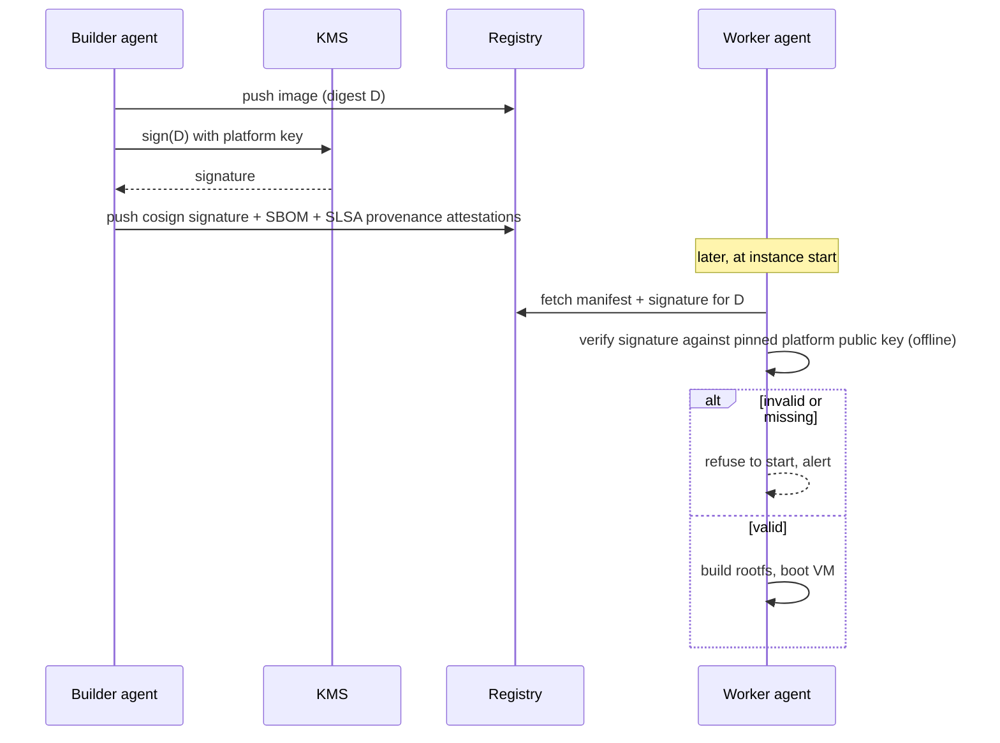
```mermaid
sequenceDiagram
    participant B as Builder agent
    participant K as KMS
    participant R as Registry
    participant A as Worker agent
    B->>R: push image (digest D)
    B->>K: sign(D) with platform key
    K-->>B: signature
    B->>R: push cosign signature + SBOM + SLSA provenance attestations
    Note over A: later, at instance start
    A->>R: fetch manifest + signature for D
    A->>A: verify signature against pinned platform public key (offline)
    alt invalid or missing
        A-->>A: refuse to start, alert
    else valid
        A->>A: build rootfs, boot VM
    end
```

This closes the loop: even an attacker with registry write access cannot get code executed on the fleet without the signing key, which lives in KMS/HSM and is only usable by the builder service role.

### 10.8 Architecture compatibility

- Every release records `architecture`. The scheduler only places on matching workers.
- `architecture: auto` builds multi-arch when the runtime definition supports it, and the scheduler prefers arm64 (cheaper) with amd64 as fallback.
- Cross-arch builds: prefer **native builders** (an arm64 build worker pool) over QEMU emulation, which is 3–10× slower and has subtle bugs. Mixed-arch fleets are a V1+ cost optimization worth real money (roughly 20–40% on compute), but not an MVP concern.

---
## 11. HTTP Routing

### 11.1 The request path

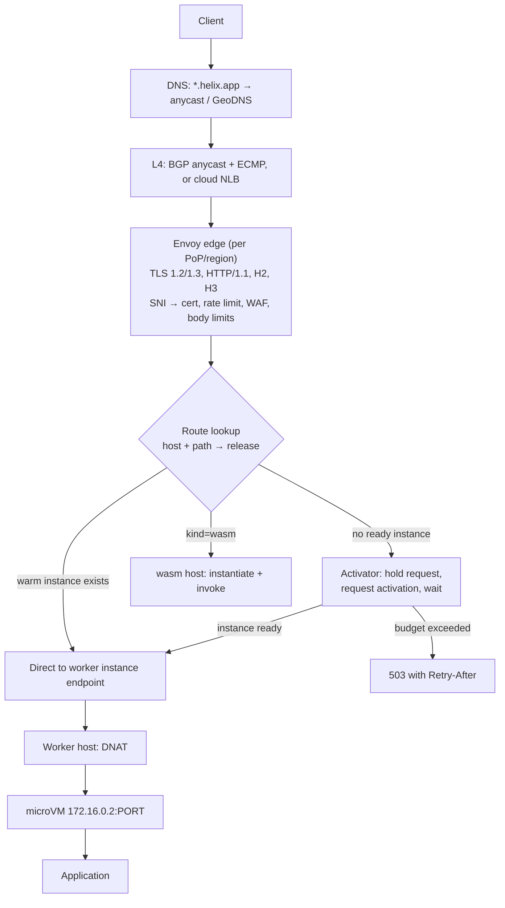
```mermaid
graph TB
    C[Client] --> DNS["DNS: *.helix.app → anycast / GeoDNS"]
    DNS --> LB["L4: BGP anycast + ECMP, or cloud NLB"]
    LB --> ENV["Envoy edge (per PoP/region)<br/>TLS 1.2/1.3, HTTP/1.1, H2, H3<br/>SNI → cert, rate limit, WAF, body limits"]
    ENV --> RT{Route lookup<br/>host + path → release}
    RT -->|warm instance exists| DIRECT[Direct to worker instance endpoint]
    RT -->|no ready instance| ACTV["Activator: hold request,<br/>request activation, wait"]
    ACTV -->|instance ready| DIRECT
    ACTV -->|budget exceeded| E503["503 with Retry-After"]
    DIRECT --> WK["Worker host: DNAT"]
    WK --> VM["microVM 172.16.0.2:PORT"]
    VM --> APP["Application"]
    RT -->|kind=wasm| WH3["wasm host: instantiate + invoke"]
```

### 11.2 Proxy selection

**Problem.** The edge proxy must: terminate TLS for tens of thousands of custom domains with dynamic certs; route on `Host` + path to a set of dynamically-changing upstream endpoints (instances appear and disappear every second); support H2 and ideally H3; support WebSockets and streaming; emit good telemetry; and be reconfigurable thousands of times per minute **without dropping connections**.

**Candidates.**

| Criterion | Envoy | HAProxy | Nginx (OSS) |
|---|---|---|---|
| Dynamic config without reload | **xDS: native, incremental (delta xDS), designed for exactly this** | Runtime API + `server-template` slots: good for servers, awkward for adding *new backends/frontends*; cert updates possible via runtime API | Reload-based (`nginx -s reload`) — spawns new workers, drains old. Works, but at thousands of reloads/hour it is memory-churny and error-prone. OSS lacks dynamic upstream APIs (that is NGINX Plus) |
| TLS SNI with 50k+ certs | Good; SDS for dynamic certs, supports lazy cert loading | Good, `crt-list` + runtime API | Requires files + reload, or Lua/njs hacks |
| HTTP/3 | Yes (QUIC) | Yes (recent versions) | Yes (recent) |
| gRPC / H2 upstream | Excellent | Good | Adequate |
| WebSockets / streaming | Yes | Yes | Yes |
| Observability | Best-in-class stats, access log formats, OpenTelemetry native | Good | Basic |
| Extensibility in the request path | ext_authz, ext_proc, Lua, **Wasm filters** | Lua, SPOE | njs, Lua (3rd party) |
| Raw throughput / latency | Good; higher memory and CPU per connection than HAProxy | **Best** | Very good |
| Memory footprint | Highest (~100s MB with large configs) | Lowest | Low |
| Operational complexity | **Highest** — xDS control plane is a system you must build and operate | Low | Lowest |
| Config debuggability | Hard (generated protobuf) | Easy | Easiest |

**Decision: Envoy at the edge, with a Go xDS control plane, plus a separate `helix-gateway` activator. [MVP → V1]**

Why: the defining requirement is **high-frequency dynamic reconfiguration of routes, clusters, endpoints and certificates**. That is precisely what xDS was built for, and every alternative requires you to invent a worse version of it. The Wasm/ext_proc extension points also give you a place to run per-tenant edge middleware later without forking a proxy.

**Tradeoffs, stated honestly:**
- You must build and operate an xDS server. `go-control-plane` makes this tractable but it is real work and a real source of outages (a bad snapshot can break all routing at once — mitigate with snapshot validation, canary Envoys, and a "last known good" fallback).
- Envoy's memory footprint with 50k routes and 50k certs is substantial. Mitigations: on-demand/delta xDS (VHDS for virtual hosts, on-demand CDS), and lazy SDS so certs load on first SNI hit rather than all at boot.
- Envoy is harder to debug at 3 a.m. than an nginx config file. Invest in `/config_dump` tooling and good dashboards early.

**Why not HAProxy:** it is the fastest and leanest, and for a *static* set of backends it would win. But `server-template` requires pre-allocating slots for maximum backend count, and adding new frontends/backends still needs a reload. For a platform where "backend set" changes continuously, this becomes a constant fight.

**Why not Nginx OSS:** reload-driven configuration at this change rate is the wrong model, and the dynamic features you would need are in the commercial product.

**Alternative worth revisiting at [SCALE]:** write the edge in Rust on **Pingora** (or `hyper` + `rustls`). Cloudflare's rationale — lower memory per connection, better connection reuse, full control — applies directly at very large scale. Do not do this before you have a working product; it is a 6–12 month project that adds no user-visible value on day one.

### 11.3 Route table and propagation

The route table is small and simple by design:

```text
(host, path_prefix) → route {
    release_id, kind, weight, timeouts, body limits,
    endpoints: [ {worker_ip, port, zone, capacity_hint} ],
    scale_to_zero: bool, cold_start_budget
}
```

Propagation, two tiers:

1. **Envoy xDS** — hosts, TLS certs, and the *coarse* cluster (pointing at the `helix-gateway` pool for scale-to-zero apps, or directly at an EDS cluster of instance endpoints for always-on apps). Updated on release changes: order of hundreds per minute. Fine for xDS.
2. **Gateway route cache** — the fine-grained, rapidly-changing part (which instances are ready *right now*) lives in the gateway process, fed by (a) a Redis-backed snapshot with a generation counter and (b) a gRPC stream from the control plane. Instance churn is thousands per minute; pushing that through xDS would be wasteful.

This two-tier split is the key design choice: **Envoy handles the slow-changing parts (TLS, hostnames); the gateway handles the fast-changing parts (live endpoints, activation).**

Generations are monotonic per route; the gateway ignores any update with a generation ≤ what it already has. If the control plane is unreachable, the gateway keeps serving the last-known table indefinitely, marking it stale in metrics.

### 11.4 The activator (scale-to-zero request path)

This component is what makes serverless feel instant-ish, and it does not exist in off-the-shelf proxies.

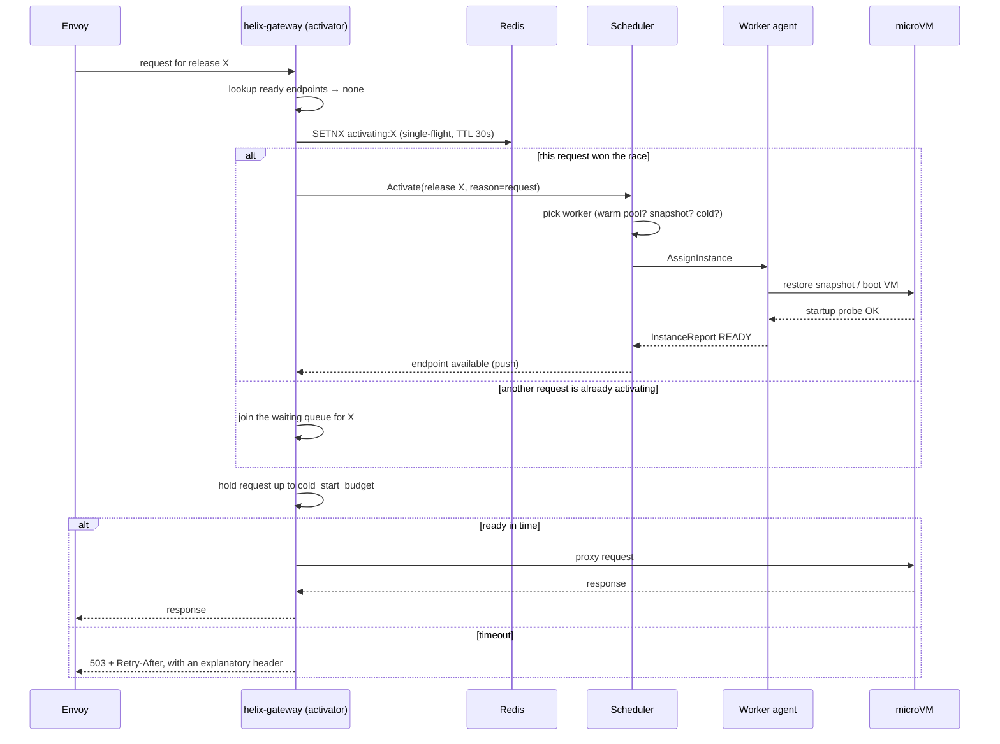
```mermaid
sequenceDiagram
    participant E as Envoy
    participant G as helix-gateway (activator)
    participant R as Redis
    participant S as Scheduler
    participant A as Worker agent
    participant V as microVM

    E->>G: request for release X
    G->>G: lookup ready endpoints → none
    G->>R: SETNX activating:X (single-flight, TTL 30s)
    alt this request won the race
        G->>S: Activate(release X, reason=request)
        S->>S: pick worker (warm pool? snapshot? cold?)
        S->>A: AssignInstance
        A->>V: restore snapshot / boot VM
        V-->>A: startup probe OK
        A-->>S: InstanceReport READY
        S-->>G: endpoint available (push)
    else another request is already activating
        G->>G: join the waiting queue for X
    end
    G->>G: hold request up to cold_start_budget
    alt ready in time
        G->>V: proxy request
        V-->>G: response
        G-->>E: response
    else timeout
        G-->>E: 503 + Retry-After, with an explanatory header
    end
```

Design requirements:
- **Single-flight per release.** 500 concurrent requests to a cold app must cause one cold start, not 500. Redis `SETNX` plus in-process coalescing.
- **Bounded queue.** Per-release queue cap (e.g. `target_concurrency × max_instances`); beyond that, shed with 503 immediately rather than building an unbounded backlog.
- **Request buffering.** The activator must buffer the request body up to `max_request_body` to be able to replay it to the instance. Above that limit, stream — which means you cannot retry, so document it.
- **Progressive scale-up.** While holding N queued requests, tell the scheduler `N / target_concurrency` instances are needed, not one.
- **Hand-off.** Once instances exist, the gateway proxies directly; for always-on releases Envoy can bypass the gateway entirely and go straight to instance endpoints (one less hop for the hot path).
- **Fairness.** One tenant's cold-start storm must not exhaust gateway memory. Per-tenant queue and memory budgets.

### 11.5 TLS, domains and certificates

| Concern | Design |
|---|---|
| Platform wildcard (`*.helix.app`, `*.preview.helix.app`) | One wildcard cert per zone via ACME DNS-01, auto-renewed, distributed via SDS. Note: `*.helix.app` does **not** cover `a.b.helix.app` — use a dedicated label scheme (`<slug>-<hash>.helix.app`) so one wildcard suffices |
| Custom domains | User adds `api.customer.com`; platform verifies ownership via a `TXT` record or by observing the CNAME/A pointing at the platform; then issues a cert via ACME HTTP-01 (once traffic routes) or DNS-01 (if the user delegates) |
| Apex domains | Provide an anycast A/AAAA target, or ALIAS/ANAME guidance per DNS provider |
| Cert storage | Encrypted in Postgres (private keys via envelope encryption), distributed to Envoy via SDS over mTLS. Never on Envoy's local disk unencrypted |
| Renewal | Renew at 2/3 of lifetime; alert on failures ≥ 14 days before expiry; a cert-expiry outage is one of the most common platform incidents — monitor it as a P1 SLO |
| ACME rate limits | Let's Encrypt limits (50 certs/registered-domain/week, 300 new orders/3h) will bite. Mitigations: use the wildcard for platform domains; batch SANs where appropriate; consider a second CA (ZeroSSL/Google Trust) as failover; implement your own order queue with backoff |
| OCSP / revocation | OCSP stapling enabled; must-staple optional |
| TLS versions | 1.2 and 1.3 only; modern cipher suites; HSTS optional per domain (with a clear warning — HSTS is hard to undo) |
| mTLS for customers | [SCALE] per-domain client cert requirements |

### 11.6 Protocol support

| Feature | Client ↔ Envoy | Envoy ↔ gateway/instance | Notes |
|---|---|---|---|
| HTTP/1.1 | ✅ | ✅ | Default to instances |
| HTTP/2 | ✅ | ✅ (h2c if app supports) | `http.protocol: http2` in config |
| HTTP/3 (QUIC) | ✅ [V1] | ❌ (unnecessary internally) | Advertise via `Alt-Svc`; requires UDP/443 at the LB and careful anycast handling |
| WebSockets | ✅ | ✅ (upgrade passthrough) | Must be opted into (`http.websockets: true`) because it breaks scale-to-zero assumptions: a WS connection pins an instance. Bill accordingly and exclude from concurrency-based scale-down |
| SSE / streaming responses | ✅ | ✅ | Disable response buffering for these routes; ensure `max_response_body` does not truncate |
| gRPC | ✅ | ✅ | Works as H2; trailers must pass through |
| Request/response compression | Envoy brotli/gzip filter | — | Do it at the edge, not in every customer app |

### 11.7 Timeouts, limits and their interaction

Get these consistent or you will produce mysterious 502s.

| Parameter | Default | Notes |
|---|---|---|
| Client idle timeout (Envoy) | 300 s | |
| Request header timeout | 10 s | Slowloris defense |
| **Request timeout (end-to-end)** | 30 s (max 900 s with streaming) | Must be > cold start budget + app processing |
| Cold start budget | 5 s (configurable to 60 s) | The activator's hold time |
| Upstream connect timeout | 2 s | To a known-ready instance |
| Upstream idle timeout | 60 s | Must be **shorter** than the app's keep-alive timeout, otherwise you race the server closing a connection and get spurious 502s. Document this; it is the single most common keep-alive bug |
| Max request body | 10 MiB (to 100 MiB) | Enforced at Envoy; larger uploads should go direct to object storage with presigned URLs |
| Max response body | Unlimited when streaming; else 100 MiB | |
| Max concurrent streams (H2) | 100 | |
| Connections per client IP | rate-limited | |
| Drain timeout | 90 s | Must be ≥ request timeout for clean deploys |

### 11.8 Load balancing and health

- **Algorithm:** least-request (P2C) across ready instances. Round-robin is wrong for serverless because request durations vary wildly; least-request naturally routes around a slow instance.
- **Locality:** prefer instances in the same zone as the gateway, spill to other zones when local capacity is saturated (Envoy locality-weighted LB, or gateway-side logic).
- **Outlier detection:** eject an instance after N consecutive 5xx or high latency; re-admit after a backoff. This automatically routes around a broken instance before health checks notice.
- **Health signals, three sources:** (a) agent-driven readiness probe → authoritative, propagated via control plane; (b) gateway-observed errors → outlier ejection, fast and local; (c) connection failures → immediate removal + retry on another instance.
- **Retries:** safe methods and idempotent requests only (`GET/HEAD/OPTIONS`, or any request with an `Idempotency-Key`), max 1 retry, only on connect-failure/refused-stream/503 with no bytes sent. Retrying non-idempotent POSTs will corrupt customer data — do not.

### 11.9 What happens when the control plane is down

The single most important routing property:

| Situation | Behavior |
|---|---|
| Control plane unreachable, instances healthy | **Traffic flows normally.** Envoy uses last xDS snapshot; gateway uses last route table |
| Control plane unreachable, an instance dies | Gateway removes it via connection failure + outlier detection; remaining instances serve. No replacement is started (that needs the scheduler) |
| Control plane unreachable, app is scaled to zero | **Cold start fails** → 503. This is the honest limitation. Mitigation: keep `min_instances ≥ 1` for anything critical, and make that recommendation explicit in the product |
| Redis down | Gateway falls back to in-memory cache + gRPC; single-flight degrades to per-gateway-replica (a few duplicate cold starts, acceptable) |
| A gateway replica dies | Its in-flight requests fail; L4 LB routes elsewhere; clients retry |

---

## 12. Serverless Scheduling

### 12.1 What the scheduler decides

Four distinct decisions that are often conflated:

| Decision | Frequency | Latency budget | Where |
|---|---|---|---|
| **How many instances should release R have?** (autoscaling) | Every 2 s per active release | Seconds | Autoscaler (per region) |
| **Which worker should instance I go on?** (placement) | Per instance creation | < 50 ms | Placement engine (per region) |
| **Which instance should this request go to?** (load balancing) | Per request | < 1 ms | Gateway, local |
| **Which region should this request/deployment go to?** | Per request (DNS/anycast) / per deployment | — | GeoDNS + anycast; deployment config |

Separating these is essential. Per-request decisions must never touch the control plane.

### 12.2 Autoscaling algorithm

**Primary signal: concurrency**, not CPU.

Reasoning: for request-driven workloads, in-flight request count is a direct measure of demand, is available instantly at the gateway, and does not lag the way CPU does. CPU is a poor proxy for an I/O-bound app (a Node app waiting on a database is at 3% CPU while being completely saturated on concurrency). Knative learned this; AWS Lambda's model is pure concurrency.

```text
desired = ceil( observed_concurrency / target_concurrency )
desired = clamp(desired, min_instances, max_instances)
```

Observed concurrency is the average in-flight requests for the release over a sliding window, aggregated from all gateway replicas (each gateway publishes its counts to Redis/NATS every 1 s; the autoscaler sums).

**Two windows, Knative-style:**
- *Stable window* (60 s): smooth scaling, avoids flapping.
- *Panic window* (6 s): if `desired_panic > 2 × current`, enter panic mode and scale to the panic figure immediately. Exit panic after the stable window is calm. This is what handles a traffic spike without a 60 s lag.

**Secondary signals (optional, per-project):** `target_cpu_percent` and `target_rps`. Take the **maximum** of all enabled signals' desired counts — scaling up on any saturated dimension is correct; scaling down requires *all* to be below target.

**Scale-down** is deliberately asymmetric: up fast, down slow. `scale_down_delay` (default 60 s) must elapse with `desired < current` before removing an instance, and remove at most `max(1, 10% of current)` per interval. Scaling to zero waits `scale_down_delay` plus an idle check (no requests at all).

**Special cases:**
- WebSocket/streaming connections pin instances: exclude long-lived connections from the concurrency average (or they permanently inflate it) but do prevent scale-down of an instance holding them.
- Instances with in-flight requests are never killed; drain first.
- `min_instances > 0` disables scale-to-zero and the activator path entirely for that release.

### 12.3 Placement algorithm

**Problem.** Pick a worker for a new instance, in < 50 ms, across a fleet of hundreds, optimizing for cold-start latency, packing efficiency, and isolation — without a global lock.

**Candidates:**

| Approach | Assessment |
|---|---|
| Full scan + score all workers | O(N) per placement; fine to ~1000 workers if state is in memory; simple and gives the best decisions |
| **Filter + score a sampled subset (power-of-two-choices style)** | O(k); scales indefinitely; near-optimal in practice |
| Consistent hashing on release id | Excellent for image-cache locality, poor for balance, bad when a release is hot |
| Bin packing (first-fit-decreasing) | Good density, ignores cold-start locality |

**Decision: filter → score → pick best of a sample of k=8 (plus always include up to 3 workers that already have the image/snapshot cached).** Hybrid of P2C and cache-affinity.

```text
FILTER (hard constraints — a worker is eligible only if all hold)
  ✓ status == Ready and not cordoned
  ✓ region and zone match the release's placement constraints
  ✓ architecture matches
  ✓ free_memory ≥ instance memory + host reserve
  ✓ free_cpu_shares ≥ instance cpu (under the node's overcommit ratio)
  ✓ instance_count < node max
  ✓ tenant anti-affinity: (optional) this org has < max_per_node instances here
  ✓ spread: this release has < ceil(desired / min_zones) instances in this zone

SCORE (weighted sum, higher is better)
  + 40  has warm snapshot for this release locally
  + 25  has rootfs for this image digest locally
  + 15  has the base image layers locally (partial cache)
  + 20 * (1 - memory_utilization)        # prefer emptier nodes ... but
  - 10 * bin_packing_penalty            # ... prefer packing when utilization < 50%
  + 10  zone matches the requesting gateway's zone
  -  5 * recent_failure_count(worker)   # penalize flaky nodes
  - 30  node is in a different zone than existing instances of this release (spread bonus inverted)
  + 15  worker already runs instances of this ORG (cache + core-scheduling affinity)
  - 50  worker already runs > N instances of this org (blast-radius / noisy-neighbor cap)
```

The two org-related terms are deliberately opposed: mild affinity for cache and core-scheduling efficiency, hard penalty past a cap so a single tenant cannot colonize a node.

**Concurrency safety.** Placement must not oversubscribe a node when several schedulers/goroutines place simultaneously. Use optimistic reservation: the placement engine writes a reservation row (`worker_id, instance_id, memory, expires_at`) with a conditional update against the worker's capacity, in one transaction. If the agent does not confirm within the TTL, the reservation expires and capacity is returned. The **agent is the final authority** — it rejects an assignment it cannot satisfy, and the scheduler re-places.

**Leader election.** One autoscaler+placement leader per region, elected via a Postgres advisory lock with a lease (or NATS KV). Followers are hot standbys. Loss of leader → up to `lease_ttl` (5 s) of no new placements. Running instances are unaffected because the data plane is independent.

### 12.4 Instance selection for cold start: the decision tree

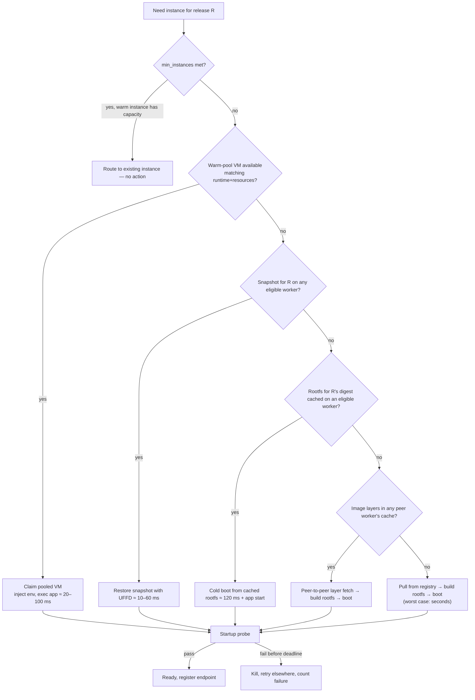
```mermaid
graph TD
    A[Need instance for release R] --> B{min_instances met?}
    B -->|yes, warm instance has capacity| C[Route to existing instance — no action]
    B -->|no| D{Warm-pool VM available<br/>matching runtime+resources?}
    D -->|yes| E["Claim pooled VM<br/>inject env, exec app ≈ 20–100 ms"]
    D -->|no| F{Snapshot for R on any eligible worker?}
    F -->|yes| G["Restore snapshot with UFFD ≈ 10–60 ms"]
    F -->|no| H{Rootfs for R's digest cached on an eligible worker?}
    H -->|yes| I["Cold boot from cached rootfs ≈ 120 ms + app start"]
    H -->|no| J{Image layers in any peer worker's cache?}
    J -->|yes| K["Peer-to-peer layer fetch → build rootfs → boot"]
    J -->|no| L["Pull from registry → build rootfs → boot<br/>(worst case: seconds)"]
    E & G & I & K & L --> M[Startup probe]
    M -->|pass| N[Ready, register endpoint]
    M -->|fail before deadline| O[Kill, retry elsewhere, count failure]
```

### 12.5 Scale-to-zero decision

A release scales to zero when **all** hold:
- `min_instances == 0`
- No request in the last `scale_down_delay` (default 60 s)
- No in-flight requests, no open WebSockets
- No active background work signal (if the app opts into a "keepalive" API)

On scale-to-zero: gracefully stop instances, take a snapshot from the *last* instance if snapshot policy allows, mark the route as "cold" so the gateway knows to activate, and retain the snapshot + rootfs on that worker with a bias so the next activation lands there.

**Anti-flap:** if a release scales 0↔1 more than N times in an hour, automatically pin `min_instances = 1` for an hour and surface a recommendation. Constant cold starts are worse for the user and more expensive for you than one idle instance.

### 12.6 Geographic placement

| Decision | Mechanism |
|---|---|
| Which region serves a request | Anycast BGP (best) or GeoDNS (simpler). Anycast gives automatic failover and no DNS TTL problems; GeoDNS is far easier to start with |
| Which regions run a release | Explicit in config (`environments.production.regions`). Do not auto-expand — it surprises users with cost |
| Cross-region fallback | If a release has no healthy instance in the local region, the gateway may proxy to the nearest region that does, with a latency penalty, flagged in response headers and metrics. Configurable per project (some users would rather 503 than serve from another continent for data-residency reasons) |
| Data residency | A hard constraint flag per project that forbids cross-region fallback and cross-region log shipping |

---

## 13. Cold Start Optimization

### 13.1 The cold-start budget, decomposed

```text
Total cold start = routing overhead
                 + placement decision
                 + artifact availability     ← biggest variance
                 + VM/instance creation
                 + guest boot
                 + application startup       ← biggest absolute cost for most languages
                 + first-request handling (JIT, lazy init, connection pools)
```

Optimize in order of (variance × frequency), which means: artifact availability first, application startup second, VM creation third.

### 13.2 Strategy 1 — Warm pools

Keep pre-booted, *generic* microVMs on each worker: booted guest kernel, `vminit` running, no application yet. Claiming one means: attach the release's rootfs as a second device (hot-plug via `PATCH /drives` is limited — better: the pooled VM boots with a placeholder drive and `vminit` waits on vsock for a "here is your rootfs" message; the agent hot-attaches or the VM uses a lazily-populated device), inject env, `exec` the command.

Realistically, hot-swapping a rootfs into a running VM is fiddly. **Two practical variants:**

| Variant | Mechanism | Saves |
|---|---|---|
| **Generic warm pool** | Pre-booted VMs with the *platform base* rootfs; the release's app files arrive via a second block device attached at boot and mounted by `vminit` on signal | Kernel boot (~50–80 ms) |
| **Per-release warm pool** | For releases with `min_instances: 0` but frequent traffic, keep N fully-started idle instances that the scheduler does not count as "running" for billing-to-user purposes (you eat the cost) | Everything (~0 ms) — this is just min_instances with different accounting |

**Decision:** implement per-release warm instances as `min_instances` (honest and simple), and use generic warm pools only if measurement shows kernel boot is a meaningful share of your cold start. Given app startup usually dominates, **snapshots (§13.3) are the higher-value investment.** Pool sizing: `pool_size = f(recent activation rate)`, per worker, capped.

### 13.3 Strategy 2 — Firecracker snapshots (highest value)

Covered mechanically in §7.9–7.11. The product design:

- Snapshot is taken once per (release, worker, CPU template), after readiness + `snapshot_warmup_requests` synthetic requests.
- Stored locally on NVMe and asynchronously uploaded to object storage so other workers can fetch it.
- Restore uses UFFD so memory pages fault in lazily from page cache → ~10–60 ms to a serving process.
- Post-restore hooks (entropy, clock, reconnect signal) run before the instance is marked ready.

**Expected improvement:** Spring Boot from ~3–8 s to ~50–150 ms. This is the single biggest DX lever in the whole platform and is the reason to build snapshot support properly rather than as an afterthought.

### 13.4 Strategy 3 — Image and filesystem caching

| Technique | Effect |
|---|---|
| **Worker-local blob cache**, content-addressed, LRU with a high watermark | Layers shared across releases and tenants (public base images) are pulled once per worker |
| **Rootfs cache** keyed by image config digest | Conversion cost paid once per worker per image |
| **Page cache warmth** | The read-only rootfs is shared by all VMs of a release; the first VM warms the page cache for the rest. Do not evict aggressively — leave RAM headroom for this |
| **Prefetch on deploy** | When a release is created, push the image to the N workers most likely to host it *before* the first request. Cheap, high impact for scale-to-zero apps |
| **Peer-to-peer layer distribution** | Workers fetch layers from peers (Dragonfly/Kraken-style, or a simple BitTorrent-ish gossip) instead of hammering the registry. Essential when 200 workers scale up one release simultaneously |
| **Registry regional mirrors** | Zot sync or Distribution pull-through per region |
| **Base-image standardization** | Platform run-images share layers across all tenants using that runtime. A tenant's app layer is often < 50 MB while the base is 200 MB — make the base universally cached |

### 13.5 Strategy 4 — Lazy image loading [SCALE]

Convert images to **Nydus** (or eStargz/SOCI) format at build time; the guest's block device is backed by a host-side daemon that fetches chunks on demand. A 1 GB image typically touches 3–10% of its bytes at startup, so time-to-first-byte becomes near-constant regardless of image size.

Cost: a new image format in your pipeline, a new daemon in the data path, and a hard failure mode (backing store stall = guest I/O stall). Worth it when large images are common; not before.

### 13.6 Strategy 5 — Language-specific optimization

The platform can materially improve startup by shipping good defaults in runtime definitions:

| Runtime | Technique | Effect |
|---|---|---|
| **JVM** | `-XX:TieredStopAtLevel=1` for short-lived, **AppCDS** (`-XX:SharedArchiveFile`) generated at build time, **CRaC** where supported, `-XX:+UseSerialGC` for small heaps, `-XX:MaxRAMPercentage` instead of fixed `-Xmx` | AppCDS alone: 20–40% off JVM startup |
| **JVM, aggressive** | **GraalVM native-image** as an opt-in runtime variant (`runtime.type: java-native`) | 3000 ms → 30 ms, at the cost of long builds and reflection config pain. Offer it, do not default to it |
| **.NET** | ReadyToRun + tiered compilation, or NativeAOT as a variant | 500 ms → 50 ms with NativeAOT |
| **Node.js** | V8 snapshot / `--snapshot-blob` [experimental], bundling to one file (esbuild) to cut module resolution syscalls, `--max-semi-space-size` tuning | Bundling alone can halve startup for large dependency trees |
| **Python** | Precompiled `.pyc` in the image (`compileall` at build), `-X frozen_modules`, avoid heavy imports at module scope, consider `python -X importtime` in build output as a DX feature | 30–50% off for import-heavy apps |
| **Ruby/Rails** | Bootsnap in the image, precompiled assets | Significant |
| **PHP** | FrankenPHP/RoadRunner (persistent worker) instead of PHP-FPM cold per request; opcache with `validate_timestamps=0` and a preloaded script | Large |
| **Go / Rust** | Nothing needed; static binaries, tiny images (`FROM scratch` / distroless) | Already optimal |
| **Elixir/Erlang** | Releases (`mix release`) rather than `mix run`; BEAM starts fast but is memory-hungry | Moderate |
| **WASM** | Precompiled `.cwasm` + Wizer pre-initialization + pooling allocator | Sub-millisecond |

Surface these as **automatic** where safe (AppCDS, `.pyc`, bootsnap) and as **opt-in** where they change semantics (native-image, GraalVM). Report "your cold start is 4.2 s; enabling X would reduce it to ~0.9 s" in the dashboard — that is a genuinely differentiating feature.

### 13.7 Expected cold-start figures

**These are engineering estimates for planning, not measurements. Validate each on your own hardware.** Assumes: rootfs cached locally, warm page cache, 1 vCPU / 512 MiB, small-to-medium app.

| Runtime | Platform overhead | App startup | First-request penalty | **Total cold (no snapshot)** | **Total with snapshot** |
|---|---|---|---|---|---|
| WASM (precompiled, pooled) | 0.1–0.5 ms | ~0 (pre-initialized) | ~0 | **0.1–2 ms** | n/a |
| Go (static binary) | 60–90 ms | 5–20 ms | ~0 | **~80–120 ms** | 15–40 ms |
| Rust (axum/actix) | 60–90 ms | 3–15 ms | ~0 | **~75–110 ms** | 15–40 ms |
| Node.js (bundled, small) | 60–90 ms | 40–120 ms | 10–30 ms | **~120–250 ms** | 20–60 ms |
| Node.js (large dep tree, unbundled) | 60–90 ms | 300–900 ms | 50–150 ms | **~450–1100 ms** | 25–70 ms |
| Python (FastAPI, moderate imports) | 60–90 ms | 200–700 ms | 20–80 ms | **~300–850 ms** | 25–70 ms |
| Ruby on Rails | 60–90 ms | 1500–4000 ms | 200–600 ms | **~2–5 s** | 40–120 ms |
| PHP (FrankenPHP) | 60–90 ms | 50–200 ms | 10–40 ms | **~130–330 ms** | 20–60 ms |
| Java / Spring Boot | 60–90 ms | 2500–8000 ms | 300–1500 ms | **~3–10 s** | 50–150 ms |
| Java / Spring Boot + AppCDS | 60–90 ms | 1800–5000 ms | 300–1000 ms | **~2–6 s** | 50–150 ms |
| Java / GraalVM native | 60–90 ms | 20–60 ms | ~0 | **~90–150 ms** | 20–50 ms |
| .NET 8 (JIT) | 60–90 ms | 300–900 ms | 50–200 ms | **~400–1200 ms** | 30–80 ms |
| .NET NativeAOT | 60–90 ms | 20–60 ms | ~0 | **~90–150 ms** | 20–50 ms |
| Elixir/Phoenix | 60–90 ms | 400–1200 ms | 30–100 ms | **~500–1400 ms** | 40–100 ms |

**Add for a truly cold worker (no cached image):** image pull + rootfs conversion, typically **2–30 s** depending on image size and network. This is why §13.4 matters more than everything else.

### 13.8 Startup probes and the "is it ready" contract

- **Startup probe** has a long deadline (default 60 s, configurable to 300 s) and does not count toward liveness failures. This is what lets a Spring Boot app boot without being killed.
- Default probe type is TCP connect on the app port — it works for every language with no user configuration. HTTP probes are better (they catch "listening but not initialized") and should be recommended.
- `vminit` additionally reports process exit immediately. An app that exits during startup is failed instantly with its exit code and last 100 log lines, rather than waiting for the probe deadline. This detail massively improves the debugging experience.

---
## 14. Storage Architecture

### 14.1 The principle: instances are cattle with amnesia

```text
Application
    │
    ├── read-only rootfs        ← shared, immutable, from the OCI image
    ├── writable overlay        ← ephemeral, destroyed with the instance
    ├── /tmp (tmpfs)            ← ephemeral, in-memory, size-capped
    └── everything durable      ← external services, over the network
```

**Why application state must not live in the microVM:**

1. **Scale-to-zero deletes it.** An app that scales to zero loses any local state, silently. Users who store sessions on disk will experience random logouts and blame you.
2. **Horizontal scaling breaks it.** With 10 instances, a file written by instance 3 is invisible to instances 1–10. Every "it works locally" bug traces here.
3. **Deployments destroy it.** Every deploy replaces instances.
4. **Workers fail.** Local NVMe is not durable.
5. **Snapshots multiply it.** A snapshot taken with local state produces N instances that all believe they own the same "unique" data.
6. **It defeats the isolation model.** Persistent per-tenant volumes on shared hosts create a data-remanence problem (a deleted volume's blocks must be securely erased or encrypted-at-rest with per-tenant keys) and constrain placement (an instance must go where its volume is).

Make this loud in the product: the docs, the CLI, and a startup warning when an app writes more than X MB to the overlay.

### 14.2 The storage tiers

| Tier | Backing | Lifetime | Use |
|---|---|---|---|
| **Instance overlay** | Sparse file / thin LV on worker NVMe, size = `ephemeral_storage` | Instance | Temp files, caches, compiled templates |
| **`/tmp` tmpfs** | Guest RAM (counted against `memory`) | Instance | Fast scratch |
| **Object storage** | S3-compatible (MinIO on-prem, or cloud S3) | Durable | User uploads, build artifacts, snapshots, logs, SBOMs |
| **Managed databases** | External — the user's own Postgres/MySQL/Redis, or a platform add-on | Durable | Application data |
| **Platform KV** *(optional product feature)* | Redis/FoundationDB behind an API | Durable-ish | Small config/session data for serverless apps |
| **Persistent volumes** *(SCALE, opt-in)* | Network block storage (Ceph RBD / cloud EBS) attached as a virtio-blk device | Durable, pinned | Stateful workloads that genuinely need it |

### 14.3 Persistent volumes — if and how

They will be requested. Design constraints if you build them **[SCALE]**:

- A volume pins its instance to a zone (network block) or to a host (local NVMe). Local NVMe is much faster but makes the instance non-relocatable — a worker failure means data loss unless replicated.
- **Single-attach only.** Multi-attach requires a cluster filesystem and is a support nightmare. An app with a volume gets `max_instances: 1` and no scale-to-zero-with-data-loss semantics.
- Encrypted at rest with a per-volume key derived from a per-org key in KMS. Deletion = destroy the key (crypto-erase), then reclaim blocks.
- Snapshots and backups become your responsibility, with all the RPO/RTO implications.
- Strongly prefer steering users to object storage and managed databases. "We do not offer persistent disks" is a legitimate, defensible product position for a long time.

### 14.4 Object storage usage

| Bucket | Contents | Lifecycle |
|---|---|---|
| `helix-registry` | OCI blobs and manifests | GC per §5.10 |
| `helix-uploads` | Source tarballs from CLI deploys | 7 days |
| `helix-build-cache` | Exported BuildKit caches (if registry-backed cache is not used) | 30 days, LRU by project |
| `helix-snapshots` | Firecracker snapshots (encrypted) | Tied to release lifetime |
| `helix-logs` | Cold log archive beyond Loki retention | 90–365 days per plan |
| `helix-sbom` | SBOMs, scan reports, provenance attestations | Retained as long as the image |
| `helix-backups` | Postgres base backups + WAL | Per §21 |

Self-hosted choice: **MinIO** (or SeaweedFS/Garage) with erasure coding across ≥4 nodes. On cloud, use the provider's S3 but keep the S3 API abstraction so you can move — egress pricing is the main reason you might.

---

## 15. Database Schema

### 15.1 Conventions

- PostgreSQL 16+.
- Primary keys are ULIDs stored as `text` with a type prefix (`prj_01J8X...`) for human-debuggable IDs and natural time ordering, **or** `uuid` v7 if you prefer native types. Prefixed ULIDs are chosen here because they make logs and support enormously easier.
- Every tenant-scoped table carries `org_id` **denormalized**, even when derivable, so that row-level security and every query can filter on it without joins.
- `created_at`/`updated_at` `timestamptz NOT NULL DEFAULT now()`.
- Soft delete via `deleted_at` only where users expect restore; otherwise hard delete.
- `jsonb` for open-ended structures (resolved specs, provider payloads), with CHECK constraints or schema validation at the application layer.
- **Row-level security enabled** on tenant tables, with `app.current_org_id` set per connection/transaction. This is a second line of defense against a missing `WHERE org_id = ...` — the most common multi-tenant data-leak bug.

Two naming notes against the original requirement list: **`releases`** is the table you might have called `deployment_versions` (an immutable runnable artifact + config), and **`instances`** is the one you might have called `microvms` — it covers both Firecracker and WASM instances, which is why it is not named after a VM. The DDL below is grouped for readability rather than in strict dependency order; a few forward foreign-key references (e.g. `projects.git_installation_id`) are added with `ALTER TABLE` in the real migration.

### 15.2 ER diagram

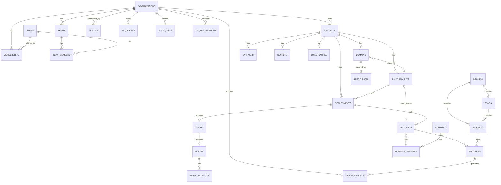
```mermaid
erDiagram
    ORGANIZATIONS ||--o{ MEMBERSHIPS : has
    USERS ||--o{ MEMBERSHIPS : belongs_to
    ORGANIZATIONS ||--o{ TEAMS : has
    TEAMS ||--o{ TEAM_MEMBERS : has
    USERS ||--o{ TEAM_MEMBERS : in
    ORGANIZATIONS ||--o{ PROJECTS : owns
    ORGANIZATIONS ||--o{ QUOTAS : constrained_by
    ORGANIZATIONS ||--o{ API_TOKENS : issues
    ORGANIZATIONS ||--o{ AUDIT_LOGS : records
    ORGANIZATIONS ||--o{ USAGE_RECORDS : accrues
    ORGANIZATIONS ||--o{ GIT_INSTALLATIONS : connects

    PROJECTS ||--o{ ENVIRONMENTS : has
    PROJECTS ||--o{ DEPLOYMENTS : has
    PROJECTS ||--o{ DOMAINS : has
    PROJECTS ||--o{ ENV_VARS : has
    PROJECTS ||--o{ SECRETS : has
    PROJECTS ||--o{ BUILD_CACHES : has

    ENVIRONMENTS ||--o{ DEPLOYMENTS : targets
    ENVIRONMENTS ||--o| RELEASES : current_release

    DEPLOYMENTS ||--o| BUILDS : produces
    DEPLOYMENTS ||--o| RELEASES : yields
    BUILDS ||--o| IMAGES : produces
    IMAGES ||--o{ IMAGE_ARTIFACTS : has

    RELEASES ||--o{ INSTANCES : runs
    RELEASES }o--|| RUNTIME_VERSIONS : uses
    RUNTIMES ||--o{ RUNTIME_VERSIONS : has

    WORKERS ||--o{ INSTANCES : hosts
    REGIONS ||--o{ WORKERS : contains
    REGIONS ||--o{ ZONES : contains
    ZONES ||--o{ WORKERS : contains

    DOMAINS ||--o| CERTIFICATES : secured_by
    DOMAINS }o--|| ENVIRONMENTS : routes_to

    INSTANCES ||--o{ USAGE_RECORDS : generates
```

### 15.3 DDL

#### Identity and tenancy

```sql
CREATE TABLE users (
  id              text PRIMARY KEY,                 -- usr_01J8...
  email           citext NOT NULL UNIQUE,
  email_verified  boolean NOT NULL DEFAULT false,
  name            text,
  avatar_url      text,
  password_hash   text,                             -- NULL if SSO-only
  mfa_secret_enc  bytea,
  status          text NOT NULL DEFAULT 'active'
                  CHECK (status IN ('active','suspended','deleted')),
  created_at      timestamptz NOT NULL DEFAULT now(),
  updated_at      timestamptz NOT NULL DEFAULT now(),
  last_login_at   timestamptz
);

CREATE TABLE organizations (
  id              text PRIMARY KEY,                 -- org_01J8...
  slug            citext NOT NULL UNIQUE,
  name            text NOT NULL,
  plan            text NOT NULL DEFAULT 'free',
  billing_ref     text,                             -- Stripe customer id
  status          text NOT NULL DEFAULT 'active'
                  CHECK (status IN ('active','past_due','suspended','closed')),
  suspended_reason text,
  data_residency  text,                             -- NULL | 'eu' | 'sg' ...
  created_at      timestamptz NOT NULL DEFAULT now(),
  updated_at      timestamptz NOT NULL DEFAULT now()
);

CREATE TABLE memberships (
  org_id     text NOT NULL REFERENCES organizations(id) ON DELETE CASCADE,
  user_id    text NOT NULL REFERENCES users(id) ON DELETE CASCADE,
  role       text NOT NULL CHECK (role IN ('owner','admin','developer','viewer','billing')),
  created_at timestamptz NOT NULL DEFAULT now(),
  PRIMARY KEY (org_id, user_id)
);
CREATE INDEX ON memberships (user_id);

CREATE TABLE teams (
  id         text PRIMARY KEY,
  org_id     text NOT NULL REFERENCES organizations(id) ON DELETE CASCADE,
  name       text NOT NULL,
  created_at timestamptz NOT NULL DEFAULT now(),
  UNIQUE (org_id, name)
);

CREATE TABLE team_members (
  team_id text NOT NULL REFERENCES teams(id) ON DELETE CASCADE,
  user_id text NOT NULL REFERENCES users(id) ON DELETE CASCADE,
  PRIMARY KEY (team_id, user_id)
);

CREATE TABLE api_tokens (
  id           text PRIMARY KEY,                    -- tok_01J8...
  org_id       text NOT NULL REFERENCES organizations(id) ON DELETE CASCADE,
  user_id      text REFERENCES users(id) ON DELETE CASCADE,  -- NULL = machine token
  name         text NOT NULL,
  token_hash   bytea NOT NULL,                      -- sha256 of the secret half
  prefix       text NOT NULL,                       -- first 8 chars, for display/lookup
  scopes       text[] NOT NULL DEFAULT '{}',
  project_id   text,                                -- NULL = org-wide
  expires_at   timestamptz,
  last_used_at timestamptz,
  revoked_at   timestamptz,
  created_at   timestamptz NOT NULL DEFAULT now()
);
CREATE UNIQUE INDEX ON api_tokens (prefix);
```

#### Projects, environments, config

```sql
CREATE TABLE projects (
  id                 text PRIMARY KEY,              -- prj_01J8...
  org_id             text NOT NULL REFERENCES organizations(id) ON DELETE CASCADE,
  slug               citext NOT NULL,
  name               text NOT NULL,
  git_installation_id text REFERENCES git_installations(id) ON DELETE SET NULL,
  repo_provider      text CHECK (repo_provider IN ('github','gitlab','bitbucket')),
  repo_external_id   text,
  repo_full_name     text,
  production_branch  text NOT NULL DEFAULT 'main',
  root_directory     text NOT NULL DEFAULT '.',
  auto_deploy        boolean NOT NULL DEFAULT true,
  preview_enabled    boolean NOT NULL DEFAULT true,
  default_regions    text[] NOT NULL DEFAULT '{}',
  deleted_at         timestamptz,
  created_at         timestamptz NOT NULL DEFAULT now(),
  updated_at         timestamptz NOT NULL DEFAULT now(),
  UNIQUE (org_id, slug)
);

CREATE TABLE environments (
  id                 text PRIMARY KEY,              -- env_01J8...
  project_id         text NOT NULL REFERENCES projects(id) ON DELETE CASCADE,
  org_id             text NOT NULL,
  name               text NOT NULL,                 -- production | preview | staging | ...
  kind               text NOT NULL CHECK (kind IN ('production','preview','custom')),
  git_ref            text,                          -- branch/PR for preview envs
  current_release_id text,                          -- FK added after releases
  protected          boolean NOT NULL DEFAULT false,
  created_at         timestamptz NOT NULL DEFAULT now(),
  expires_at         timestamptz,                   -- preview auto-cleanup
  UNIQUE (project_id, name)
);

CREATE TABLE env_vars (
  id          text PRIMARY KEY,
  project_id  text NOT NULL REFERENCES projects(id) ON DELETE CASCADE,
  org_id      text NOT NULL,
  environment text,                                  -- NULL = all environments
  key         text NOT NULL CHECK (key ~ '^[A-Za-z_][A-Za-z0-9_]*$'),
  value       text NOT NULL,
  scope       text NOT NULL DEFAULT 'runtime'
              CHECK (scope IN ('runtime','build','both')),
  created_at  timestamptz NOT NULL DEFAULT now(),
  updated_at  timestamptz NOT NULL DEFAULT now(),
  UNIQUE (project_id, environment, key, scope)
);

CREATE TABLE secrets (
  id             text PRIMARY KEY,                   -- sec_01J8...
  project_id     text NOT NULL REFERENCES projects(id) ON DELETE CASCADE,
  org_id         text NOT NULL,
  environment    text,
  key            text NOT NULL CHECK (key ~ '^[A-Za-z_][A-Za-z0-9_]*$'),
  ciphertext     bytea NOT NULL,                     -- AES-256-GCM
  nonce          bytea NOT NULL,
  dek_id         text NOT NULL REFERENCES data_keys(id),
  scope          text NOT NULL DEFAULT 'runtime'
                 CHECK (scope IN ('runtime','build','both')),
  version        int  NOT NULL DEFAULT 1,
  last_rotated_at timestamptz,
  created_at     timestamptz NOT NULL DEFAULT now(),
  UNIQUE (project_id, environment, key, scope)
);

CREATE TABLE data_keys (                              -- envelope encryption
  id            text PRIMARY KEY,
  org_id        text NOT NULL REFERENCES organizations(id) ON DELETE CASCADE,
  wrapped_key   bytea NOT NULL,                      -- DEK encrypted by KMS CMK
  kms_key_id    text NOT NULL,
  active        boolean NOT NULL DEFAULT true,
  created_at    timestamptz NOT NULL DEFAULT now(),
  rotated_at    timestamptz
);
```

#### Runtimes

```sql
CREATE TABLE runtimes (
  id           text PRIMARY KEY,                     -- rt_java
  name         text NOT NULL UNIQUE,                 -- java
  display_name text NOT NULL,
  kind         text NOT NULL CHECK (kind IN ('firecracker','wasm')),
  status       text NOT NULL DEFAULT 'ga'
               CHECK (status IN ('ga','beta','experimental','deprecated')),
  created_at   timestamptz NOT NULL DEFAULT now()
);

CREATE TABLE runtime_versions (
  id                text PRIMARY KEY,                -- rtv_java_21
  runtime_id        text NOT NULL REFERENCES runtimes(id) ON DELETE CASCADE,
  version           text NOT NULL,                   -- "21"
  definition        jsonb NOT NULL,                  -- the RuntimeDefinition document
  definition_hash   bytea NOT NULL,
  build_image       text NOT NULL,                   -- pinned by digest
  run_image         text NOT NULL,
  architectures     text[] NOT NULL DEFAULT '{amd64}',
  status            text NOT NULL DEFAULT 'ga',
  deprecated_after  timestamptz,
  eol_after         timestamptz,
  created_at        timestamptz NOT NULL DEFAULT now(),
  UNIQUE (runtime_id, version)
);
```

#### Deployments, builds, images, releases

```sql
CREATE TABLE deployments (
  id               text PRIMARY KEY,                 -- dep_01J8...
  org_id           text NOT NULL,
  project_id       text NOT NULL REFERENCES projects(id) ON DELETE CASCADE,
  environment_id   text NOT NULL REFERENCES environments(id) ON DELETE CASCADE,
  state            text NOT NULL,                    -- see §38.8
  trigger          text NOT NULL
                   CHECK (trigger IN ('git_push','git_pr','cli','api','rollback','redeploy','promote')),
  actor_user_id    text REFERENCES users(id),
  source_kind      text NOT NULL CHECK (source_kind IN ('git','upload','image')),
  git_commit_sha   text,
  git_ref          text,
  git_commit_msg   text,
  git_author       text,
  upload_key       text,                             -- S3 key for tarball
  config_raw       text,                             -- the helix.yaml as submitted
  config_resolved  jsonb,                            -- fully resolved spec
  config_hash      bytea,
  build_id         text,
  release_id       text,
  idempotency_key  text,
  error_code       text,
  error_message    text,
  queued_at        timestamptz NOT NULL DEFAULT now(),
  started_at       timestamptz,
  ready_at         timestamptz,
  finished_at      timestamptz,
  created_at       timestamptz NOT NULL DEFAULT now(),
  updated_at       timestamptz NOT NULL DEFAULT now()
);
CREATE INDEX ON deployments (project_id, created_at DESC);
CREATE INDEX ON deployments (state) WHERE state NOT IN ('ACTIVE','STOPPED','FAILED','CANCELLED');
CREATE UNIQUE INDEX ON deployments (project_id, idempotency_key) WHERE idempotency_key IS NOT NULL;

CREATE TABLE builds (
  id                text PRIMARY KEY,                -- bld_01J8...
  org_id            text NOT NULL,
  deployment_id     text NOT NULL REFERENCES deployments(id) ON DELETE CASCADE,
  project_id        text NOT NULL,
  state             text NOT NULL,                   -- QUEUED|RUNNING|SUCCEEDED|FAILED|CANCELLED|TIMED_OUT
  attempt           int  NOT NULL DEFAULT 1,
  builder_id        text,                            -- build worker id
  lease_expires_at  timestamptz,
  cancel_requested  boolean NOT NULL DEFAULT false,
  runtime_version_id text REFERENCES runtime_versions(id),
  image_id          text,
  exit_code         int,
  failure_class     text,                            -- user_error|infra|timeout|policy
  error_message     text,
  log_object_key    text,
  cpu_seconds       numeric,
  peak_memory_bytes bigint,
  cache_hit_ratio   numeric,
  started_at        timestamptz,
  finished_at       timestamptz,
  created_at        timestamptz NOT NULL DEFAULT now()
);
CREATE INDEX ON builds (state, lease_expires_at) WHERE state = 'RUNNING';

CREATE TABLE images (
  id             text PRIMARY KEY,                   -- img_01J8...
  org_id         text NOT NULL,
  project_id     text NOT NULL,
  repository     text NOT NULL,                      -- org_slug/project_slug
  digest         text NOT NULL,                      -- sha256:...
  architecture   text NOT NULL,
  size_bytes     bigint NOT NULL,
  layer_count    int NOT NULL,
  config         jsonb NOT NULL,                     -- OCI image config
  signed         boolean NOT NULL DEFAULT false,
  signature_ref  text,
  sbom_key       text,
  scan_status    text,                               -- pending|clean|vulnerable|error
  scan_summary   jsonb,                              -- {critical:1,high:4,...}
  scanned_at     timestamptz,
  source         text NOT NULL DEFAULT 'build'
                 CHECK (source IN ('build','import')),
  created_at     timestamptz NOT NULL DEFAULT now(),
  UNIQUE (repository, digest)
);

CREATE TABLE releases (
  id                 text PRIMARY KEY,               -- rel_01J8...
  org_id             text NOT NULL,
  project_id         text NOT NULL REFERENCES projects(id) ON DELETE CASCADE,
  environment_id     text NOT NULL REFERENCES environments(id) ON DELETE CASCADE,
  deployment_id      text NOT NULL REFERENCES deployments(id),
  image_id           text REFERENCES images(id),
  runtime_kind       text NOT NULL CHECK (runtime_kind IN ('firecracker','wasm')),
  wasm_artifact_key  text,                           -- for wasm releases
  spec               jsonb NOT NULL,                 -- immutable ReleaseSpec
  spec_hash          bytea NOT NULL,
  env_snapshot_id    text,                           -- pinned env set version
  min_instances      int NOT NULL DEFAULT 0,
  max_instances      int NOT NULL DEFAULT 10,
  target_concurrency int NOT NULL DEFAULT 50,
  vcpu               numeric NOT NULL,
  memory_mib         int NOT NULL,
  regions            text[] NOT NULL,
  state              text NOT NULL
                     CHECK (state IN ('pending','ready','active','draining','retired','failed')),
  created_at         timestamptz NOT NULL DEFAULT now(),
  retired_at         timestamptz
);
CREATE INDEX ON releases (project_id, created_at DESC);
CREATE INDEX ON releases (state) WHERE state IN ('ready','active','draining');

ALTER TABLE environments
  ADD CONSTRAINT fk_current_release
  FOREIGN KEY (current_release_id) REFERENCES releases(id);
```

#### Infrastructure

```sql
CREATE TABLE regions (
  id          text PRIMARY KEY,                      -- sin1
  name        text NOT NULL,
  continent   text NOT NULL,
  country     text NOT NULL,
  status      text NOT NULL DEFAULT 'active'
              CHECK (status IN ('active','draining','disabled')),
  is_default  boolean NOT NULL DEFAULT false
);

CREATE TABLE zones (
  id        text PRIMARY KEY,                        -- sin1-a
  region_id text NOT NULL REFERENCES regions(id),
  status    text NOT NULL DEFAULT 'active'
);

CREATE TABLE workers (
  id                 text PRIMARY KEY,               -- wrk_01J8...
  region_id          text NOT NULL REFERENCES regions(id),
  zone_id            text NOT NULL REFERENCES zones(id),
  hostname           text NOT NULL,
  internal_ip        inet NOT NULL,
  architecture       text NOT NULL DEFAULT 'amd64',
  cpu_cores          int NOT NULL,
  cpu_threads        int NOT NULL,
  memory_mib         int NOT NULL,
  disk_gib           int NOT NULL,
  allocatable_vcpu   numeric NOT NULL,
  allocatable_mib    int NOT NULL,
  allocated_vcpu     numeric NOT NULL DEFAULT 0,
  allocated_mib      int NOT NULL DEFAULT 0,
  instance_count     int NOT NULL DEFAULT 0,
  max_instances      int NOT NULL DEFAULT 600,
  role               text NOT NULL DEFAULT 'runtime'
                     CHECK (role IN ('runtime','build','both')),
  status             text NOT NULL
                     CHECK (status IN ('provisioning','ready','cordoned','draining','unhealthy','fenced','decommissioned')),
  agent_version      text,
  kernel_version     text,
  fc_version         text,
  cpu_template       text,                           -- for snapshot compatibility
  labels             jsonb NOT NULL DEFAULT '{}',
  last_heartbeat_at  timestamptz,
  generation         bigint NOT NULL DEFAULT 0,      -- fencing token
  created_at         timestamptz NOT NULL DEFAULT now()
);
CREATE INDEX ON workers (region_id, status) WHERE status = 'ready';

CREATE TABLE instances (
  id              text PRIMARY KEY,                  -- ins_01J8...
  org_id          text NOT NULL,
  project_id      text NOT NULL,
  release_id      text NOT NULL REFERENCES releases(id) ON DELETE CASCADE,
  worker_id       text NOT NULL REFERENCES workers(id),
  region_id       text NOT NULL,
  zone_id         text NOT NULL,
  kind            text NOT NULL CHECK (kind IN ('firecracker','wasm')),
  state           text NOT NULL,                     -- see §7.3
  internal_ip     inet,
  port            int,
  vcpu            numeric NOT NULL,
  memory_mib      int NOT NULL,
  start_reason    text,                              -- request|min_instances|scale_up|deploy|replace
  start_method    text,                              -- cold|snapshot|warm_pool
  start_duration_ms int,
  assigned_at     timestamptz NOT NULL DEFAULT now(),
  ready_at        timestamptz,
  last_request_at timestamptz,
  stopping_at     timestamptz,
  stopped_at      timestamptz,
  stop_reason     text,
  exit_code       int
);
CREATE INDEX ON instances (release_id) WHERE stopped_at IS NULL;
CREATE INDEX ON instances (worker_id) WHERE stopped_at IS NULL;

CREATE TABLE worker_reservations (                    -- optimistic capacity reservation
  instance_id text PRIMARY KEY,
  worker_id   text NOT NULL REFERENCES workers(id) ON DELETE CASCADE,
  vcpu        numeric NOT NULL,
  memory_mib  int NOT NULL,
  expires_at  timestamptz NOT NULL
);
CREATE INDEX ON worker_reservations (expires_at);
```

#### Domains and certificates

```sql
CREATE TABLE domains (
  id                 text PRIMARY KEY,               -- dom_01J8...
  org_id             text NOT NULL,
  project_id         text NOT NULL REFERENCES projects(id) ON DELETE CASCADE,
  environment_id     text REFERENCES environments(id) ON DELETE CASCADE,
  hostname           citext NOT NULL UNIQUE,
  kind               text NOT NULL
                     CHECK (kind IN ('platform','custom','wildcard')),
  verification_token text,
  verification_method text CHECK (verification_method IN ('dns_txt','http','cname')),
  verified_at        timestamptz,
  certificate_id     text,
  redirect_to        text,
  status             text NOT NULL
                     CHECK (status IN ('pending_verification','verifying','active','error','disabled')),
  error_message      text,
  created_at         timestamptz NOT NULL DEFAULT now()
);

CREATE TABLE certificates (
  id             text PRIMARY KEY,
  org_id         text,
  hostnames      text[] NOT NULL,
  issuer         text NOT NULL,                      -- letsencrypt | zerossl | custom
  cert_pem       text NOT NULL,
  chain_pem      text NOT NULL,
  key_ciphertext bytea NOT NULL,
  key_nonce      bytea NOT NULL,
  dek_id         text NOT NULL REFERENCES data_keys(id),
  not_before     timestamptz NOT NULL,
  not_after      timestamptz NOT NULL,
  renewal_state  text NOT NULL DEFAULT 'ok',
  last_renewal_error text,
  created_at     timestamptz NOT NULL DEFAULT now()
);
CREATE INDEX ON certificates (not_after);
```

#### Git, usage, quotas, audit

```sql
CREATE TABLE git_installations (
  id                text PRIMARY KEY,
  org_id            text NOT NULL REFERENCES organizations(id) ON DELETE CASCADE,
  provider          text NOT NULL CHECK (provider IN ('github','gitlab','bitbucket')),
  external_id       text NOT NULL,                   -- installation id
  account_login     text NOT NULL,
  access_token_enc  bytea,                           -- for OAuth providers
  refresh_token_enc bytea,
  token_expires_at  timestamptz,
  webhook_secret_enc bytea NOT NULL,
  created_at        timestamptz NOT NULL DEFAULT now(),
  UNIQUE (provider, external_id)
);

CREATE TABLE usage_records (                          -- append-only, partitioned by month
  id            bigserial,
  org_id        text NOT NULL,
  project_id    text,
  release_id    text,
  instance_id   text,
  region_id     text,
  metric        text NOT NULL,                        -- cpu_ms|mem_mib_ms|requests|egress_bytes|
                                                      -- build_seconds|storage_byte_hours|instance_seconds
  quantity      numeric NOT NULL,
  window_start  timestamptz NOT NULL,
  window_end    timestamptz NOT NULL,
  source        text NOT NULL,                        -- agent|gateway|builder
  dedup_key     text NOT NULL,
  created_at    timestamptz NOT NULL DEFAULT now(),
  PRIMARY KEY (id, window_start)
) PARTITION BY RANGE (window_start);
CREATE UNIQUE INDEX ON usage_records (dedup_key, window_start);
CREATE INDEX ON usage_records (org_id, window_start);

CREATE TABLE quotas (
  org_id                 text PRIMARY KEY REFERENCES organizations(id) ON DELETE CASCADE,
  max_projects           int NOT NULL DEFAULT 10,
  max_concurrent_builds  int NOT NULL DEFAULT 2,
  max_instances_total    int NOT NULL DEFAULT 20,
  max_instances_per_release int NOT NULL DEFAULT 10,
  max_vcpu_per_instance  numeric NOT NULL DEFAULT 2,
  max_memory_mib         int NOT NULL DEFAULT 2048,
  max_image_size_bytes   bigint NOT NULL DEFAULT 2147483648,
  max_build_minutes_month int NOT NULL DEFAULT 500,
  max_egress_gib_month   int NOT NULL DEFAULT 100,
  max_custom_domains     int NOT NULL DEFAULT 5,
  api_rate_per_min       int NOT NULL DEFAULT 600,
  updated_at             timestamptz NOT NULL DEFAULT now()
);

CREATE TABLE audit_logs (                             -- append-only, partitioned by month
  id           bigserial,
  org_id       text NOT NULL,
  actor_type   text NOT NULL CHECK (actor_type IN ('user','token','system','git')),
  actor_id     text,
  actor_ip     inet,
  user_agent   text,
  action       text NOT NULL,                         -- project.create, secret.update, ...
  resource_type text NOT NULL,
  resource_id  text,
  before       jsonb,
  after        jsonb,
  outcome      text NOT NULL CHECK (outcome IN ('success','failure','denied')),
  request_id   text,
  created_at   timestamptz NOT NULL DEFAULT now(),
  PRIMARY KEY (id, created_at)
) PARTITION BY RANGE (created_at);
CREATE INDEX ON audit_logs (org_id, created_at DESC);
```

### 15.4 Notes on schema decisions

- **`deployments` vs `releases` are separate.** A deployment is an *attempt*; a release is a *runnable artifact + config*. A failed deployment has no release. A rollback creates a new deployment pointing at an existing release. Conflating them (one `deployments` table that is both) is the most common modeling mistake in this domain and makes rollback, promotion, and history all awkward.
- **`env_snapshot_id` on releases** implements the pinning decision from §4.5.
- **`workers.generation`** is a fencing token (§38.3): every re-registration increments it, and the control plane rejects reports from a stale generation, which prevents a resurrected zombie worker from claiming instances.
- **`usage_records` partitioned by month with a `dedup_key`** makes at-least-once delivery safe: duplicate events collide on the unique index and are discarded.
- **`instances` is not truncated** — it is the record of what ran where, needed for billing disputes and incident forensics. Partition or archive it monthly; it will be your largest table.
- Consider **TimescaleDB or a separate ClickHouse** for `usage_records` and instance history at [SCALE]. Start in Postgres.

---
## 16. API Design

### 16.1 Conventions

- Base: `https://api.helix.dev/v1`
- JSON only. `snake_case` fields. RFC 3339 timestamps with `Z`.
- Every response carries `X-Request-Id`; every error is RFC 9457 `application/problem+json`.
- Pagination: cursor-based (`?limit=50&cursor=...` → `{data: [...], next_cursor: "..."}`). Never offset-based — offsets break under concurrent writes and get slow.
- Mutating endpoints accept `Idempotency-Key` (§2.5).
- Versioning: URL major version + `Helix-Version: 2026-09-01` date header for minor breaking changes, Stripe-style. Old date versions keep working; a compatibility shim layer translates.
- Long-running operations return `202` with the resource in a non-terminal state; clients poll or stream.

### 16.2 Authentication

| Credential | Use | Transport |
|---|---|---|
| Session cookie (`__Host-helix_session`, `Secure; HttpOnly; SameSite=Lax`) | Dashboard | Cookie + CSRF token on mutations |
| Personal access token `hxp_<prefix>_<secret>` | CLI, scripts | `Authorization: Bearer` |
| Machine token `hxm_...` scoped to an org/project | CI | `Authorization: Bearer` |
| OAuth 2.0 (auth code + PKCE) | Third-party integrations | Bearer |
| mTLS + SPIFFE | Worker agents (internal gRPC only) | Client cert |
| GitHub App installation JWT | Git operations | Internal |

Token format matters: the `hxp_<prefix>_<secret>` shape lets you (a) look up by `prefix` without a table scan, (b) detect leaked tokens in public repos via GitHub's secret scanning partner program — **register for this, it is free and catches real leaks**, (c) revoke by prefix. Store only `sha256(secret)`.

### 16.3 Authorization

RBAC evaluated in one place:

```text
authorize(principal, action, resource) →
   1. resolve principal's org membership role
   2. resolve token scopes (∩ with role — a token can never exceed its user's role)
   3. resolve resource's org_id; must match
   4. check role→permission matrix
   5. check resource-level constraints (protected environment, project-scoped token)
   6. deny by default
```

| Role | Permissions |
|---|---|
| `owner` | Everything, including billing, org deletion, member removal |
| `admin` | Everything except billing and org deletion |
| `developer` | Create/deploy projects, read secrets they created, rollback; **cannot** read other secrets, manage domains on protected envs, or change quotas |
| `viewer` | Read-only, no secret values, no logs containing secrets |
| `billing` | Billing and usage only |

Additional rules: production environments can be marked `protected`, requiring `admin` to deploy or rollback. Secret *values* are never returned by any API after creation — only metadata (key, scope, last updated). This is non-negotiable; "let me just show it in the UI" is how secrets end up in browser history and screenshots.

### 16.4 Core endpoints

#### Projects

```http
POST /v1/projects
Authorization: Bearer hxp_...
Idempotency-Key: 0f2c...
Content-Type: application/json

{
  "name": "my-api",
  "slug": "my-api",
  "repo": {
    "provider": "github",
    "full_name": "acme/my-api",
    "production_branch": "main",
    "root_directory": "."
  },
  "regions": ["sin1"],
  "auto_deploy": true
}
```

```http
201 Created
{
  "id": "prj_01J8XQ2H3K5M7P9R1T3V5W7Y9A",
  "org_id": "org_01J8W...",
  "name": "my-api",
  "slug": "my-api",
  "repo": { "provider":"github", "full_name":"acme/my-api",
            "production_branch":"main", "root_directory":"." },
  "environments": [
    {"id":"env_01J8...","name":"production","kind":"production"},
    {"id":"env_01J8...","name":"preview","kind":"preview"}
  ],
  "default_domain": "my-api-acme.helix.app",
  "regions": ["sin1"],
  "auto_deploy": true,
  "created_at": "2026-09-13T04:12:00Z"
}
```

```http
GET /v1/projects?limit=20&cursor=eyJpZCI6InByal8...
200 OK
{ "data": [ {...}, {...} ], "next_cursor": "eyJpZCI6..." }

GET /v1/projects/prj_01J8XQ2H3K5M7P9R1T3V5W7Y9A
200 OK
{ ...project..., "current_release": { "production": "rel_01J8...", "preview": null },
  "stats": { "instances_running": 2, "requests_24h": 148203, "error_rate_24h": 0.0021 } }

PATCH  /v1/projects/{id}
DELETE /v1/projects/{id}      → 202, async teardown (stop instances, release domains, GC images)
```

#### Deployments

```http
POST /v1/deployments
Idempotency-Key: 7b1e...

{
  "project_id": "prj_01J8XQ...",
  "environment": "production",
  "source": {
    "kind": "git",
    "ref": "refs/heads/main",
    "commit_sha": "9f2c1d0a8b7e6f5d4c3b2a1908f7e6d5c4b3a291"
  },
  "config_override": { "scaling": { "min_instances": 1 } }
}
```

```http
202 Accepted
Location: /v1/deployments/dep_01J8Y...

{
  "id": "dep_01J8Y3K5M7P9R1T3V5W7Y9AB",
  "project_id": "prj_01J8XQ...",
  "environment": "production",
  "state": "QUEUED",
  "trigger": "api",
  "source": { "kind":"git", "ref":"refs/heads/main", "commit_sha":"9f2c1d0a..." },
  "build": null,
  "release": null,
  "urls": { "logs": "/v1/deployments/dep_01J8Y.../logs",
            "events": "/v1/deployments/dep_01J8Y.../events" },
  "created_at": "2026-09-13T04:14:22Z"
}
```

```http
GET /v1/deployments/dep_01J8Y3K5M7P9R1T3V5W7Y9AB
200 OK
{
  "id": "dep_01J8Y...",
  "state": "READY",
  "state_history": [
    {"state":"QUEUED",    "at":"2026-09-13T04:14:22Z"},
    {"state":"BUILDING",  "at":"2026-09-13T04:14:25Z"},
    {"state":"BUILT",     "at":"2026-09-13T04:16:41Z"},
    {"state":"SCHEDULING","at":"2026-09-13T04:16:42Z"},
    {"state":"STARTING",  "at":"2026-09-13T04:16:44Z"},
    {"state":"READY",     "at":"2026-09-13T04:16:51Z"}
  ],
  "build": {
    "id": "bld_01J8Y...", "state": "SUCCEEDED",
    "duration_ms": 136000, "cache_hit_ratio": 0.82,
    "image": { "digest": "sha256:4c1f...", "size_bytes": 214958080,
               "scan": { "critical":0, "high":2, "medium":11 } }
  },
  "release": {
    "id": "rel_01J8Y...",
    "instances": { "desired": 1, "ready": 1 },
    "url": "https://my-api-acme.helix.app"
  },
  "durations_ms": { "queue": 3000, "build": 136000, "schedule": 2000, "start": 7000, "total": 148000 }
}
```

```http
POST /v1/deployments/{id}/cancel
202 Accepted    { "id": "...", "state": "CANCELLING" }
409 Conflict    if already terminal

POST /v1/deployments/{id}/rollback
{ "reason": "5xx spike after deploy" }
202 Accepted
{ "id": "dep_01J8Z...", "trigger": "rollback",
  "rolled_back_to": { "deployment_id": "dep_01J8W...", "release_id": "rel_01J8W..." },
  "env_diff": [ {"key":"FEATURE_X","from":"true","to":"false"} ],
  "state": "SCHEDULING" }

POST /v1/projects/{id}/promote
{ "from_deployment": "dep_01J8Y...", "to_environment": "production" }

GET  /v1/deployments/{id}/logs?source=build&follow=true&since=2026-09-13T04:14:00Z
     Accept: text/event-stream
     → SSE stream of {"ts":"...","stream":"stdout","seq":1042,"line":"..."}

GET  /v1/deployments/{id}/logs?source=runtime&instance=ins_01J8...&limit=1000
     200 OK  { "data":[...], "next_cursor":"..." }
```

#### Domains

```http
POST /v1/domains
{ "project_id":"prj_01J8XQ...", "environment":"production", "hostname":"api.acme.com" }

201 Created
{
  "id": "dom_01J8A...",
  "hostname": "api.acme.com",
  "status": "pending_verification",
  "verification": {
    "method": "dns_txt",
    "record": { "type":"TXT", "name":"_helix-challenge.api.acme.com",
                "value":"helix-verify=7f3a91c2..." },
    "alternative": { "type":"CNAME", "name":"api.acme.com", "value":"cname.helix.app" }
  },
  "certificate": null
}

POST   /v1/domains/{id}/verify        → triggers an immediate check
GET    /v1/domains/{id}
DELETE /v1/domains/{id}               → 204; cert revoked, routes removed
```

#### Environment variables and secrets

```http
POST /v1/environment-variables
{ "project_id":"prj_...", "environment":"production",
  "key":"LOG_LEVEL", "value":"info", "scope":"runtime" }
201 Created { "id":"evar_01J8...", "key":"LOG_LEVEL", "value":"info", ... }

POST /v1/secrets
{ "project_id":"prj_...", "environment":"production",
  "key":"DATABASE_URL", "value":"postgres://...", "scope":"runtime" }
201 Created
{ "id":"sec_01J8...", "key":"DATABASE_URL", "scope":"runtime",
  "version":1, "created_at":"..." }          // note: no value echoed back, ever

GET    /v1/secrets?project_id=prj_...        → metadata only
PATCH  /v1/secrets/{id}                       → new version; requires redeploy to take effect
DELETE /v1/environment-variables/{id}         → 204
DELETE /v1/secrets/{id}                       → 204
```

A deliberate design point: **changing an env var or secret does not restart running instances.** It applies to the next deployment. Silent restarts on config change cause surprise outages. Provide `POST /v1/projects/{id}/redeploy` to apply immediately, and show a "config changed since last deploy" banner.

#### Instances, logs, metrics

```http
GET /v1/releases/{id}/instances
GET /v1/instances/{id}
POST /v1/instances/{id}/restart
GET /v1/projects/{id}/metrics?metric=request_duration_p95&from=...&to=...&step=60s
GET /v1/projects/{id}/usage?from=2026-09-01&to=2026-09-30&group_by=metric
```

#### Webhooks (outbound to customers)

```http
POST /v1/webhooks
{ "project_id":"prj_...", "url":"https://acme.com/hooks/helix",
  "events":["deployment.succeeded","deployment.failed","instance.crashed"] }
```
Signed with HMAC-SHA256 over `timestamp.body`, header `Helix-Signature: t=...,v1=...`, with retries and exponential backoff, and a replay-protection window. Same design as Stripe's — do not invent a new one.

### 16.5 Errors

```json
{
  "type": "https://docs.helix.dev/errors/quota_exceeded",
  "title": "Quota exceeded",
  "status": 429,
  "detail": "Your plan allows 10 concurrent instances; this deployment requires 15.",
  "code": "quota_exceeded",
  "request_id": "req_01J8Y...",
  "errors": [
    { "path": "scaling.max_instances", "code": "above_plan_limit", "limit": 10, "given": 15 }
  ],
  "docs_url": "https://docs.helix.dev/limits"
}
```

Error codes are a stable API surface. Version them like endpoints.

### 16.6 Rate limiting

| Scope | Default |
|---|---|
| Per token, all endpoints | 600 req/min |
| `POST /deployments` | 30/min per project, 100/min per org |
| Log streaming connections | 10 concurrent per org |
| Unauthenticated (login, signup) | 10/min per IP, plus progressive delay and CAPTCHA after failures |

Return `X-RateLimit-Limit`, `-Remaining`, `-Reset`, and `Retry-After` on 429. Implement with a sliding-window counter in Redis; fail *open* for reads and *closed* for expensive writes if Redis is unavailable.

### 16.7 gRPC (internal only)

`WorkerService` (§3.5), `SchedulerService`, `RouteService`, `LogIngestService`. Never exposed publicly. mTLS with SPIFFE IDs; authorization by SPIFFE ID per method.

---

## 17. Git Integration and Preview Deployments

### 17.1 Provider integration model

| Provider | Mechanism | Notes |
|---|---|---|
| **GitHub** | **GitHub App** (not OAuth App) | Fine-grained per-repo permissions, short-lived installation tokens, Checks API, no user-token expiry problems. This is the right choice |
| **GitLab** | OAuth app + project/group webhooks, or a GitLab App where available | Self-managed GitLab must be supported for enterprise — allow a custom base URL |
| **Bitbucket** | OAuth consumer + webhooks | Lowest priority |

**Permissions requested (GitHub App), minimal:**
`contents: read`, `metadata: read`, `pull_requests: write` (for preview comments), `checks: write` (for status), `deployments: write` (optional, for the Deployments API). **Never** request `contents: write` or admin scopes — you do not need to push, and asking for it loses you enterprise deals.

### 17.2 OAuth and installation flow

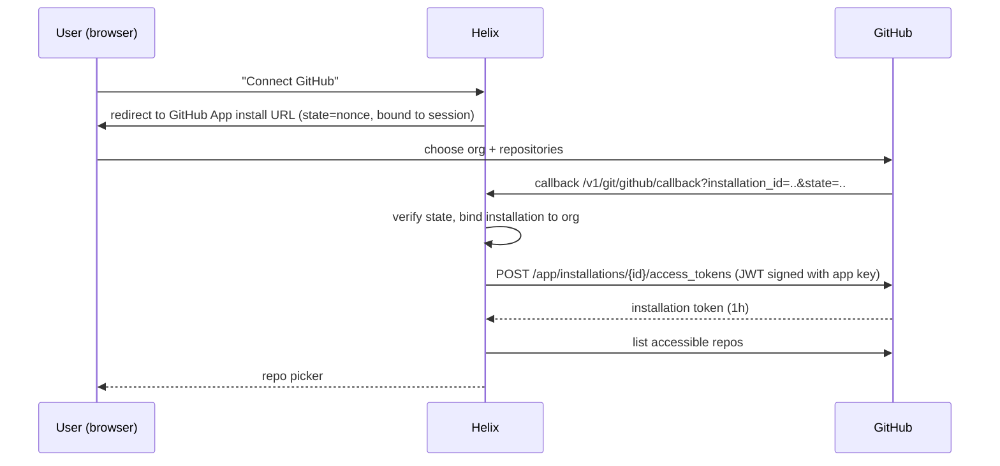
```mermaid
sequenceDiagram
    participant U as User (browser)
    participant H as Helix
    participant G as GitHub
    U->>H: "Connect GitHub"
    H->>U: redirect to GitHub App install URL (state=nonce, bound to session)
    U->>G: choose org + repositories
    G->>H: callback /v1/git/github/callback?installation_id=..&state=..
    H->>H: verify state, bind installation to org
    H->>G: POST /app/installations/{id}/access_tokens (JWT signed with app key)
    G-->>H: installation token (1h)
    H->>G: list accessible repos
    H-->>U: repo picker
```

App private key lives in KMS; installation tokens are minted per operation and never persisted.

### 17.3 Webhooks

- Endpoint `POST /v1/git/{provider}/webhook`, verified by HMAC (`X-Hub-Signature-256`) with **constant-time comparison**, timestamp freshness, and a replay cache on delivery ID.
- Handled events: `push`, `pull_request` (opened/synchronize/reopened/closed), `installation`/`installation_repositories`, `delete` (branch deleted).
- **Respond 200 within 1 second**, always. Enqueue the work; never process inline. Providers disable webhooks that time out.
- Missed webhooks happen. A reconciliation job polls each connected repo's default branch every 15 minutes and creates a deployment if the head commit has no deployment. This single job removes an entire class of "my deploy didn't trigger" tickets.

### 17.4 Deployment triggers

| Event | Behavior |
|---|---|
| Push to `production_branch` | Deploy to production (if `auto_deploy`) |
| Push to any other branch | Deploy to a branch preview environment (if `preview_enabled`) |
| PR opened / synchronized | Deploy to a PR preview environment; comment with URL |
| PR closed / merged | Schedule preview environment teardown |
| Branch deleted | Tear down its preview environment |
| Tag pushed matching a pattern | Optional: deploy to production (a common enterprise preference over branch-based) |
| Commit message contains `[skip deploy]` | Skip |
| Changed paths do not intersect `root_directory` | Skip (monorepo support — essential, not optional) |

**Superseding:** a new push to a branch with an in-flight deployment for the same branch **cancels** the in-flight one (unless it is already past `BUILT` and deploying to production, where you may prefer to let it finish). This saves enormous build capacity on active branches.

### 17.5 Commit status and checks

Post a GitHub Check Run: `queued` → `in_progress` → `success`/`failure`, with a summary containing build duration, image size, cold-start estimate, vulnerability delta versus the base branch, and the preview URL. Deep-link to logs. This is the highest-visibility surface you have; invest in it.

Also post a single, *updated-in-place* PR comment (never a new comment per push — that is the most-complained-about behavior in this product category).

### 17.6 Preview deployments

```text
PR #42 on acme/my-api, branch feature/new-checkout
   ↓
environment: preview (kind=preview, git_ref=feature/new-checkout, expires_at=+7d)
   ↓
URLs:
   https://my-api-pr-42-acme.helix.app            ← stable per PR
   https://my-api-9f2c1d0-acme.helix.app          ← immutable per deployment
   https://feature-new-checkout.my-api.acme.dev   ← optional custom preview domain
```

**URL design.** Three levels, all useful:
- *Deployment URL* — includes the short commit SHA, never changes, always points to that exact build. Essential for "the bug was in this build."
- *Branch/PR alias* — moves with the latest deployment on that branch. This is what goes in the PR comment.
- *Custom preview wildcard* — for customers who want previews on their own domain (`*.preview.acme.com` with a delegated wildcard cert).

Slugs must be sanitized: lowercase, `[a-z0-9-]`, truncated with a hash suffix to stay within DNS label limits (63 chars) and to avoid collisions from truncation (`feature/very-long-name-a` and `-b`).

**Environment variables for previews:** a separate `preview` scope. Never expose production secrets to preview deployments by default — a PR from a fork would otherwise leak your production database URL to anyone who opens a PR. **Deployments from forked repositories must run with no secrets at all unless a maintainer explicitly approves**, exactly as GitHub Actions does. This is a real, exploited attack class.

**Access control:** previews can be public (default), password-protected, or restricted to org members via an auth check at the gateway. Offer all three; default to public only if the project's repo is public, otherwise default to protected.

**Cleanup:**
- PR closed → teardown after a grace period (1h, so someone can still look at it).
- Branch preview idle → scale to zero immediately (it should be `min_instances: 0` always), and delete the environment after `expires_at` (default 7 days of no deploys).
- A nightly job reconciles: any preview environment whose branch/PR no longer exists gets torn down.
- Deleting an environment removes routes, certs, and instances; images are GC'd on the normal schedule.

**Production promotion:** `helix promote <deployment-id>` takes the *exact image* from a preview deployment and creates a production release from it, re-resolving only the environment-specific config (env vars, scaling, regions). No rebuild. This makes "what I tested is what ships" literally true, which is the main value proposition of previews.

---

## 18. Multi-Tenancy

### 18.1 The boundaries

| Boundary | Enforced by |
|---|---|
| **Organization** | The billing, quota, and data boundary. Every row carries `org_id`; RLS enforces it |
| **Project** | Grouping + access control within an org; not a security boundary against the same org's other projects |
| **Environment** | Config and secret scope; production can be `protected` |
| **Instance** | The runtime isolation boundary (microVM) |
| **Worker** | The blast-radius boundary for a host compromise |
| **Region** | Data residency and failure domain |

### 18.2 Data isolation

Three layers, because one is not enough:
1. **Application layer** — every repository method takes an `org_id` and every query filters on it. Enforced by making the data-access layer require a `TenantContext` parameter; a query without one does not compile.
2. **Database layer** — PostgreSQL RLS policies on every tenant table, with `SET LOCAL app.current_org_id` at transaction start. A forgotten `WHERE` clause returns zero rows instead of everyone's data.
3. **Test layer** — an automated test that, for every table with `org_id`, verifies RLS is enabled and a cross-org read returns empty. Run in CI.

Object storage: per-org key prefixes and, for the registry, per-repository token scoping. Logs: tenant ID as a Loki label, and the log query API always injects the tenant filter server-side (never from client input).

### 18.3 Runtime isolation

Covered in §6. The multi-tenancy-specific rules:
- Different orgs' VMs never share a physical CPU core's sibling threads (core scheduling, §6.6).
- No guest-to-guest network path, even within an org, unless explicitly enabled.
- A per-org cap on instances per worker (blast radius).
- Snapshots are never shared across orgs, and snapshot files are encrypted with per-org keys.
- Build caches are per project.

### 18.4 Quotas and limits

Two categories with different enforcement:

| Type | Examples | Enforcement | Behavior on breach |
|---|---|---|---|
| **Hard limits** (protect the platform) | max instances, max memory per instance, max image size, max concurrent builds, API rate | Checked at admission, synchronously | Request rejected with a clear error |
| **Soft limits** (protect the bill) | monthly build minutes, egress GiB, request count | Metered asynchronously | Warn at 80%, notify at 100%, then either throttle or bill overage per plan. **Never** hard-stop a paying customer's production traffic without explicit consent — that is an outage you caused |

Free tier gets hard limits on everything including egress, because free tiers are where abuse lives (§24).

Quota checks must be cheap: cache the org's quota row in Redis with a short TTL, and count current usage from an authoritative source (`SELECT count(*) FROM instances WHERE org_id=$1 AND stopped_at IS NULL`) with a Redis counter as a fast path plus periodic reconciliation.

### 18.5 Noisy neighbor prevention

| Dimension | Control |
|---|---|
| CPU | `cpu.max` hard ceiling per instance; `cpu.weight` for fair share; core scheduling; monitor steal time per instance and alert when a worker's aggregate steal exceeds a threshold |
| Memory | No overcommit of configured maximums; `memory.high` for graceful pressure |
| Disk I/O | `io.max` per instance on the overlay device; separate NVMe for rootfs cache vs overlays; io.latency protection for the host's own needs |
| Network | `tc` HTB per VM; per-worker aggregate cap; conntrack limits |
| Page cache | Shared read-only rootfs is a *benefit*, but a tenant reading a huge file can evict others' pages. Accept; monitor; consider cgroup `memory.max` including page cache at [SCALE] |
| Gateway | Per-tenant connection and queue budgets in the activator |
| Control plane | Per-org API rate limits; per-org concurrency limits on expensive operations (builds, log queries) |
| Database | Statement timeouts; separate connection pools for API vs background jobs so a slow report cannot starve the API |

**The worker-level cap is the most important one:** limit any single org to N% (e.g. 25%) of a worker's capacity. It costs a little packing efficiency and prevents one tenant from monopolizing a host.

### 18.6 Billing isolation

Every usage record carries `org_id`, `project_id`, `release_id`, `instance_id`, `region_id`. Metering happens at the agent and gateway (§25), independent of the control plane, so a control-plane outage does not lose billing data.

---
## 19. Autoscaling

Three independent loops operating at different timescales. Confusing them is a common source of oscillation.

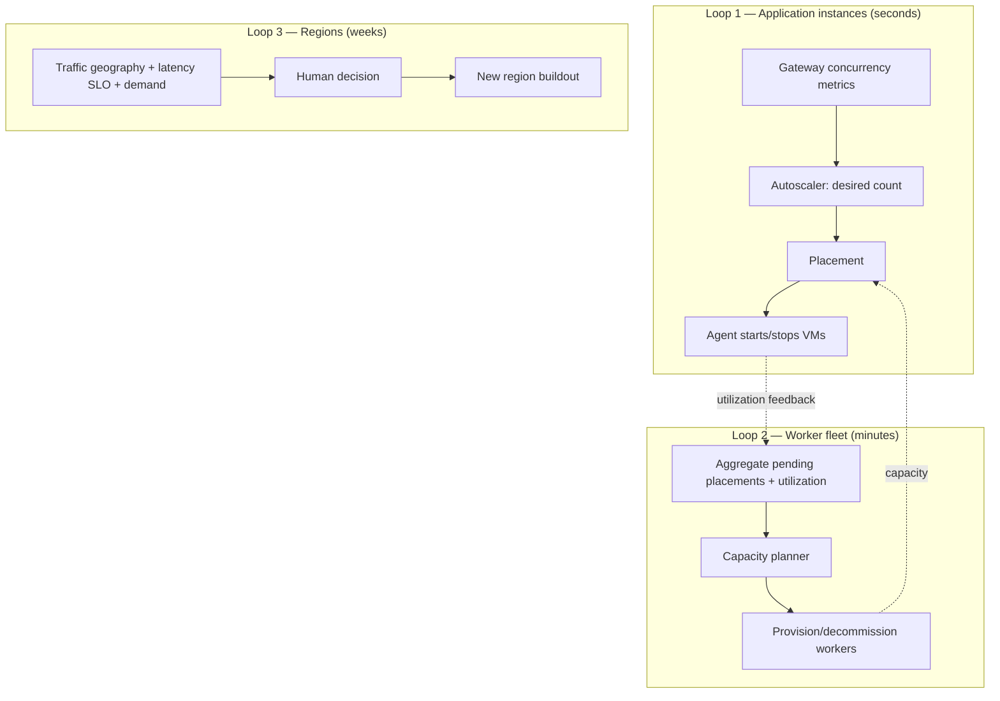
```mermaid
graph TB
    subgraph L1["Loop 1 — Application instances (seconds)"]
        A1[Gateway concurrency metrics] --> A2[Autoscaler: desired count] --> A3[Placement] --> A4[Agent starts/stops VMs]
    end
    subgraph L2["Loop 2 — Worker fleet (minutes)"]
        B1[Aggregate pending placements + utilization] --> B2[Capacity planner] --> B3[Provision/decommission workers]
    end
    subgraph L3["Loop 3 — Regions (weeks)"]
        C1[Traffic geography + latency SLO + demand] --> C2[Human decision] --> C3[New region buildout]
    end
    A4 -.->|utilization feedback| B1
    B3 -.->|capacity| A3
```

### 19.1 Loop 1 — application instances

Algorithm in §12.2. Key operational parameters:

| Parameter | Default | Rationale |
|---|---|---|
| Evaluation interval | 2 s | Fast enough to feel responsive |
| Stable window | 60 s | Damping |
| Panic window | 6 s | Spike response |
| Panic threshold | 2× | |
| Max scale-up per interval | `max(2, current)` — i.e. doubling | Prevents a metric glitch from creating 500 instances |
| Max scale-down per interval | `max(1, 10% of current)` | Gentle |
| Scale-down delay | 60 s | |
| Activation concurrency cap | 20 simultaneous cold starts per release | Protects workers and the registry |

**0 → 1** is special: driven by the activator on request arrival, not by the periodic loop.
**1 → N** is driven by concurrency.
**N → 0** requires zero requests for the full delay.

### 19.2 Loop 2 — worker fleet

**Signals:**
- `pending_placements` — instances the scheduler could not place. Any sustained non-zero value is an emergency.
- Fleet allocatable headroom per region/zone: `1 - (allocated_memory / allocatable_memory)`.
- Forecast: the same weekday/hour last week, plus recent trend.

**Policy:**

```text
target_headroom = 25%                  # enough to absorb a scale-up burst and one worker failure
if headroom < 15%  → provision workers (batch of ceil(deficit / worker_capacity), min 1)
if headroom > 45% sustained 30 min → cordon and drain the emptiest workers
never go below min_workers_per_zone = 2
never remove more than 1 worker per zone per 10 minutes
```

**Provisioning mechanics differ sharply by infrastructure:**

| Infrastructure | Provision time | Approach |
|---|---|---|
| Cloud metal (AWS `*.metal`, Equinix, OVH cloud) | 3–15 min | API-driven autoscaling; keep a small pool of pre-provisioned, cordoned "hot spare" workers to cover the provisioning gap |
| Dedicated bare metal (Hetzner AX/EX) | hours to days | **Cannot autoscale.** Capacity planning is a human process with weeks of lead time. Keep 30–40% headroom, and use a cloud-metal burst pool for spikes |
| Hybrid (recommended) | — | Baseline on cheap dedicated bare metal, burst on cloud metal. This is the cost-optimal shape (§33) |

Because bare metal cannot scale in minutes, **the architecture must tolerate a saturated region**: admission control that queues new instance starts, cross-region spillover for releases that allow it, and honest 503s with `Retry-After` when neither is possible. Design this early; it is not an edge case at small scale, it is the normal Tuesday-afternoon case.

New workers must warm before serving: pull the top-N most common base images and runtime images, build their rootfs, and populate the warm pool, *then* mark Ready. A worker that goes Ready cold will receive traffic and give every one of those users a multi-second cold start.

### 19.3 Loop 3 — regions

Not automated. A region is: a rack or cloud footprint, a Postgres replica, a NATS cluster, an Envoy fleet, a registry mirror, an object storage endpoint, IP allocations, and compliance review. Plan it as a project (§20.1), not an autoscaling policy.

---

## 20. High Availability

### 20.1 Target topology

```mermaid
graph TB
    subgraph GLOBAL["Global"]
        DNS2["DNS / Anycast"]
        S3G[("Object storage — cross-region replicated")]
        KMS2[KMS / HSM]
    end

    subgraph RA["Region A — primary"]
        direction TB
        EA[Envoy fleet ×N]
        GA[helix-gateway ×N]
        CA["helix-control ×N (all roles)"]
        SCHA[Scheduler leader A]
        PGA[("PostgreSQL primary + sync standby")]
        RDA[(Redis HA)]
        NA[(NATS JetStream R3)]
        REGA[(Registry)]
        WA1[Workers ×M]
    end

    subgraph RB["Region B"]
        direction TB
        EB[Envoy fleet ×N]
        GB[helix-gateway ×N]
        CB["helix-control ×N (read + local scheduling)"]
        SCHB[Scheduler leader B]
        PGB[("PostgreSQL async replica")]
        RDB[(Redis HA)]
        NB[(NATS JetStream R3)]
        REGB[(Registry mirror)]
        WB1[Workers ×M]
    end

    DNS2 --> EA & EB
    EA --> GA --> WA1
    EB --> GB --> WB1
    CA --> PGA
    CB -->|writes| PGA
    CB -->|reads| PGB
    PGA -.->|streaming replication| PGB
    REGA -.->|sync| REGB
    NA <-.->|gateway/leafnode| NB
    RA & RB --> S3G
```

### 20.2 PostgreSQL

**Decision: single logical primary, synchronous standby in the same region, asynchronous replica in the secondary region. [V1]**

| Option | Assessment |
|---|---|
| Single instance + backups | MVP only |
| **Primary + sync standby (same region) + async replica (other region)** | RPO 0 within region, RPO seconds cross-region, RTO ~30 s with automatic failover. Standard, well-understood. **Chosen** |
| Multi-primary (BDR, Citus multi-master) | Conflict resolution complexity not justified |
| Distributed SQL (CockroachDB, Yugabyte) | Genuinely solves multi-region writes, but: higher latency per transaction, different operational model, weaker Postgres compatibility in corners, and more expensive. Revisit at [SCALE] if cross-region write latency becomes a product problem |

Tooling: **Patroni** + etcd/Consul for leader election and automatic failover, or a managed Postgres if you are on a cloud that has a good one. Connection routing via PgBouncer (transaction pooling) + HAProxy/pgpool in front, or Patroni's REST-driven endpoints.

**Cross-region write latency is the key constraint.** Region B's control plane writes to Region A's primary, adding ~50–200 ms per write. This is acceptable because writes are control-plane operations (deploy, config), not request-path. The request path in Region B touches **no database at all**.

Additional practices: `synchronous_commit = on` with `synchronous_standby_names` set to the local standby; statement timeouts; separate pools per workload; `pg_stat_statements`; partition the big append-only tables; and test failover monthly, in production, on purpose.

### 20.3 Failure matrix

| Failure | Detection | Impact | Recovery | Requests lost? |
|---|---|---|---|---|
| **Single `helix-control` replica** | LB health check | None | LB removes it; N-1 replicas serve | No |
| **All control replicas in a region** | Alert | No deploys, no scale-up, no cold starts for scale-to-zero apps in that region. **Warm traffic unaffected** | Restart/failover; other region's control plane can drive workers if configured for cross-region control | Cold-start requests only |
| **Postgres primary** | Patroni | Writes fail ~15–45 s (deploys 503, reads served by replicas if the app supports it) | Automatic promotion of sync standby; connection strings via service discovery so apps reconnect | Deploy API calls in flight |
| **Postgres both primary and standby** | Alert | Control plane read-only at best | Promote the cross-region async replica — **accept RPO of seconds and reconcile** (§21) | Recent writes |
| **Redis** | Sentinel | Sessions lost (re-login), rate limits reset, gateway falls back to gRPC route fetch, single-flight degrades | Sentinel failover; caches refill | No |
| **NATS node** | Cluster | None (R3) | Automatic | No |
| **NATS cluster** | Alert | Telemetry buffered at agents (bounded); build queue falls back to Postgres polling if implemented | Restart; agents drain buffers | Telemetry beyond buffer |
| **Scheduler leader** | Lease expiry | No new placements for ≤5 s | Follower acquires lease | No |
| **A worker** | 3 missed heartbeats (15 s) | Its instances' in-flight requests fail; gateway ejects endpoints within ~2 s via connection errors | Scheduler replaces instances elsewhere; worker fenced | In-flight on that worker |
| **Many workers (rack/PDU)** | Zone-level | Capacity loss; releases with instances only there go cold | Zone-aware spread means most releases keep instances elsewhere; scheduler backfills | Some |
| **Envoy replica** | L4 health | Connections on it drop | L4 LB reroutes; clients reconnect | In-flight on that replica |
| **Entire edge in a region** | Anycast/GeoDNS health | Traffic shifts to another region | Automatic with anycast (BGP withdrawal), 60–300 s with GeoDNS TTL | Some during shift |
| **Registry** | Pull failures | New instance starts fail where the image is not cached; **warm instances unaffected** | Regional mirrors + worker caches + object-storage-backed HA registry | Cold starts of uncached images |
| **Object storage** | API errors | Registry degraded (unless cached), no new builds (artifact push), no log archive, snapshots unavailable | Multi-AZ object store; cross-region replication; workers serve from local cache | Builds |
| **DNS provider** | External monitoring | Catastrophic if total | **Use two DNS providers** with the same zone (e.g. Route53 + NS1/Cloudflare) and NS records for both. This is cheap insurance against a provider outage, which has happened to everyone | New resolutions |
| **Network partition between regions** | Cross-region probes | Region B cannot write to Postgres → no deploys in B; B's data plane keeps serving | Region B enters "degraded autonomous" mode: serves traffic, no control changes. **Must not** promote its own primary automatically (split brain) | No |
| **KMS unavailable** | API errors | Cannot decrypt secrets → new instance starts fail for apps with secrets | Cache unwrapped DEKs in control-plane memory with a TTL (a deliberate, documented tradeoff); multi-region KMS | Cold starts |

### 20.4 The autonomy principle

Each region must be able to serve existing traffic with **zero** cross-region dependencies:
- Envoy has its config.
- Gateway has its route table.
- Workers have their images and are running their instances.
- Metering buffers locally and ships later.

Cross-region dependencies are acceptable only for: creating deployments, changing config, and cross-region scheduling. All of those can be unavailable for minutes without a customer-visible outage.

### 20.5 Split brain prevention

- **Postgres:** only Patroni/etcd may promote. Never automatic cross-region promotion; it requires a human with a runbook, because the network partition case and the "region is actually gone" case look identical from inside.
- **Scheduler:** leases with fencing tokens (§38.3). Worker `generation` increments on re-registration; the control plane rejects reports carrying a stale generation.
- **Workers:** a worker that cannot reach any control plane for `self_fence_timeout` (default 5 min) stops its instances. Better a clean stop than two regions both believing they own a release and both serving stale code.
- **Route table:** monotonic generations; gateways never apply an older generation.

### 20.6 Graceful degradation ladder

State this explicitly so on-call knows what "still fine" looks like:

| Level | Symptom | User impact |
|---|---|---|
| 0 Normal | — | — |
| 1 Degraded control | Deploys slow/queued | Deploys delayed |
| 2 No control plane | Deploys fail, no autoscaling, no cold starts | Existing traffic fine; scaled-to-zero apps down |
| 3 No scheduler | Failed instances not replaced | Gradual capacity decay |
| 4 Gateway degraded | Elevated latency, some 503s | Partial outage |
| 5 Edge down in a region | Region unreachable | Failover to other region |
| 6 Data loss | — | Incident, §21 |

### 20.7 Registry availability

Because the registry is tier-0 for scale-out:
- Distribution/Zot replicas behind a load balancer, backed by S3 (stateless replicas).
- A read-only mirror per region, synced continuously.
- Worker-local content-addressed cache with generous retention (the last N releases per project on workers that ran them).
- Peer-to-peer layer fetch between workers.
- **Prefetch on release creation** so a scale-up never hits the registry cold.
- Effect: a total registry outage degrades to "no new images can be created, but everything already deployed can scale."

---

## 21. Disaster Recovery

### 21.1 Objectives

| Data class | RPO | RTO | Justification |
|---|---|---|---|
| Control-plane database (projects, deployments, secrets, domains) | **0 in-region / ≤ 30 s cross-region** | **≤ 30 min** | Loss means customers cannot manage or redeploy |
| Usage/billing records | **≤ 5 min** | ≤ 4 h | Revenue; also reconstructible from agent/gateway buffers |
| OCI registry (images) | **≤ 15 min** | ≤ 2 h | Images are rebuildable from source, but rebuilding everything is hours; treat as important, not critical |
| Object storage (build artifacts, SBOMs) | ≤ 1 h | ≤ 4 h | |
| Logs | ≤ 1 h, best-effort | ≤ 8 h | Non-critical |
| Snapshots | **No RPO** — regenerable | — | Explicitly disposable |
| Customer application data | N/A | N/A | **Not stored by the platform.** Say this loudly in the docs |
| Serving capability (a region) | — | **≤ 15 min** via failover | |

### 21.2 Backup strategy

**PostgreSQL:**
- Continuous WAL archiving to object storage (pgBackRest or WAL-G) → point-in-time recovery to any second within the retention window.
- Full base backup daily, incremental every 6 h, retained 30 days; one monthly full retained 12 months.
- Backups encrypted with a key that is **not** the same key protecting the database, and stored in a **different account/project** than production, so that a compromised production credential cannot delete backups. Enable object-lock / immutability where available. Ransomware against backups is the scenario that kills companies.
- **Restore tested monthly, automatically**: a job restores the latest backup into a scratch instance, runs schema and row-count assertions, and reports. An untested backup is not a backup.

**Object storage:** versioning on, lifecycle rules, cross-region replication for `helix-registry` and `helix-sbom`. Object-lock on the backup bucket.

**Configuration and infrastructure:** everything in Git (Terraform/OpenTofu for infra, Ansible for host config, Helm/manifests or systemd units for services). Cluster state must be reconstructible from the repo plus the database backup.

**Secrets:** KMS keys are the crown jewels. Multi-region KMS keys; documented key-material backup or an HSM with a quorum-controlled export; **if the CMK is lost, every secret is unrecoverable** — this deserves an explicit, rehearsed procedure and an owner.

**What is deliberately not backed up:** instance overlays, `/tmp`, snapshots, worker local caches, Redis. All reconstructible.

### 21.3 Restore procedures

**Scenario A — accidental deletion of a customer's project.**
Soft-delete with a 30-day window. Restore = clear `deleted_at`, re-create routes, redeploy the last release from its stored image. Automate it; this will happen weekly.

**Scenario B — Postgres corruption or bad migration.**
1. Stop writes (put control plane in read-only mode; the data plane keeps serving).
2. PITR to just before the bad event into a new instance.
3. Validate: row counts, spot-check recent deployments, verify secret decryption works.
4. Repoint, re-enable writes.
5. **Reconcile:** for every release marked active, verify instances exist; for every instance reported by agents, verify a row exists. The agents' actual state is the tiebreaker for runtime; the database is the tiebreaker for intent. Write the reconciliation tool *before* you need it.
Target: 30 min for a database under 500 GB.

**Scenario C — total region loss.**
1. Confirm loss (not a partition) — requires human judgment, with a checklist.
2. Promote the cross-region async replica. Record the data-loss window from `pg_last_wal_receive_lsn` versus the last known primary LSN.
3. Repoint DNS/anycast; withdraw the dead region's routes.
4. Scale workers in the surviving region (or the burst pool).
5. Re-create instances for all active releases — this is the long pole; images must be present in the surviving region's registry mirror (they are, if replication was healthy).
6. Reconcile lost writes: deployments created in the last RPO window are re-driven from the outbox or reported as failed to customers. Be transparent about which.
Target RTO: 15 min to serve, up to 2 h to full capacity.

**Scenario D — compromised signing key or registry.**
1. Revoke the key in KMS; rotate.
2. Re-sign all images from a known-good manifest inventory, or force rebuild.
3. Agents refuse unsigned/old-key images — meaning the fleet stops starting new instances until re-signing completes. Plan for this: keep a key rotation runbook with a grace period where two keys are trusted.

### 21.4 DR calendar

| Exercise | Frequency |
|---|---|
| Automated backup restore verification | Daily |
| Postgres failover drill (in production) | Monthly |
| Region failover game day | Quarterly |
| Full DR from backups into a clean environment | Semi-annually |
| Key rotation drill | Annually |
| Chaos: kill a random worker during business hours | Weekly, automated |

---

## 22. Observability

### 22.1 Stack

| Signal | Tool | Rationale |
|---|---|---|
| Metrics | **Prometheus** (per region) + **Thanos** or **Mimir** for global query and long retention | Pull model fits a fleet with service discovery; enormous ecosystem. Thanos/Mimir solves the multi-region + retention problem that plain Prometheus does not |
| Dashboards | **Grafana** | — |
| Logs | **Loki** | Label-indexed, object-storage-backed, cheap. Perfect for high-volume, low-query-rate platform and customer logs. Alternative at scale: ClickHouse or Quickwit if you need full-text search — Loki's weakness is ad-hoc search without good labels |
| Traces | **OpenTelemetry SDK → OTel Collector → Tempo** (or Jaeger) | Tempo is object-storage-backed and pairs with Grafana |
| Instrumentation | **OpenTelemetry everywhere** | Vendor-neutral; lets you swap backends without re-instrumenting. Use OTel for traces and logs; Prometheus client libs for metrics (or OTel metrics exported in Prometheus format) |
| Profiling [V1] | Pyroscope / Parca (continuous profiling) | Finding a Rust agent's CPU regression across 500 hosts is otherwise miserable |
| Alerting | Alertmanager → PagerDuty/Opsgenie | |
| Status page | Statuspage/Instatus, driven by real SLOs | |

**Two separate telemetry planes.** Platform telemetry (your operations) and customer telemetry (their logs and metrics, shown in their dashboard) have different retention, access control, cardinality, and cost profiles. Keep them in separate Loki tenants and separate Prometheus/Mimir tenants. Never let a customer's log volume affect your ability to debug the platform.

### 22.2 What to measure — the SLO set

Start with four user-facing SLOs; everything else is diagnostic.

| SLO | Definition | Target |
|---|---|---|
| **Request availability** | Non-5xx-originating-from-platform / total, per region | 99.95% monthly |
| **Warm request latency** | p99 platform-added latency (excluding app time) | < 15 ms |
| **Cold start latency** | p95 time from request arrival to first byte for a scaled-to-zero release, by runtime | < 1.5 s (snapshot-enabled) |
| **Deployment success + duration** | p95 git-push → live, for successful deploys | < 3 min |

Distinguish platform errors from app errors rigorously. A customer's app returning 500 is **not** an availability violation; a 503 from the activator timing out **is**. Tag every gateway response with `error_source: app|platform|client`.

### 22.3 Metric catalogue

```text
# Deployment pipeline
helix_deployment_duration_seconds{phase=queue|build|schedule|start|total,runtime,result}
helix_deployment_total{result=succeeded|failed|cancelled,trigger,failure_class}
helix_build_duration_seconds{runtime,cache=hit|miss,result}
helix_build_queue_depth{region}
helix_build_queue_wait_seconds
helix_build_concurrent{region}
helix_image_size_bytes{runtime}
helix_image_pull_duration_seconds{worker,cached}

# Cold start / runtime
helix_cold_start_duration_seconds{runtime,method=cold|snapshot|warm_pool,region}
helix_microvm_start_duration_seconds{phase=rootfs|network|jail|boot|init|probe}
helix_microvm_count{worker,state}
helix_instance_state_transitions_total{from,to,reason}
helix_instance_start_failures_total{reason=pull|boot|probe|oom|capacity}
helix_snapshot_restore_duration_seconds
helix_snapshot_create_duration_seconds
helix_warm_pool_size{worker,runtime}
helix_warm_pool_hit_ratio

# Request path
helix_request_duration_seconds{route,release,method,status_class,phase=total|platform|upstream}
helix_requests_total{release,status,error_source}
helix_request_concurrency{release}
helix_activation_duration_seconds{release,result=hit|timeout}
helix_activation_queue_depth{release}
helix_activation_coalesced_total
helix_upstream_connect_errors_total{worker}
helix_route_table_generation{gateway}
helix_route_table_staleness_seconds{gateway}

# Scheduling
helix_placement_duration_seconds
helix_placement_failures_total{reason=no_capacity|no_match|reservation_conflict}
helix_pending_placements{region,zone}
helix_scheduler_leader{region}
helix_desired_vs_actual_instances{release}

# Worker
helix_worker_cpu_usage_ratio{worker}
helix_worker_memory_allocatable_bytes / _allocated_bytes
helix_worker_steal_time_ratio{worker}
helix_worker_instance_count{worker}
helix_worker_heartbeat_age_seconds{worker}
helix_worker_disk_free_bytes{worker,mount}
helix_worker_rootfs_cache_bytes / _hit_ratio

# Per-tenant (for billing and abuse, cardinality-controlled)
helix_instance_cpu_seconds_total{org,project,release}
helix_instance_memory_mib_seconds_total{org,project,release}
helix_egress_bytes_total{org,project}
helix_requests_billed_total{org,project}

# Control plane
helix_api_request_duration_seconds{endpoint,status}
helix_db_query_duration_seconds{query}
helix_db_pool_saturation
helix_outbox_lag_seconds
helix_queue_depth{subject}
helix_certificate_expiry_seconds{hostname}   # alert < 14d
helix_acme_order_failures_total
```

**Cardinality discipline.** `{org,project,release}` labels on high-frequency metrics will destroy Prometheus. Rules: per-tenant metrics are **aggregated at the agent/gateway into 60 s windows and sent as billing events via NATS, not scraped as Prometheus series**. Prometheus keeps per-release series only for the top-N releases by traffic, or per-project rollups. This is the most common way self-built platforms melt their monitoring.

### 22.4 Logs

| Stream | Source | Destination | Retention |
|---|---|---|---|
| Customer app stdout/stderr | `vminit` → vsock → agent | NATS → Loki (customer tenant) | 7–30 days by plan, then S3 |
| Build logs | Build VM → builder agent | NATS → Loki + S3 | 30 days |
| Platform component logs | Structured JSON with `trace_id` | Loki (platform tenant) | 30 days |
| Audit logs | Postgres (authoritative) + Loki (queryable) | Postgres partitions | 1–7 years |
| Access logs (Envoy/gateway) | Envoy | Loki, sampled for 2xx, full for errors | 30 days |

Labels for customer logs: `org`, `project`, `environment`, `release`, `instance`, `region`, `stream`. Keep it to these — every additional label multiplies stream count.

Customer log API queries always inject `org` server-side. Never build the LogQL query from unsanitized client input (LogQL injection is a real cross-tenant read).

### 22.5 Tracing

Trace context flows: Envoy generates/propagates `traceparent` → gateway adds an activation span → the span is linked to the instance-start span produced by the agent → injected into the guest as `traceparent` so the customer's app can continue the trace if instrumented.

The high-value traces are: **the deployment pipeline** (one trace from API call to instance ready, with spans for build phases, push, scan, placement, pull, boot, probe) and **the cold-start path** (one trace showing exactly where the 1.8 s went). These two traces will answer 80% of "why is it slow" questions. Sample deployments at 100% (low volume, high value) and requests at 0.1–1% plus all errors.

### 22.6 Alerting philosophy

Page only on **symptoms**, not causes:

| Page | Ticket |
|---|---|
| Request availability SLO burn rate > 14.4× (2% budget in 1 h) | A single worker unhealthy |
| p95 cold start > 5 s for 10 min | Build queue depth elevated |
| Deployment success rate < 95% for 15 min | Image cache hit ratio dropped |
| Certificate expiring in < 7 days | Disk 70% full |
| Postgres replication lag > 60 s | A flaky test |
| Pending placements > 0 for 5 min | |
| Any cross-tenant authorization failure detected | |
| Signature verification failure on any worker | |

Use multi-window multi-burn-rate alerting on the SLOs rather than static thresholds. Every alert must link to a runbook; an alert without a runbook gets deleted.

---
## 23. Security Architecture

### 23.1 Authentication

| Surface | Mechanism | Controls |
|---|---|---|
| Dashboard | Email+password (Argon2id) or OIDC/SAML; TOTP/WebAuthn MFA | Session cookie `__Host-` prefixed, `Secure; HttpOnly; SameSite=Lax`, 7-day sliding with 30-day absolute; CSRF token on mutations; session invalidation on password change; device list with revocation |
| CLI / API | PATs `hxp_<prefix>_<secret>` | `sha256` storage, scopes, expiry, last-used tracking, GitHub secret-scanning partnership, one-time display |
| CI | Machine tokens, optionally OIDC federation (GitHub Actions → short-lived token, no stored secret) | OIDC federation is the right answer and eliminates long-lived CI secrets |
| Workers | mTLS with SPIFFE-style SVIDs, 24 h rotation | Node identity established at provisioning via a one-time bootstrap token |
| Internal services | mTLS, SPIFFE IDs, per-method authorization | |
| Git providers | GitHub App JWT → per-installation short-lived tokens | |

Brute-force defense: per-account and per-IP exponential backoff, account lockout with self-service recovery, CAPTCHA after N failures, and credential-stuffing detection (many accounts, one IP, high failure rate).

### 23.2 Authorization

Covered in §16.3. Additional platform-level controls:
- **Deny by default.** The authorization function returns `denied` unless a rule explicitly permits.
- **A single choke point.** All handlers call `authz.Check(ctx, action, resource)`. A linter/test asserts that every mutating handler does.
- **Every denial is audit-logged** with actor, resource, and action. A spike in denials is an attack signal.
- **Cross-tenant access is impossible by construction**, not by check: the repository layer requires a `TenantContext`, and RLS is the backstop.

### 23.3 API security

- TLS 1.2+ only; HSTS on the API domain.
- Strict body size limits, JSON depth/size limits, request timeout.
- CORS: dashboard origin only; the API is not designed for direct browser use from customer sites.
- No sensitive data in URLs (they land in logs and referrers).
- Security headers on the dashboard: CSP with nonces, `X-Content-Type-Options`, `Referrer-Policy`, `Permissions-Policy`, `X-Frame-Options: DENY`.
- **Customer-content isolation:** customer apps are served on `*.helix.app`, which is a *different registrable domain* from the dashboard. Put `helix.app` on the Public Suffix List, otherwise a customer's app can set cookies for `helix.app` and attack the dashboard, and `document.domain`/cookie-scope attacks become possible. This is a common and serious oversight.

### 23.4 Secrets management

```mermaid
graph LR
    subgraph KMSB["KMS / HSM"]
        CMK["Customer Master Key per org (or per environment)"]
    end
    subgraph PGB2["PostgreSQL"]
        DEK["data_keys: wrapped DEK"]
        CT["secrets: AES-256-GCM ciphertext + nonce"]
    end
    subgraph CPB["helix-control (memory only)"]
        UNW["Unwrapped DEK, TTL-cached"]
        PT["Plaintext secret, request-scoped"]
    end
    subgraph AGB["Worker"]
        ENVV["Env vars in Firecracker config → vsock → guest memory"]
    end
    CMK -->|Decrypt| UNW
    DEK --> UNW
    CT --> PT
    UNW --> PT
    PT -->|mTLS gRPC| ENVV
```

Rules:
- Envelope encryption: per-org DEK wrapped by a KMS CMK; DEK rotated quarterly; secrets re-encrypted lazily.
- Plaintext exists only in `helix-control` memory (request-scoped, zeroed after use where the language permits) and in guest memory.
- **Never written to worker disk.** Secrets go into the Firecracker config that lives in a tmpfs inside the jail, or better, are delivered to `vminit` over vsock after boot so they never touch a file at all. Prefer the vsock path.
- Never on the kernel command line (world-readable via `/proc/cmdline`).
- Never in logs: structured logging with a redaction middleware plus a test that asserts known secret values never appear in log output.
- Never returned by the API after creation.
- Rotation: `PATCH` creates a new version; old versions retained briefly for rollback, then destroyed.
- **Snapshots contain secrets in guest memory** — encrypt snapshot files at rest, scope them per org, and invalidate on secret rotation (§7.11).

### 23.5 Encryption

| Data | At rest | In transit |
|---|---|---|
| Postgres | Full-disk (LUKS) + column-level for secrets/keys | TLS between app and DB, and for replication |
| Object storage | SSE with KMS keys (or client-side for the most sensitive buckets) | TLS |
| Registry blobs | Storage-layer encryption | TLS (mTLS internally) |
| Snapshots | AES-256-GCM with per-org key | TLS |
| Worker local disk (rootfs cache, overlays) | **LUKS full-disk encryption on worker NVMe** — protects against physical disk recovery and is required for most compliance regimes | n/a |
| Backups | Separate key, separate account, object-lock | TLS |
| Internal service traffic | n/a | **mTLS everywhere**, no plaintext internal hops |
| Customer traffic | n/a | TLS 1.2/1.3 at the edge; edge→worker over a private network, mTLS at [V1] |

### 23.6 Key management

- One KMS/HSM (cloud KMS, or Vault + HSM self-hosted). Keys never leave it.
- Distinct keys with distinct access policies for: secrets encryption, snapshot encryption, certificate private keys, backup encryption, image signing, token signing.
- Image signing key usable only by the builder service role; **require an approval or use a keyless/Fulcio flow with an identity-bound short-lived certificate** for the strongest posture.
- Key rotation schedule documented and rehearsed; support a dual-key grace period for every key so rotation is never a flag-day.

### 23.7 Audit logging

Every mutating action: actor (user/token/system), IP, user agent, action, resource, before/after diff (secrets redacted to key names only), outcome, request ID, timestamp. Append-only — no `UPDATE`/`DELETE` grants on the table for the application role; ship to a write-once store for compliance tiers.

Customer-visible audit log is a paid feature and also a support tool ("who deleted the production domain?").

### 23.8 Supply-chain security

**Yours:**
- Pin all dependencies by hash (`go.sum`, `Cargo.lock`, lockfiles). Renovate/Dependabot with review.
- Reproducible-ish builds of your own binaries; sign releases; SBOM for your own components.
- Base images for build/run rebuilt weekly and pinned by digest in runtime definitions.
- Two-person review on anything touching the agent, jailer invocation, seccomp filters, authz, or crypto.
- Restricted CI: no secrets in PR builds from forks; separate deploy credentials with OIDC federation.

**Customers':**
- SBOM generated per image; vulnerability scanning; provenance attestation; dependency-confusion protection at the mirror; notification when a shipped image gains a new critical CVE.

### 23.9 Security attack tree (platform-wide)

```mermaid
graph TD
    ROOT["GOAL: compromise the platform or a tenant"] --> P1[Path 1: Escape a runtime sandbox]
    ROOT --> P2[Path 2: Compromise the control plane]
    ROOT --> P3[Path 3: Compromise the supply chain]
    ROOT --> P4[Path 4: Abuse legitimate access]
    ROOT --> P5[Path 5: Attack the network/edge]
    ROOT --> P6[Path 6: Insider or credential theft]

    P1 --> P1a[KVM/Firecracker 0-day → host root]
    P1 --> P1b[Wasmtime JIT escape → wasm host process]
    P1 --> P1c[Agent vuln via vsock/log parsing]
    P1 --> P1d[Escape build sandbox]
    P1a --> P1a1[Read other tenants' memory/rootfs on that host]
    P1a --> P1a2[Steal worker mTLS cert → impersonate worker]

    P2 --> P2a[AuthZ bypass / IDOR in API]
    P2 --> P2b[SQL injection]
    P2 --> P2c[SSRF from control plane, e.g. git URL / webhook URL]
    P2 --> P2d[Compromise a control-plane dependency]
    P2 --> P2e[Steal DB credentials]

    P3 --> P3a[Malicious runtime definition or base image]
    P3 --> P3b[Registry write access → backdoored image]
    P3 --> P3c[Compromised platform dependency]
    P3 --> P3d[Typosquatting in a tenant's deps → tenant compromise]

    P4 --> P4a[Crypto mining]
    P4 --> P4b[Proxy/VPN abuse]
    P4 --> P4c[Phishing sites on subdomains]
    P4 --> P4d[Spam/DDoS origin]
    P4 --> P4e[Resource exhaustion of shared components]

    P5 --> P5a[DDoS the edge]
    P5 --> P5b[TLS/cert attacks, ACME hijack]
    P5 --> P5c[DNS hijack / subdomain takeover]
    P5 --> P5d[Cache poisoning at the gateway]

    P6 --> P6a[Stolen employee credential]
    P6 --> P6b[Leaked PAT in a public repo]
    P6 --> P6c[Malicious insider]

    style ROOT fill:#7f1d1d,color:#fff
```

Selected mitigations for the less obvious branches:

| Branch | Mitigation |
|---|---|
| P1a2 worker cert theft | Worker certs are short-lived and node-bound; the control plane authorizes per-node and rejects reports about instances not assigned to that node; a stolen cert cannot read secrets for other workers' instances |
| P1c agent vuln | Agent treats all guest-originated bytes as untrusted opaque data; no parsing of guest content in the privileged process; fuzz the vsock framing |
| P2c SSRF from control plane | The control plane fetches user-supplied URLs (webhooks, git remotes, external registries). Route all such fetches through an egress proxy with DNS re-resolution pinning (defeat DNS rebinding), deny RFC1918/link-local/metadata, and enforce redirect limits with re-validation at each hop |
| P3a malicious runtime definition | Runtime definitions are platform-controlled, reviewed, signed, and pinned by digest. If you accept community definitions, they run in the same sandbox as user builds and get the same review as code |
| P5c subdomain takeover | When a project is deleted, its `*.helix.app` name must be quarantined (not immediately reusable) so an attacker cannot claim a subdomain a customer still has a CNAME pointing at. Also verify custom-domain ownership continuously, not just once |
| P5d cache poisoning | Do not cache by default at the edge. If you add caching, key on the full `Host` + path + `Vary` and forbid customer control of cache keys |
| P6b leaked PAT | GitHub secret-scanning partner program → automatic revocation on detection |

### 23.10 Compliance posture (forward-looking)

Design now so these are achievable later without rearchitecting: audit logs, RBAC, MFA, encryption at rest/in transit, data residency flag, access reviews, change management, vendor list, incident response plan. SOC 2 Type II typically becomes a sales requirement around your first serious enterprise deal; ISO 27001 for EU enterprise; GDPR obligations (DPA, subprocessor list, deletion workflow, data export) from the first EU customer.

---

## 24. Abuse Prevention

This section is not optional. **A platform that runs arbitrary code for free is, from day one, a crypto-mining and phishing platform.** Every provider in this space has learned this the hard way. Budget real engineering and real human review time.

### 24.1 Layers

```mermaid
graph TB
    S[Signup] --> S1[Email verification, disposable-domain blocklist, phone/card for compute access]
    S1 --> D[Deploy]
    D --> D1[Static checks: image scan, known-miner binary hashes, suspicious entrypoints]
    D1 --> R[Runtime]
    R --> R1[Behavioral: CPU/network/DNS/connection profiles]
    R --> R2[Network policy: port blocks, egress caps, reputation]
    R --> R3[Content: phishing/malware scanning of served pages]
    R1 & R2 & R3 --> A[Scoring engine]
    A -->|low| A1[Log]
    A -->|medium| A2[Throttle + notify + require verification]
    A -->|high| A3[Suspend workload, human review]
    A -->|critical| A4[Terminate, ban, preserve evidence, report]
```

### 24.2 Detection signals

| Abuse | Signals |
|---|---|
| **Crypto mining** | Sustained ≥95% CPU with near-zero inbound HTTP; egress to known pool domains/IPs (stratum ports 3333/4444/5555/8888/14444); DNS lookups of known pool hostnames; process/binary hashes matching XMRig et al.; very high CPU-to-egress ratio; no listening socket on the expected port |
| **Proxy / VPN abuse** | High connection count to many distinct destination IPs; inbound:outbound byte ratio near 1:1; long-lived connections; CONNECT-like patterns; traffic to residential IP ranges |
| **Spam** | Outbound to ports 25/465/587 (blocked, but attempts are a signal); high-volume POSTs to mail APIs; sudden egress to many distinct MX hosts |
| **Port scanning** | Many SYNs to distinct (IP, port) pairs; high connection-failure ratio; sequential address patterns; conntrack table pressure |
| **DDoS origin** | Very high packet rate; low bytes-per-packet; spoofing attempts (drop with uRPF); UDP amplification patterns |
| **Phishing** | Page content resembling known brands (perceptual hashing of screenshots, favicon matching, form field names like `password`+brand terms); domains registered minutes before deploy; abuse reports; Google Safe Browsing / PhishTank feeds |
| **Malware hosting** | Served file hashes matching threat intel; high download-to-unique-IP ratios of executable content |
| **Free-tier farming** | Many accounts sharing IP/device fingerprint/card BIN/email pattern; identical deployments across accounts |
| **Brute forcing (as origin)** | Repeated auth failures at a single external destination from one instance |

### 24.3 Controls

**Preventive:**
- Email verification for any account; card verification (with a small auth hold) or phone verification before granting CPU beyond a token free allowance. This single control removes the majority of abuse.
- Default-deny outbound ports for free accounts except 80/443; open more as accounts age and verify.
- Hard egress bandwidth caps on free tier (e.g. 10 GiB/month, 10 Mbit/s burst).
- CPU quota per free account low enough that mining is economically pointless.
- No inbound path except through the platform's HTTP gateway (mining pools need outbound, so this alone does not stop mining, but it stops a lot else).

**Detective:**
- Per-instance resource profiles computed at the agent every 60 s (cheap counters, no deep packet inspection), shipped as features to a scoring service.
- DNS query analysis at the platform resolver.
- Netflow-style aggregates (destination ASN distribution, unique destination count, port entropy).
- Periodic crawl of customer-served pages for phishing/malware signatures.
- Third-party abuse report intake (`abuse@`), handled with an SLA. **Have this from day one** — your upstream provider will forward complaints and will null-route you if you ignore them.

**Responsive, graduated:**

| Level | Action |
|---|---|
| 1 | Log and score. No user impact |
| 2 | Throttle CPU/egress; email the user; require verification to lift |
| 3 | Suspend the specific workload; project remains, data intact; user notified with a reason and an appeal path |
| 4 | Suspend the organization; preserve evidence; human review within 24 h |
| 5 | Terminate, ban payment instrument and device fingerprint, report to authorities where required |

**False positives are serious.** A legitimate ML inference workload looks exactly like mining on CPU metrics alone. Never auto-terminate on a single signal; require multiple independent signals plus (above level 2) human review. Provide a fast appeal path and a human to answer it. Publish an acceptable use policy that actually describes these categories.

### 24.4 Detecting a compromised platform host

Separate from tenant abuse: signals that a tenant escaped.
- Host-level eBPF/auditd monitoring for unexpected syscalls from a Firecracker process, any `execve` outside the expected set, any file access outside the jail, any new listening socket.
- File integrity monitoring on the agent binary, kernel, jailer, and config.
- Unexpected outbound connections from the host's own IP (as opposed to the NAT pool).
- Any host process running as root that is not on the allowlist.
- Alert as P0 and **isolate the host automatically**: cordon, cut egress, snapshot for forensics, do not reboot (memory is evidence).

### 24.5 IP reputation

Your NAT egress IPs will get listed. Mitigations: separate IP pools for free vs paid; per-org dedicated egress IPs at higher tiers; monitor your ranges against major blocklists and have a delisting runbook; do not put platform infrastructure and customer egress on the same ranges; publish accurate WHOIS/abuse contacts.

---

## 25. Billing and Metering

### 25.1 What to meter

| Metric | Unit | Source | Granularity |
|---|---|---|---|
| CPU time | vCPU-seconds | Agent, from cgroup `cpu.stat` | 60 s window per instance |
| Memory time | GiB-seconds (configured, not used — users buy an allocation) | Agent, from instance config × duration | 60 s |
| Instance time | instance-seconds | Agent | 60 s |
| Requests | count | Gateway | 60 s |
| Egress bandwidth | bytes | Gateway (response bytes) + agent (instance egress) | 60 s |
| Build time | build-seconds × build size class | Builder | Per build |
| Artifact storage | GiB-hours | Registry/object-store accounting job | Hourly |
| Log storage | GiB-hours | Loki accounting | Hourly |
| Active deployments / projects / domains | count | Control plane | Daily snapshot |

**Pricing model recommendation:** charge for instance-time (vCPU-s + GiB-s) with a per-request component and metered egress — the Lambda/Cloud Run shape. It is the model customers understand, it maps directly to your costs, and scale-to-zero becomes a genuine benefit to them rather than an accounting puzzle. Avoid billing for "CPU actually used" alone; it makes your revenue unpredictable while your costs are allocation-driven.

### 25.2 Collection without impacting the runtime

Hard requirements: metering must not add latency to requests, must not block the guest, and must survive component failure.

```mermaid
graph LR
    subgraph W["Worker"]
        CG["cgroup counters (already maintained by the kernel)"]
        AG2["Agent sampler: read counters every 60s (O(instances), microseconds)"]
        BUF["Local durable buffer (bounded, disk-backed)"]
    end
    subgraph GWM["Gateway"]
        CTR["In-memory counters per release, incremented on response completion"]
        BUF2["Local buffer"]
    end
    CG --> AG2 --> BUF --> NQ[(NATS JetStream: usage.raw)]
    CTR --> BUF2 --> NQ
    NQ --> AGGR["Usage aggregator (idempotent, dedup_key)"]
    AGGR --> PGU[("usage_records (partitioned)")]
    PGU --> ROLL["Hourly/daily rollups"]
    ROLL --> BILL["Billing provider (Stripe) — metered subscription items"]
    ROLL --> DASH[Customer usage dashboard]
```

Design points:
- **Sampling, not instrumentation.** CPU and memory come from counters the kernel already maintains. Reading them costs microseconds. There is zero instrumentation in the request path or the guest.
- **Request counting happens where the response completes** (gateway), incrementing an in-memory counter. No per-request database write, ever.
- **Local durable buffering** on the agent and gateway means a NATS outage delays billing data, it does not lose it. Buffer is bounded (e.g. 1 h of data); on overflow, emit a metric and drop the *oldest* with a gap marker rather than blocking.
- **`dedup_key` = hash(source, instance_id, window_start, metric)** makes replay idempotent — exactly the property you need under at-least-once delivery.
- **Aggregation is a separate service** so a slow rollup never touches the request path.
- **Reconciliation job** compares instance-seconds derived from the `instances` table (assigned_at → stopped_at) against reported usage. Discrepancies over a threshold are an alert — this catches both lost data and a metering bug, and you want to find those before a customer does.

### 25.3 Partial-minute and edge cases

| Case | Handling |
|---|---|
| Instance runs 3 s | Bill a minimum billable duration (e.g. 100 ms granularity, or a 1-second minimum). Decide and document |
| Instance killed by the platform (worker failure) | Do not bill for the failed window, and do not bill the replacement's cold start. Small cost to you; large trust benefit |
| Cold start time | Billable or not? **Recommend: not billed** for the platform's portion (VM boot), billed for the app's startup. Simpler alternative: bill from "instance ready." Pick one and be explicit — this is a common source of billing complaints |
| Clock skew across workers | Use the *aggregator's* receipt window bucketing with the worker's timestamp as a hint; require NTP on all workers and alert on skew > 1 s |
| Double-reported window after agent restart | `dedup_key` handles it |
| Free tier | Apply credits at rollup time, not at metering time — meter everything, discount later |

### 25.4 Billing integration

Stripe (or equivalent) with metered subscription items. Push usage once daily (and at period close) rather than continuously — fewer API calls, easier reconciliation. Keep your own `usage_records` as the source of truth; the billing provider is a downstream consumer, never the record.

Handle: plan changes mid-period (proration), failed payments (dunning → grace period → suspend non-production first, then production, with plenty of warning), spending limits (a hard cap customers can set — this is a *feature*, because the fear of a runaway bill is the #1 objection to usage-based pricing), and usage alerts at 50/80/100%.

---
## 26. Developer Experience and CLI

### 26.1 Design goals

1. **Time from `git clone` of an example to a live URL: under 3 minutes**, including signup.
2. **Every error tells you what to do next.** Not "deployment failed" but "your app is listening on 127.0.0.1:8080; bind to 0.0.0.0:$PORT instead — see https://docs.helix.dev/port".
3. **The CLI is a first-class client of the public API.** No private endpoints. If the CLI can do it, a customer's script can.
4. **Works offline for everything that does not need the server** (`init`, `validate`, `config`).

### 26.2 Command surface

```bash
# Auth
helix login                          # device-code OAuth flow, opens browser, stores token in OS keyring
helix logout
helix whoami
helix org list | switch <slug>

# Project lifecycle
helix init                           # detect runtime, generate helix.yaml interactively
helix link                           # link this directory to an existing project
helix validate                       # local schema + semantic validation
helix deploy [--env production] [--prod] [--no-wait] [--message "..."]
helix dev                            # run locally in a container matching the runtime image

# Inspect
helix status                         # current release, instances, health, recent deploys
helix deployments list [--env] [--limit 20]
helix deployments inspect <id>
helix logs [--env production] [--follow] [--since 1h] [--instance <id>] [--filter "level=error"]
helix logs --build <deployment-id>
helix metrics [--metric p95] [--since 24h]
helix usage [--from 2026-09-01]

# Change
helix rollback [<deployment-id>]     # defaults to the previous successful release
helix promote <deployment-id>        # preview → production, same image
helix redeploy                       # rebuild current commit
helix cancel <deployment-id>
helix scale --min 1 --max 20 --concurrency 40
helix restart

# Config
helix env list|set|rm|pull|push      # plaintext vars; pull writes .env.local
helix secrets list|set|rm            # values write-only; list shows keys+metadata
helix domains list|add|remove|verify
helix regions list|add|remove

# Runtimes & debugging
helix runtimes list
helix run <cmd>                      # one-off task in a fresh instance of the current release
helix shell                          # interactive shell in a NEW instance (never a production one)
helix doctor                         # diagnose local setup + project config issues
helix open                           # open the deployment URL in a browser
```

**Two deliberate DX decisions:**

- `helix shell` starts a **new** instance from the same release rather than attaching to a serving instance. Attaching to production would be convenient and is what people ask for, but it breaks the immutability model, creates a debugging-vs-serving resource conflict, and is an audit nightmare. Offer it as `--attach` behind a permission and an audit event if demand is overwhelming.
- `helix dev` runs the app locally in the *same run image* the platform uses, with the same env vars. "Works locally, breaks on deploy" is the most corrosive DX failure, and matching the image removes most of its causes.

### 26.3 CLI architecture

```text
cli/
├── cmd/            Cobra command tree; thin — parse, call, render
├── internal/
│   ├── api/        Generated client from the OpenAPI spec (single source of truth)
│   ├── auth/       Device-code flow, OS keyring (keychain/wincred/secret-service),
│   │               token refresh, org context
│   ├── config/     helix.yaml parse + validate (shared crate/module with the server
│   │               so validation is IDENTICAL locally and remotely)
│   ├── project/    Link file (.helix/project.json), runtime detection heuristics
│   ├── upload/     Tarball creation honoring .helixignore, presigned upload, resumable
│   ├── stream/     SSE/WebSocket log tailing with reconnect and sequence-based dedup
│   ├── render/     Human output (tables, spinners, colors) and --json for scripts
│   └── update/     Self-update with signature verification
└── main.go
```

Key choices:
- **Go**, single static binary, cross-compiled for linux/darwin/windows × amd64/arm64. Distributed via Homebrew, Scoop, `curl | sh` (with a checksum and a signature), and a Docker image.
- **The config validation code is shared with the server** — compiled into both. This is worth the coupling: divergent validation between CLI and API is a constant source of "it validated locally but failed on deploy."
- **`--json` on every command** and stable exit codes, so the CLI is usable in CI without screen-scraping.
- **Never store tokens in a plaintext dotfile** when an OS keyring is available; fall back to a `0600` file with a warning.
- Telemetry is opt-in, anonymous, and disclosed.

### 26.4 Other DX surfaces

| Surface | Notes |
|---|---|
| **Dashboard** | Next.js/React SPA. Deployment timeline, live build logs, runtime logs with filtering, metrics, env/secrets, domains, usage. The deployment detail page is the most-viewed screen in the product — make the failure states excellent |
| **GitHub Checks + PR comment** | §17.5 |
| **SDKs** | Generated from OpenAPI for TS, Go, Python. Low effort, high perceived quality |
| **GitHub Action / GitLab template** | `helix/deploy-action@v1` with OIDC auth |
| **Terraform provider** | Enterprise requirement; defer to [V1+] |
| **Docs** | Runtime-specific quickstarts that actually work, copy-pasteable. A troubleshooting page for each common failure (port binding, missing lockfile, OOM, slow cold start, health check) |
| **Example repos** | One per runtime, deployable with one click. These are your most effective marketing and your best integration tests |

### 26.5 Error message quality (a worked example)

This is a product feature, so specify it:

```text
✗ Deployment failed: application did not become healthy

  Your app started but the startup probe never succeeded within 60s.

  What we observed:
    • Process started (pid 1) at 04:16:44
    • Process is running and has not exited
    • Port 8080 has no listener inside the instance
    • Last 5 log lines:
        2026-09-13T04:16:45Z  Started MyApp in 1.204 seconds
        2026-09-13T04:16:45Z  Tomcat started on port 8080 (http) with context path ''
        2026-09-13T04:16:45Z  Listening on 127.0.0.1:8080

  Most likely cause:
    Your app is bound to 127.0.0.1, which is only reachable from inside
    the instance. The platform connects from outside the guest.

  Fix:
    server.address=0.0.0.0        (application.properties)
    or set SERVER_ADDRESS=0.0.0.0

  Docs: https://docs.helix.dev/troubleshooting/port-binding
  Deployment: https://app.helix.dev/d/dep_01J8Y...
```

Building the detection for each of the top ~15 failure modes (loopback binding, wrong port, missing interpreter, OOM during startup, exited immediately with code N, health path 404, image too large, no lockfile, architecture mismatch) is maybe two weeks of work and will halve your support load.

---

## 27. Deployment Configuration Format

Fully specified in §9.3. The summary of *why* the format looks like that:

| Principle | Manifestation |
|---|---|
| Versioned | `version: 1` at the top |
| Minimal happy path | A working config is 6 lines; everything else has a sane default |
| Environments are first-class | `environments:` block, not three files |
| Nothing implicit about resources | `resources` and `scaling` are explicit and validated against plan |
| Separation of build-time and run-time | Distinct `build.env`/`build.secrets` vs `env`/`secrets` |
| Escape hatch always available | `build.dockerfile` or `image:` for anything the managed path cannot express |
| Config is data, not code | No templating language, no scripting. If users need logic, they generate the YAML |

Minimal viable config:

```yaml
version: 1
name: my-api
runtime:
  type: go
  version: "1.23"
http:
  port: 8080
```

And the file is optional entirely — `helix init` can infer everything from the repo for the common cases, storing the resolved config in the dashboard. **Zero-config deploys for the top 5 runtimes is the single highest-leverage DX investment.**

---

## 28. Internal Services

### 28.1 The inventory

| Service | Deployable? | Language | Datastore | API | Depends on | Scaling | Failure behavior |
|---|---|---|---|---|---|---|---|
| **API + Auth + Projects + Domains + Deployments + Usage** (`helix-control`) | Yes, one binary | Go | Postgres, Redis | REST (public), gRPC (internal) | Postgres, Redis, NATS, KMS, registry | Horizontal, stateless; 3+ replicas per region | Replicas fail independently; total loss = no control operations, data plane unaffected |
| **Scheduler + Autoscaler** | Module in `helix-control`, leader-elected | Go | Postgres, Redis | gRPC | Postgres, Redis, agents | Singleton per region + standbys | ≤5 s gap on leader loss |
| **Route Publisher / xDS** | Module in `helix-control` | Go | Postgres, Redis | xDS (gRPC) to Envoy | Postgres | Horizontal (each serves a consistent snapshot) | Envoy keeps last-known-good config |
| **`helix-gateway`** (activator + proxy) | **Yes, separate** | Go (Rust at SCALE) | Redis (cache) | HTTP in, HTTP out, gRPC to control | Redis, control plane (soft) | Horizontal, per region, CPU/connection-bound | Stateless; in-flight requests lost on a replica; serves stale routes during CP outage |
| **`helix-builder`** | **Yes, separate** | Go (+ Rust for the VM supervisor, shared with agent) | Postgres, NATS, object storage | gRPC/NATS | BuildKit, registry, object storage, egress proxy | Horizontal, bursty, on dedicated build workers | Builds orphaned and retried via lease expiry |
| **`helix-agent`** | **Yes, on every worker** | Rust | Local embedded DB | gRPC client; vsock server | Control plane (soft), registry | One per worker | Restart re-adopts running VMs (§3.9) |
| **`helix-wasm-host`** | **Yes, per tenant per worker** | Rust | none | local socket from agent | agent | Process pool | Crash kills that tenant's wasm instances only |
| **Telemetry ingest (`helix-logd`)** | **Yes, separate** | Go | Loki, object storage | NATS consumer | NATS, Loki | Horizontal | Backpressure buffers at agents; loss is tolerable |
| **Usage aggregator** | Module in `helix-control` (extract at SCALE) | Go | Postgres | NATS consumer | NATS, Postgres | Horizontal with partitioned consumers | Idempotent; catches up after outage |
| **Registry** | **Yes, vendored** | — | Object storage (+ Postgres) | OCI Distribution API | Object storage | Horizontal, stateless | §20.7 |
| **Envoy** | **Yes, vendored** | — | — | HTTP/xDS | Route publisher | Horizontal per region | Last-known-good config |
| **Dashboard** | Yes | TypeScript/Next.js | — | Calls public API | API | Static/edge | Independent of the data plane |
| **Notification service** | Module in `helix-control` | Go | Postgres | NATS consumer | Email/Slack providers | Horizontal | Retries; non-critical |

**Count: 7 things you build and run + 2 vendored + 1 frontend.** Compare to the 14-microservice strawman.

### 28.2 Why each separation exists

| Split | Justification |
|---|---|
| gateway out of control | Different availability requirement (must survive CP outage) and different scaling axis (connections vs API calls) |
| builder out of control | Different trust level (orchestrates untrusted builds) and radically different resource profile |
| agent out of everything | Different trust level, runs on every host, must be tiny and in Rust |
| wasm-host out of agent | A Wasmtime escape must not land in the privileged agent; per-tenant process boundary |
| logd out of control | Write volume 100–1000× the API's; must not share a DB pool or a deploy cadence |

### 28.3 What stays in the monolith and why

Auth, projects, deployments, domains, secrets, scheduler, route publisher, usage aggregation, notifications. They share the same database, participate in the same transactions (creating a project creates environments, a default domain, and quota rows — one transaction), and have the same availability and scaling profile. Splitting them buys distributed transactions and a saga framework you do not need.

**Module boundary discipline** (the thing that makes this work):
```text
internal/
  auth/        api/  service.go  store.go        ← owns tables: users, memberships, api_tokens
  project/     api/  service.go  store.go        ← owns: projects, environments
  deploy/      api/  service.go  store.go        ← owns: deployments, builds, releases
  domain/      api/  service.go  store.go        ← owns: domains, certificates
  secret/      api/  service.go  store.go        ← owns: secrets, env_vars, data_keys
  schedule/    api/  service.go  store.go        ← owns: workers, instances, reservations
  usage/       api/  service.go  store.go        ← owns: usage_records, quotas
  platform/    db/ nats/ kms/ authz/ telemetry/  ← shared infrastructure
```
Rule: `deploy` may import `project.Service` (an interface), never `project.Store` and never `SELECT ... FROM projects`. Enforce with an import linter in CI (`go-arch-lint` or `depguard`). This one rule is what keeps a modular monolith from becoming a big ball of mud, and it makes extraction later a mechanical change.

---

## 29. Repository Structure

```text
helix/
├── README.md
├── Makefile                         # dev, test, lint, build, e2e — one entry point
├── docker-compose.dev.yaml          # postgres, redis, nats, registry, minio, loki, grafana
├── go.work                          # Go workspace for the Go modules
├── Cargo.toml                       # Rust workspace
│
├── api/
│   ├── openapi/helix-v1.yaml        # SOURCE OF TRUTH for the public API
│   └── proto/                       # internal gRPC
│       ├── worker/v1/worker.proto
│       ├── scheduler/v1/scheduler.proto
│       └── logs/v1/logs.proto
│
├── control-plane/                   # Go — the modular monolith
│   ├── cmd/helix-control/main.go
│   ├── internal/{auth,project,deploy,domain,secret,schedule,usage,notify}/
│   ├── internal/platform/{db,nats,kms,authz,telemetry,outbox,idempotency}/
│   ├── migrations/                  # goose/atlas SQL migrations, forward-only
│   └── testdata/
│
├── gateway/                         # Go — activator + proxy + route cache
│   ├── cmd/helix-gateway/
│   └── internal/{router,activator,cache,proxy}/
│
├── builder/                         # Go — build coordinator
│   ├── cmd/helix-builder/
│   └── internal/{queue,vm,buildkit,artifact,scan,sign,egressproxy}/
│
├── agent/                           # Rust — worker agent
│   ├── src/{main.rs,control.rs,firecracker/,wasm/,image/,network/,resource/,logs/,metrics/,health/,store.rs}
│   └── tests/
│
├── vminit/                          # Rust — guest PID 1
│   └── src/main.rs
│
├── wasm-host/                       # Rust — Wasmtime embedder
│   └── src/
│
├── shared/
│   ├── config-schema/               # Rust + Go bindings for helix.yaml validation
│   │   ├── schema.json
│   │   └── ...                      # ONE schema, both languages generate from it
│   └── protoutil/
│
├── cli/                             # Go
│   └── cmd/helix/, internal/...
│
├── sdk/
│   ├── typescript/
│   ├── go/
│   └── python/
│
├── dashboard/                       # Next.js
│
├── runtime-definitions/             # DATA, not code — the extensibility surface
│   ├── schema.json
│   ├── java/{17.yaml,21.yaml}
│   ├── node/{20.yaml,22.yaml}
│   ├── python/{3.11.yaml,3.12.yaml}
│   ├── go/1.23.yaml
│   ├── rust/1.81.yaml
│   ├── php/8.3.yaml
│   ├── ruby/3.3.yaml
│   ├── dotnet/8.yaml
│   ├── elixir/1.17.yaml
│   ├── wasm/component-0.2.yaml
│   └── README.md                    # "how to add a language" — a 30-minute task
│
├── images/                          # Dockerfiles for platform-provided images
│   ├── build/{java,node,python,...}/Dockerfile
│   ├── run/{java,node,python,...}/Dockerfile
│   └── buildkit-vm/                 # the build VM rootfs
│
├── kernel/                          # guest kernel build
│   ├── config-amd64
│   ├── config-arm64
│   └── build.sh
│
├── infrastructure/
│   ├── terraform/{modules,envs/{dev,staging,prod}}/
│   ├── ansible/                     # worker host provisioning, hardening
│   ├── packer/                      # worker base image
│   └── k8s/                         # control plane manifests (if you run CP on k8s)
│
├── deploy/
│   ├── helm/                        # control plane chart
│   └── systemd/                     # agent, gateway unit files
│
├── test/
│   ├── e2e/                         # full deploy-to-URL tests against a live stack
│   ├── load/                        # k6 / vegeta scenarios
│   ├── chaos/                       # fault injection scenarios
│   └── security/                    # sandbox escape attempts, RLS assertions
│
├── tools/
│   ├── rootfs-builder/              # OCI → ext4 (also usable standalone for debugging)
│   ├── devstack/                    # spin up the whole platform locally
│   └── loadgen/
│
└── docs/
    ├── architecture/                # THIS document, split by section
    ├── adr/                         # architecture decision records — 0001-oci-as-artifact.md, ...
    ├── runbooks/                    # one per alert
    ├── security/                    # threat model, review notes, incident response
    └── user/                        # customer-facing docs source
```

**Improvements over the sketch in the brief:**

- `scheduler/` is **not** a top-level directory — it is a module inside `control-plane/`. Giving it a top-level folder invites premature extraction.
- Added `vminit/` and `wasm-host/` — both are real deliverables that are easy to forget in planning.
- Added `shared/config-schema/` with **one** schema generating both Go and Rust validation. This prevents the CLI/server validation drift problem.
- Added `kernel/` and `images/` — the guest kernel and the build/run images are products you version and ship, not incidental files.
- Added `runtime-definitions/` with its own README framed as "adding a language takes 30 minutes." Make this contribution-friendly; it is where community help is actually useful.
- Added `docs/adr/` — you will re-litigate these decisions in 18 months and want the reasoning.
- Added `test/security/` — sandbox escape attempts as *automated tests* (attempt to reach the metadata service, attempt cross-tenant DB reads, attempt to read another VM's memory). Run in CI.

**Monorepo, yes.** Cross-cutting changes (a protobuf field, the config schema, a new runtime) touch 4+ components; atomic commits and one CI pipeline are worth far more than independent versioning at this team size.

---
## 30. Implementation Roadmap

### 30.0 How to read this

Durations assume **one experienced full-time engineer** for Phases 0–2 and a small team (3–6) thereafter. They are calendar estimates with normal interruptions, not ideal-world estimates. If you are part-time, multiply by 2.5–3.

The ordering rule: **each phase must end with something demonstrable and, where possible, usable**. Do not build the scheduler before you can boot one VM by hand.

---

### Phase 0 — Foundations and local development (2–4 weeks)

**Goal.** A Linux environment where you can boot a Firecracker microVM from an OCI image by hand, with a script, and understand every step.

**Components.** None of the platform yet. Tooling only.

**Tasks.**
1. Set up the development environment (§31). Get `/dev/kvm` working and verified.
2. Build a minimal guest kernel from source with the microVM config. Boot it with a busybox initrd. Time it.
3. Write `tools/rootfs-builder`: pull an OCI image with `crane`/`skopeo`, flatten, `mkfs.ext4 -d`. Start in a shell script; port to Rust later.
4. Boot Firecracker manually: kernel + rootfs + tap, run `nginx` or a Go hello-world inside, `curl` it from the host.
5. Add `jailer`. Confirm the process is unprivileged and chrooted.
6. Write `vminit` v0 in Rust: mount `/proc`, exec a command, forward stdout over vsock. Host side prints it.
7. Set up the repo skeleton, `docker-compose.dev.yaml` (Postgres, Redis, registry, MinIO), Makefile, CI with lint+test.
8. Write ADR-0001 (OCI as artifact) and ADR-0002 (Firecracker for isolation).

**Dependencies.** Hardware/VM with nested virtualization or bare metal.

**Acceptance criteria.**
- `make vm-demo IMAGE=nginx:alpine` boots a jailed microVM and serves HTTP on a host port, in under 1 second, reproducibly.
- Guest logs appear on the host via vsock.
- You can explain every file in the jail directory.

**Risks.**
- *Nested virtualization unavailable or flaky.* → Rent a bare-metal box early (§31). This is the most common Phase 0 blocker and it wastes weeks if unresolved.
- *Kernel config rabbit hole.* → Start from Firecracker's published microVM config; do not optimize yet.

---

### Phase 1 — Single-node MVP: git → build → OCI → Firecracker → HTTP (6–10 weeks)

**Goal.** `helix deploy` on a Go/Node app produces a live URL, on one machine, for one user (you).

**Components.** `helix-control` (minimal), `helix-agent` (minimal), `vminit`, `cli`, local registry, one runtime definition.

**Tasks.**
1. Postgres schema for: users, orgs, projects, environments, deployments, builds, images, releases, instances, workers. Migrations tooling.
2. `helix-control`: auth with a single hardcoded user + PAT; `POST /deployments`; deployment state machine with Postgres as the queue (`FOR UPDATE SKIP LOCKED`) — **no NATS yet**.
3. Build path: BuildKit in a container (not a VM yet — accept the security debt, document it, and **do not expose this to any third party**). Render Dockerfile from a runtime definition. Push to the local registry.
4. `helix-agent` in Rust: gRPC session with control, image pull + rootfs build, network setup, jailer + Firecracker boot, vsock logs, TCP health check, instance report.
5. Routing: a single Go reverse proxy (not Envoy yet) that maps `Host` → instance. Hardcoded wildcard DNS to your dev box.
6. CLI: `login`, `init`, `deploy`, `logs`, `status`.
7. Two runtime definitions: `go` and `node`. Prove the extensibility claim by adding the second one without touching Go/Rust code.
8. Logs: agent → Postgres or a file, tailed by the CLI. Loki comes later.

**Dependencies.** Phase 0.

**Acceptance criteria.**
- From a clean repo: `helix init && helix deploy` → URL serving traffic in < 90 s.
- `helix logs --follow` shows app output live.
- Killing the app process causes a restart; killing the agent does not kill running VMs.
- Adding a third runtime (Python) takes < 1 hour and touches only `runtime-definitions/`.

**Risks.**
- *Scope creep into Phase 2 features.* → Explicitly defer: no multi-tenancy, no TLS, no autoscaling, no scale-to-zero, no snapshots.
- *Rootfs conversion is slower than expected for big images.* → Accept for now; caching comes in Phase 4.

---

### Phase 2 — Multi-tenant, secure, publicly usable by a few people (10–16 weeks)

**Goal.** You could let a friend deploy to it without lying awake.

**Components.** Full auth/authz, secrets, build isolation in VMs, Envoy, TLS, domains, quotas, audit, observability.

**Tasks.**
1. Orgs, memberships, RBAC, PATs, sessions, MFA. **RLS on every tenant table** plus the cross-tenant test suite.
2. Secrets: KMS integration (or Vault), envelope encryption, delivery to `vminit` over vsock.
3. **Move builds into Firecracker microVMs.** Build VM rootfs with BuildKit, cache block device, egress proxy with the allowlist, resource limits, timeouts, cancellation.
4. Network isolation: per-VM netns, nftables policy (metadata blocked, RFC1918 blocked, port blocks), egress NAT, `tc` rate limits.
5. Guest hardening: minimal kernel, seccomp in `vminit`, non-root user, read-only rootfs, size-capped overlay and tmpfs.
6. Envoy at the edge + xDS server; ACME for `*.helix.app`; custom domain verification + per-domain certs.
7. Quotas and rate limits; billing-less metering (collect usage, do not charge yet).
8. Observability: Prometheus + Grafana + Loki; the four SLOs; the deployment trace.
9. Audit log; abuse basics (signup verification, egress caps, CPU anomaly alerting).
10. Runtime definitions for Java, Python, Ruby, PHP, .NET.
11. Dashboard v1: deployments, logs, env/secrets, domains.
12. `test/security/`: automated escape attempts.

**Dependencies.** Phase 1.

**Acceptance criteria.**
- A security review (§39) has been performed and its critical findings closed.
- A deliberately malicious test image cannot: reach 169.254.169.254, reach the control plane, read another tenant's data, exhaust the host, or push to another tenant's registry namespace.
- Two orgs cannot see each other's anything — verified by automated test.
- TLS works for a custom domain end to end, with automatic renewal.
- Cross-tenant RLS test suite passes.

**Risks.**
- *Build-in-VM is harder than expected* (cache devices, BuildKit in a guest, performance). → This is the biggest single chunk of Phase 2. Budget 4 weeks alone. Fallback: rootless BuildKit in a hardened container with strict egress control, shipped **only** to invited users, with the VM version as a fast follow.
- *Secrets design gets rewritten.* → Get §23.4 right the first time; retrofitting envelope encryption is painful.

---

### Phase 3 — Multiple workers (6–8 weeks)

**Goal.** Horizontal compute. Instances placed across a fleet; worker failure is survivable.

**Components.** Scheduler with placement, worker registration/lifecycle, NATS, route publisher, gateway as a separate service.

**Tasks.**
1. Worker registration, heartbeats, mTLS identity, capacity reporting, fencing generation.
2. Placement engine (§12.3) with reservations; leader election via Postgres advisory lock.
3. Reconciliation loop: desired vs actual, orphan detection, replacement on worker failure.
4. Introduce NATS: build queue, telemetry, cancellation, usage events. Keep the Postgres outbox.
5. Split `helix-gateway` out; route table via Redis + gRPC; two-tier xDS design (§11.3).
6. Worker provisioning automation (Packer + Ansible/Terraform); cordon/drain; agent upgrade without draining.
7. Zone-aware spread; per-org per-worker caps.
8. Chaos test: kill a worker under load, verify recovery and request loss bounds.

**Acceptance criteria.**
- 3+ workers; killing one during a load test causes < 1% request errors and full recovery within 60 s.
- Deploying a 20-instance app spreads across workers and zones.
- Agent upgrade is a rolling `systemctl restart` with no instance restarts.

**Risks.** *Split-brain and duplicate instances.* → Implement fencing tokens and the self-fence timeout in this phase, not later.

---

### Phase 4 — Autoscaling, scale-to-zero, cold-start optimization (8–12 weeks)

**Goal.** The serverless value proposition actually works.

**Tasks.**
1. Concurrency metrics from the gateway → autoscaler; stable/panic windows; min/max instances.
2. Activator: single-flight, queueing, cold-start budget, progressive scale-up.
3. Scale-to-zero with anti-flap.
4. Image caching: worker blob + rootfs cache with LRU; prefetch on release creation; peer-to-peer layer fetch.
5. **Firecracker snapshots**: create after warmup, UFFD restore, CPU templates, post-restore hooks (entropy, clock, app notification), encryption, storage lifecycle.
6. Warm pools if measurement justifies them.
7. Language-specific startup optimizations in runtime definitions (AppCDS, `.pyc`, bootsnap, bundling).
8. Cold-start dashboard per runtime; a "your cold start could be X" recommendation in the UI.
9. Worker fleet autoscaling (Loop 2) with a hot-spare pool.

**Acceptance criteria.**
- Spring Boot cold start p95 < 300 ms with snapshots (from ~4 s without).
- 500 simultaneous requests to a cold app cause exactly one cold start.
- Scale 0 → 20 instances under load in < 15 s.
- **Snapshot entropy test passes:** 100 VMs restored from one snapshot produce 100 distinct UUIDs and distinct TLS session keys.

**Risks.**
- *Snapshot correctness bugs are subtle and security-relevant.* → Write the entropy/clock tests before the feature is considered done.
- *CPU template mismatches cause guest crashes on heterogeneous hardware.* → Standardize CPU templates across the fleet in this phase.

---

### Phase 5 — WASM runtime (6–10 weeks)

**Goal.** A second execution path for dense, tiny, fast workloads.

**Tasks.**
1. `wasm-host` in Rust: Wasmtime, pooling allocator, epoch interruption, store limits, `wasi:http` handler.
2. Build path: compile source → component → `wasmtime compile` → `.cwasm`, sign, store. Wizer pre-initialization.
3. Runtime definitions for Rust/Go/JS wasm targets; the `helix-http` WIT world.
4. Agent integration: per-tenant host processes, instance pooling, routing from the gateway.
5. Recompilation pipeline for Wasmtime upgrades.
6. Dogfood: move gateway edge middleware to wasm.

**Acceptance criteria.** Sub-5 ms cold start p99; 5000+ instances of distinct tenants on one worker; a Wasmtime upgrade recompiles and rolls out without downtime.

**Risks.** *Ecosystem churn in WASI/component model.* → Pin versions; expect breaking changes; keep the WIT world small.

---

### Phase 6 — Multiple regions (8–12 weeks)

**Tasks.** Regional Postgres replicas; regional NATS with gateways; registry mirrors; regional Envoy + gateway + scheduler; GeoDNS then anycast; data-residency flags; cross-region failover runbook and game day; latency-aware routing; per-region capacity planning.

**Acceptance criteria.** A full region can be taken offline during a game day with < 5 min of degraded service and no data loss; a deployment can target multiple regions and roll out to all of them.

**Risks.** *Cross-region Postgres write latency degrades the deploy experience.* → Measure early; consider a regional read-replica-plus-write-forwarding pattern; revisit distributed SQL only if it is genuinely a problem.

---

### Phase 7 — Production hardening (continuous, 12+ weeks of focused effort)

**Tasks.** External penetration test and a Firecracker-focused escape assessment; SOC 2 groundwork; full DR rehearsal; abuse-detection ML/heuristics and a human review queue; billing integration and reconciliation; spending limits; status page and incident process; on-call rotation and runbooks for every alert; load testing to 10× expected peak; performance profiling of the agent and gateway; documentation; support tooling (impersonation with audit, customer-visible incident timeline).

**Acceptance criteria.** The §42 production readiness checklist is fully green.

---

### 30.1 Timeline summary

| Phase | Solo (elapsed) | Small team (3–6) |
|---|---|---|
| 0 Foundations | 3 weeks | 2 weeks |
| 1 Single-node MVP | 8 weeks | 4 weeks |
| 2 Multi-tenant + security | 14 weeks | 7 weeks |
| 3 Multiple workers | 7 weeks | 4 weeks |
| 4 Autoscaling + cold start | 10 weeks | 6 weeks |
| 5 WASM | 8 weeks | 4 weeks |
| 6 Multi-region | 10 weeks | 6 weeks |
| 7 Hardening | ongoing | ongoing |
| **To a defensible public beta (0–4)** | **~10 months** | **~5–6 months** |
| **To production v1 (0–7)** | **~18–24 months** | **~12–15 months** |

An honest note: solo, the realistic path is Phases 0–2 to a working demo you show people, then hire or partner. Phase 2's security work alone is where a solo project either becomes serious or quietly becomes a toy — and running strangers' code without it is a liability, not a product.

---

## 31. Local Development Environment

### 31.1 The Windows question, answered directly

Firecracker requires `/dev/kvm`. Your options, in order of recommendation:

| Option | Works? | Recommendation |
|---|---|---|
| **A. Dedicated remote Linux bare-metal box as the "worker target," everything else on Windows/WSL2** | Yes | **Recommended.** ~€40–70/month for a Hetzner AX41/AX52 or similar. Real KVM, real performance, matches production, no nested-virt weirdness. Develop locally, sync and run the agent there |
| **B. WSL2 with nested virtualization** | Usually, on Windows 11 with a recent kernel | **Good for convenience, not for truth.** Nested virtualization in WSL2 works on Windows 11 (22H2+) with Intel VT-x or AMD-V exposed; `/dev/kvm` appears once nested virt is enabled. Performance and timing differ from bare metal, and some Firecracker behaviors (snapshot timing, CPU templates, device quirks) are misleading under nesting. Excellent for control-plane, CLI, builder, and dashboard work |
| **C. A Linux VM under Hyper-V or VMware with nested virt enabled** | Yes, with configuration | Equivalent to B, more setup |
| **D. Dedicated local Linux machine (dual boot or a spare box)** | Yes, ideal | Best if you have the hardware. A used workstation with a modern AMD/Intel CPU and 64 GB RAM is a great investment for this project |
| **E. Docker Desktop** | **No** | Docker Desktop's Linux VM does not give you nested KVM in a usable way, and even where it might, you are three layers deep. Use it for Postgres/Redis/registry only |

**Recommended concrete setup for a Windows developer:**

```text
Windows 11 host
├── WSL2 (Ubuntu 24.04)                    ← primary dev environment
│   ├── Go, Rust, Node toolchains
│   ├── docker-compose.dev.yaml            ← postgres, redis, nats, registry, minio, loki, grafana
│   ├── helix-control, helix-gateway, helix-builder, cli, dashboard  ← run here
│   └── (optionally) nested KVM for quick Firecracker smoke tests
│
└── Remote worker box (Hetzner AX41 / used workstation / cloud metal)
    ├── Linux, KVM, bare metal
    ├── helix-agent + vminit + Firecracker    ← the real thing runs here
    └── reachable over WireGuard from WSL2
```

Workflow: `make worker-sync` cross-compiles the agent (`cargo build --target x86_64-unknown-linux-gnu`), rsyncs the binary and the kernel/rootfs artifacts to the box, and restarts the agent. The agent connects back over WireGuard to the control plane running in WSL2. This gives you a fast inner loop with real virtualization.

To enable nested virt in WSL2 (option B), in `.wslconfig`:
```ini
[wsl2]
nestedVirtualization=true
memory=16GB
processors=8
```
then verify inside WSL2 with `ls -l /dev/kvm` and `kvm-ok`. If `/dev/kvm` is absent, check that Hyper-V/virtualization is enabled in firmware and that your WSL kernel is recent (`wsl --update`).

### 31.2 Dev stack

```text
make dev            # brings up docker-compose deps, runs migrations, starts control+gateway+builder with air/watchexec
make worker-sync    # build + deploy agent to the remote worker
make e2e            # run end-to-end tests against the local stack
make seed           # create a dev org, project, and PAT
```

Aim for: **`make dev` on a fresh clone brings up everything except the worker in under 3 minutes.** Everything else about developer velocity follows from this.

For contributors without a KVM box, provide a `--runtime=docker` mode in the agent that runs instances as plain containers instead of microVMs. It is not production-representative and must be loudly marked as insecure, but it lets people work on the control plane, gateway, CLI, and dashboard with no special hardware. Guard it with a build tag so it cannot ship in a release binary.

---

## 32. Production Infrastructure Sizing

### 32.1 Stated assumptions

**These are planning estimates, not measurements. Every number below depends on workload mix and should be validated with your own load tests before you spend money.**

Assumptions used throughout:
- Average instance: 0.5 vCPU, 512 MiB, ~40% of memory actually touched.
- Average app: 60 requests/minute when active, 30 ms mean response time.
- 70% of deployments are scale-to-zero and idle most of the time.
- Average image: 200 MiB compressed, 450 MiB uncompressed.
- Average build: 90 s, 2 vCPU, 3 GiB.
- Peak/average traffic ratio: 3×.
- vCPU overcommit: 6×. Memory overcommit: 1× (none).
- Worker: 32c/64t EPYC, 256 GiB, 2×2 TB NVMe → ~430 concurrently-running 512 MiB instances at practical density (leaving host reserve and page cache).

### 32.2 Small production — 10 customers, 100 deployments/day

| Resource | Spec | Count | Notes |
|---|---|---|---|
| Runtime workers | 16c/64 GiB metal | 2 | ~100 instances each; 2 for redundancy, not capacity |
| Build workers | 16c/64 GiB, 2 TB NVMe | 1 | 100 builds/day ≈ 2.5 build-hours/day; one is plenty |
| Control plane | 4c/8 GiB VM | 2 | |
| Gateway | 4c/8 GiB VM | 2 | |
| Envoy | co-located with gateway | — | |
| PostgreSQL | 4c/16 GiB, 200 GB SSD | 1 primary + 1 standby | |
| Redis | 2c/4 GiB | 1 + replica | |
| NATS | 2c/4 GiB | 3 | Or skip NATS entirely at this scale and use Postgres queues |
| Object storage | MinIO on 3× 4 TB, or cloud S3 | — | ~2 TB used |
| Registry | co-located, S3-backed | 2 | |
| Monitoring | 8c/32 GiB, 1 TB | 1 | Prometheus + Loki + Grafana |
| **Total** | | **~12–14 machines/VMs** | Single region, 2 zones if available |

Estimated: ~120 physical cores, ~450 GiB RAM, ~15 TB storage, ~5 TB/month egress.

### 32.3 Medium production — 1,000 customers, 10,000 deployments/day

| Resource | Spec | Count | Notes |
|---|---|---|---|
| Runtime workers | 32c/256 GiB metal | 14 | ~5,000 concurrent instances at peak; 14 gives ~25% headroom + 1 failure |
| Build workers | 32c/128 GiB, 4 TB NVMe | 6 | 10k builds/day ≈ 250 build-hours/day ≈ 10.4 concurrent average, 30 at peak → 6 workers × 8 concurrent |
| Control plane | 8c/16 GiB | 6 | 3 per region × 2 regions |
| Gateway | 16c/32 GiB | 8 | Sized by connections, ~50k concurrent each |
| Envoy | 8c/16 GiB | 6 | |
| PostgreSQL | 16c/128 GiB, 2 TB NVMe | 1 primary + 1 sync standby + 1 async replica | ~500 GB data; watch `usage_records` growth |
| Redis | 8c/32 GiB | 3-node HA | |
| NATS | 8c/16 GiB | 5 | |
| Object storage | MinIO 6 nodes × 8×8 TB, or cloud | — | ~150 TB (registry dominates) |
| Registry | 8c/16 GiB | 4 + regional mirrors | |
| Monitoring | 16c/64 GiB + 10 TB | 3 | Prometheus/Mimir, Loki, Tempo |
| **Total** | | **~55–65 machines** | 2 regions |

Estimated: ~900 cores, ~5 TiB RAM, ~200 TB storage, ~120 TB/month egress.

Database load check: 10k deployments/day ≈ 0.12/s average, ~1/s peak — trivial. The database pressure comes from **usage records** (5k instances × 1 row/min ≈ 83 rows/s ≈ 7.2M rows/day) and **instance state transitions**. Partition monthly; consider moving usage to ClickHouse/Timescale around here.

### 32.4 Large production — 100,000 customers, 1,000,000 deployments/day

At this scale the numbers stop being a simple multiplication because you change architecture.

| Resource | Spec | Count | Notes |
|---|---|---|---|
| Runtime workers | 64c/512 GiB dense metal | 350–500 | ~400k concurrent instances peak; spread over 5–8 regions |
| Build workers | 64c/256 GiB, 8 TB NVMe | 150–250 | 1M builds/day ≈ 25,000 build-hours/day ≈ 1,040 concurrent average, ~3,000 peak. **This is the dominant compute cost** and the strongest argument for aggressive caching and `build.network: none` incentives |
| Control plane | 16c/32 GiB | 40+ | |
| Gateway | 32c/64 GiB | 60+ | Rust rewrite likely justified here |
| Envoy | 16c/32 GiB | 40+ | |
| PostgreSQL | 64c/512 GiB, NVMe | Sharded or Citus, 1 primary + standby per shard, per region | Usage data moved out to ClickHouse; consider splitting the "hot" scheduling tables from the "cold" business tables |
| ClickHouse | 32c/128 GiB | 12+ | Usage, metrics, request logs |
| Redis | 32c/128 GiB | Cluster, 12+ | |
| NATS | 16c/32 GiB | 15+ across regions | Kafka likely introduced alongside for the usage/event firehose |
| Object storage | Multi-PB | — | ~5–15 PB with registry GC working well; far more without it |
| Monitoring | dedicated cluster | 30+ | Mimir/Thanos, Loki, Tempo at serious scale |
| **Total** | | **~700–1,000 machines** | 5–8 regions |

Estimated: ~35,000–50,000 cores, ~250 TiB RAM, multi-PB storage, multi-PB/month egress.

**Architecture changes that become necessary here**, not optional:
- Lazy image loading (Nydus) — registry bandwidth and cold-start otherwise dominate.
- Sharded or federated control plane; the single Postgres primary becomes the bottleneck around the scheduling tables.
- Usage/metrics out of Postgres entirely.
- Peer-to-peer image distribution.
- A dedicated build-cache tier.
- Custom edge proxy (Pingora/Rust).
- Automated capacity planning and procurement.

### 32.5 Sizing heuristics you can reuse

```text
runtime_workers  = peak_concurrent_instances / instances_per_worker / (1 - headroom)
                   where headroom ≈ 0.25, instances_per_worker ≈ usable_RAM / instance_RAM

build_workers    = (builds_per_day × avg_build_seconds / 86400) × peak_ratio
                   / concurrent_builds_per_worker

gateway_nodes    = peak_concurrent_connections / 50_000   (Go; ~150k for Rust)

postgres         = sized by WRITE rate of usage_records + instance transitions,
                   not by API traffic

object_storage   = avg_image_size × releases_retained × projects × dedup_factor(≈0.3)
                   + logs + snapshots

egress           = requests × avg_response_size + build downloads + image pulls
```

---
## 33. Cost Model

### 33.1 Assumptions and caveats

**These are order-of-magnitude planning figures as of late 2026, in USD/month, and they will be wrong in detail.** Cloud pricing changes constantly, bare-metal pricing varies by region and commitment, and egress pricing dominates in ways that are easy to miss. Use these to compare *shapes*, then get quotes.

Key structural facts that drive everything:
1. **Firecracker requires KVM**, which means bare metal or metal-class instances. You cannot run this on ordinary EC2/GCE shared instances. This eliminates the cheapest cloud tiers.
2. **Metal instances on hyperscalers are expensive.** An `m6i.metal` is roughly $6/hour list (~$4,400/month) for 128 vCPU / 512 GiB. A comparable Hetzner AX162-R (48c/96t EPYC, 256 GiB, 2×1.92 TB NVMe) is roughly €200–250/month. The gap is 10–20×.
3. **Egress pricing is the other 10×.** AWS egress is ~$0.09/GB after the free tier; Hetzner/OVH include tens to hundreds of TB. At 100 TB/month, that is ~$9,000 on AWS versus ~$0 on Hetzner.

Conclusion, stated up front: **for this specific business, dedicated bare metal is the default and hyperscalers are the exception.** Your competitors' unit economics depend on it.

### 33.2 Development

| Item | Option | Monthly |
|---|---|---|
| Dev machine | Existing Windows PC | $0 |
| Worker box | Hetzner AX41 (6c/12t Ryzen, 64 GB, 2×512 GB NVMe) | ~$50 |
| Or: Hetzner AX52 (8c/16t, 64 GB, 2×1 TB NVMe) | | ~$75 |
| Or: Equinix/Latitude on-demand metal (usage-based) | ~$0.50–1.50/hr | ~$100–300 if used heavily |
| Domain + DNS | | ~$2 |
| Object storage (dev) | MinIO on the same box | $0 |
| CI | GitHub Actions free tier + self-hosted runner on the worker box | $0–20 |
| **Total** | | **~$55–100/month** |

A second box for multi-worker testing (Phase 3) adds ~$50. Do not skip this; single-worker testing hides an entire class of bug.

### 33.3 Small production (10 customers, 100 deploys/day)

| Component | Bare metal (Hetzner/OVH) | Hyperscaler (AWS) |
|---|---|---|
| 2× runtime workers (16c/64 GB) | ~$160 | 2× `c6i.metal`-class ≈ $5,000 |
| 1× build worker | ~$90 | ~$1,200 |
| Control plane + gateway (4 small VMs) | ~$80 (cloud VMs) | ~$300 |
| PostgreSQL (primary + standby) | ~$120 self-managed | RDS multi-AZ ~$400 |
| Redis | ~$30 | ElastiCache ~$120 |
| NATS (3 small) | ~$45 | ~$90 |
| Object storage (2 TB) | MinIO on worker disks ≈ $0 | S3 ~$46 |
| Monitoring host | ~$60 | ~$250 |
| Egress (5 TB) | Included | ~$450 |
| Load balancer | ~$10 | ~$25 |
| Backups (off-site) | ~$20 (Backblaze B2/Wasabi) | ~$50 |
| **Total** | **~$600–700/month** | **~$7,900/month** |

### 33.4 Medium production (1,000 customers, 10,000 deploys/day)

| Component | Bare metal | Hyperscaler | Hybrid (recommended) |
|---|---|---|---|
| 14× runtime workers (32c/256 GB) | ~$3,500 | ~$45,000 | ~$3,500 (metal) |
| 6× build workers | ~$1,200 | ~$12,000 | ~$1,200 |
| Control plane (6) + gateway (8) + Envoy (6) | ~$1,000 | ~$2,500 | ~$1,600 (cloud VMs for elasticity) |
| PostgreSQL HA (3 nodes, large) | ~$700 self-managed | RDS ~$3,500 | ~$1,800 (managed for peace of mind) |
| Redis HA | ~$150 | ~$600 | ~$400 |
| NATS (5) | ~$200 | ~$400 | ~$250 |
| Object storage (150 TB) | MinIO: 6× storage nodes ~$1,800 | S3 ~$3,450 + requests | ~$1,800 |
| Monitoring (3 + 10 TB) | ~$500 | ~$2,000 | ~$800 |
| Egress (120 TB) | Included / ~$200 overage | ~$10,800 | ~$500 (metal egress + some cloud) |
| Burst capacity pool | ~$300 (idle metal) | included | ~$600 (on-demand cloud metal) |
| Backups + DR (50 TB off-site) | ~$300 | ~$1,150 | ~$400 |
| CDN for static (optional) | Bunny/Cloudflare ~$200 | CloudFront ~$1,500 | ~$200 |
| **Total** | **~$9,850/month** | **~$82,900/month** | **~$13,050/month** |

The hybrid shape — **compute on dedicated metal, control plane and databases on managed cloud, egress through metal or a cheap CDN** — is the right default. You pay ~30% more than pure metal for meaningfully less operational burden on the stateful pieces, and still come in at ~1/6 of a hyperscaler bill.

### 33.5 Large production (100,000 customers, 1M deploys/day)

| Component | Hybrid / multi-provider metal |
|---|---|
| 400× runtime workers | ~$100,000 |
| 200× build workers | ~$40,000 |
| Control/gateway/Envoy (140 nodes) | ~$25,000 |
| Databases (sharded PG + ClickHouse) | ~$35,000 |
| Redis cluster + NATS + Kafka | ~$12,000 |
| Object storage (8 PB) | ~$60,000–90,000 (own hardware) or ~$180,000 (cloud) |
| Monitoring | ~$20,000 |
| Egress (2 PB) | ~$30,000–60,000 with transit + peering, vs ~$180,000 on a hyperscaler |
| Network (transit, IP space, DDoS protection) | ~$25,000 |
| Multi-region overhead + DR | ~$30,000 |
| **Total** | **~$380,000–450,000/month** |

At this scale you are negotiating transit contracts and considering colocation. The pure-hyperscaler equivalent is comfortably $2M+/month, which is why nobody at this scale runs this workload that way.

### 33.6 Provider comparison for this workload

| Provider | Metal availability | Egress | Best for | Watch out for |
|---|---|---|---|---|
| **Hetzner** | Excellent, cheapest | Generous included | Runtime + build workers, baseline capacity | Limited regions (DE/FI/US/SG), long provisioning, no metal API autoscaling, stricter AUP — **talk to them about running untrusted customer code before you scale** |
| **OVHcloud** | Very good | Generous | Same, more regions incl. EU/CA/APAC | Support quality varies |
| **Equinix Metal / Latitude.sh** | Excellent, **API-driven with fast provisioning** | Metered but reasonable | Burst capacity and regions where you need elasticity | More expensive than Hetzner |
| **Scaleway / Vultr / DigitalOcean** | Some metal | Moderate | Mid-tier regions | Smaller metal catalogs |
| **AWS/GCP/Azure** | `*.metal` instances, expensive | Very expensive | Control plane, managed Postgres, S3, KMS, global network; enterprise customers who require it | Egress will destroy your margins if customer traffic flows through it |
| **Cloudflare** | R2 (zero-egress object storage), CDN, DNS, DDoS | R2 has **no egress fees** | Object storage and the edge — a strong fit for the registry and static assets | Not a compute host for this |

**Recommended shape:** Hetzner/OVH for workers → Cloudflare R2 for the registry and object storage (zero egress is a large structural saving) → a hyperscaler or a good managed provider for Postgres and KMS → Cloudflare or Bunny in front for DDoS protection and static caching → Equinix Metal for burst and for regions the others do not cover.

### 33.7 Cost optimization without weakening isolation

| Lever | Saving | Isolation impact |
|---|---|---|
| Bare metal instead of cloud metal | 10–20× on compute | None |
| Zero-egress object storage (R2) | Large at scale | None |
| arm64 workers where the runtime supports it | 20–40% per unit of compute | None |
| Aggressive image caching + peer distribution | Cuts registry bandwidth and cold starts | None |
| Snapshots (fewer, shorter cold starts) | Reduces wasted compute on repeated boots | None — if entropy/clock handled (§7.11) |
| Scale-to-zero working well | Directly proportional | None |
| CPU overcommit 6–8× | Large | None (cgroups enforce) |
| Build cache hit rate | Build compute is your #2 cost; a 50% → 85% hit rate is worth real money | Only if caches stay per-project |
| Reserved/committed metal contracts | 20–40% | None |
| **Memory overcommit** | Tempting | **Do not.** Ballooning is fine; overcommitting configured maximums risks OOM cascades that take out many tenants |
| **Sharing a kernel (containers) for "low-risk" tenants** | Large | **Do not.** Two isolation tiers means two security models and the weaker one defines your breach |
| **Disabling CPU mitigations** | 10–25% | **Do not.** This is exactly the attack your architecture exists to prevent |
| **Sharing build caches across tenants** | Moderate | **Do not.** Cache poisoning |

The last four are where cost pressure will push you. They are the ones to write down as non-negotiable now, while it is easy.

---

## 34. Technology Decision Matrices

### 34.1 Runtime isolation

| Criterion (weight) | Containers (runc) | Containers (gVisor) | **Firecracker** | WASM (Wasmtime) |
|---|---|---|---|---|
| Isolation strength for untrusted code (×5) | 2 | 3.5 | **5** | 3.5 |
| Language/OS coverage (×4) | 5 | 4.5 | **5** | 2 |
| Cold start (×3) | 4 | 3.5 | 3 (**4.5** w/ snapshots) | **5** |
| Density (×3) | 4.5 | 4 | 3 | **5** |
| Operational maturity for this use (×2) | 5 | 3.5 | 4 | 3 |
| Ecosystem/tooling (×2) | 5 | 3.5 | 3.5 | 3 |
| **Weighted total** | 64.5 | 65.5 | **74.5** | 65 |

**Decision: Firecracker as the primary runtime, WASM as a second, opt-in runtime, containers as the packaging format only.** The weighting reflects that isolation is the product's core promise — if you weight isolation lower, containers win, which is exactly how platforms end up with breaches.

### 34.2 Messaging

| Criterion | **NATS (JetStream)** | Kafka | RabbitMQ |
|---|---|---|---|
| Operational burden | **Very low** — single Go binary, no ZK/KRaft ceremony | High — brokers, partitions, rebalancing, tuning | Medium — Erlang, quorum queues, mirroring |
| Latency | **Sub-ms** | ~2–10 ms | ~1–5 ms |
| Throughput | High (millions/s core NATS; ~100k–1M/s JetStream) | **Highest** sustained | Moderate (~50k/s) |
| Retention / replay | Days–weeks (JetStream, disk) | **Months, first-class** | Minimal (queues, not logs) |
| Work queue semantics | ✅ (pull consumers, ack, redelivery) | Awkward (consumer groups ≠ work queues; poor for long-running jobs) | **Excellent** |
| Request/reply | **Native, excellent** | No | Via RPC pattern |
| Pub/sub fan-out to 1000s of agents | **Excellent** (subject hierarchy, wildcards) | Poor (partition-per-consumer scaling) | Good |
| Built-in KV / object store | ✅ (useful for leader election, config) | No | No |
| Multi-region | **Gateways/leaf nodes, built for it** | MirrorMaker 2, painful | Federation, painful |
| Ecosystem / stream processing | Small | **Huge** (Connect, Streams, Flink, ClickHouse ingestion) | Medium |
| Rust + Go clients | **Excellent both** | Good Go, decent Rust | Good |

**Decision: NATS JetStream. [V1]** — and **Postgres-as-a-queue for [MVP]**, adding NATS in Phase 3.

Why: your messaging needs are (a) a work queue for builds, (b) fan-out of control signals to thousands of agents, (c) a telemetry/usage firehose, (d) request/reply for a few internal calls. NATS does all four well with one lightweight binary and a multi-region story that is actually designed rather than bolted on. Kafka does (c) better and (a)/(b) worse, at several times the operational cost.

**When to introduce Kafka [SCALE]:** when the usage/metrics event stream needs long retention and replay for analytics, when you need stream processing (Flink/Materialize) on request events, or when a single event stream exceeds ~500k msg/s sustained. Add it *alongside* NATS for that firehose; do not migrate control traffic.

**When RabbitMQ would be right:** complex routing topologies, per-message priority, and delayed delivery as first-class needs. You do not have those. Skip it.

**Critical caveat:** never make the queue the system of record. Postgres + transactional outbox is the source of truth (§4.2); the queue is transport. This makes a queue migration a boring change rather than a rewrite.

### 34.3 Edge proxy

| Criterion | **Envoy** | HAProxy | Nginx OSS | Pingora (Rust, custom) |
|---|---|---|---|---|
| Dynamic config at high churn | **5** (xDS, delta) | 3 | 2 | 5 (you write it) |
| Dynamic certs at 50k+ domains | **5** (SDS) | 4 | 2 | 5 |
| HTTP/3 | 5 | 4 | 4 | 4 |
| Observability | **5** | 3.5 | 2.5 | 3 (you write it) |
| Extensibility (authz, wasm filters) | **5** | 3 | 2.5 | 5 |
| Raw performance / memory | 3 | **5** | 4.5 | **5** |
| Operational simplicity | 2 | 4 | **5** | 2 |
| Time to first working system | 3 | 4 | **5** | 1 |
| **Fit for this platform** | **Best** | Good | Poor | Best at scale, wrong now |

**Decision: Envoy + a Go xDS control plane + a separate Go activator. [MVP→V1]** Revisit a Rust data plane at [SCALE] (§11.2).

### 34.4 Implementation language by component

| Criterion | Go | Rust | Java/Kotlin |
|---|---|---|---|
| Development velocity | **5** | 3 | 3.5 |
| Concurrency for network services | **5** (goroutines) | 4 (async/await, steeper) | 4 (virtual threads now good) |
| Low-level syscall / namespace work | 2 (thread-affinity problem, cgo) | **5** | 1 |
| Memory safety at a privileged boundary | 4 (safe, but GC) | **5** | 4 |
| Predictable latency (no GC) | 3.5 | **5** | 3 |
| Ecosystem for this domain | **5** (k8s, containerd, Envoy control planes, cloud SDKs) | 4 (rust-vmm, Firecracker, Wasmtime, tokio) | 3 |
| Binary size / footprint | 4 | **5** | 2 |
| Hiring pool | **5** | 3 | 5 |
| Compile times | **5** | 2 | 3 |

**Decisions:**

| Component | Language | Reason |
|---|---|---|
| `helix-control`, `helix-gateway`, `helix-builder`, `cli` | **Go** | Velocity, ecosystem (go-control-plane, containerd libs, cloud SDKs), easy concurrency, good-enough performance. The control plane is business logic, not systems programming |
| `helix-agent`, `vminit`, `wasm-host` | **Rust** | Namespaces are per-thread (Go's scheduler fights this); no GC pauses while managing thousands of VMs; memory safety at the most privileged boundary; shares the ecosystem with Firecracker and Wasmtime |
| Dashboard | **TypeScript** | — |
| Java/Kotlin for the control plane | **Rejected** | Heavier runtime, worse fit with the container/cloud-native ecosystem, no compelling advantage here. (Note: your Java/Spring experience transfers well to Go — the domain modeling is the hard part and it is language-independent) |

**Tradeoff acknowledged:** two languages means two toolchains, two CI paths, two dependency ecosystems, and a shared-schema problem (solved by generating both Go and Rust validation from one JSON Schema, §29). That cost is worth paying at exactly one boundary — the privileged/unprivileged line — and nowhere else. Resist adding a third.

### 34.5 Other decisions, summarized

| Decision | Choice | Runner-up | Why |
|---|---|---|---|
| Artifact format | **OCI image** | Buildpacks, custom bundles | Universal, mature ecosystem |
| Builder | **BuildKit** | Kaniko, Buildah, img | Best caching, LLB, secret/cache mounts, active development |
| Registry | **CNCF Distribution** (→ Zot for mirrors) | Harbor, cloud registries | Simple, S3-backed, stateless |
| Database | **PostgreSQL** | CockroachDB, MySQL | Maturity, RLS, `jsonb`, partitioning, `SKIP LOCKED`, extensions |
| Cache/coordination | **Redis** | etcd, Valkey | Ubiquitous; use Valkey if licensing matters to you |
| Leader election | **Postgres advisory locks** (→ NATS KV) | etcd, Consul | One fewer system to run at MVP |
| Object storage | **S3 API** (MinIO self-hosted / Cloudflare R2) | Ceph, SeaweedFS | Portability; R2's zero egress is a structural advantage |
| Metrics | **Prometheus + Mimir/Thanos** | VictoriaMetrics | Ecosystem; VictoriaMetrics is a legitimate cheaper alternative worth benchmarking |
| Logs | **Loki** | ClickHouse, Elasticsearch | Cost per GB; revisit if users demand full-text search |
| Traces | **Tempo** + OTel | Jaeger | Object-storage backed, Grafana-native |
| Secrets/KMS | **Cloud KMS** (or Vault + HSM) | Sealed secrets, SOPS | Hardware-backed key protection matters here |
| IaC | **OpenTofu/Terraform + Ansible** | Pulumi | Boring and well-understood |
| Migrations | **goose or Atlas**, forward-only | golang-migrate | Forward-only avoids the "down migration in production" trap |

---
## 35. Sequence Diagrams

### 35.1 User deployment (end to end)

```mermaid
sequenceDiagram
    autonumber
    actor Dev
    participant GH as GitHub
    participant API as helix-control (API)
    participant PG as PostgreSQL
    participant NQ as NATS
    participant BW as Build Worker
    participant REG as Registry
    participant SCH as Scheduler
    participant AG as Worker Agent
    participant VM as microVM
    participant RP as Route Publisher
    participant EV as Envoy/Gateway

    Dev->>GH: git push main
    GH->>API: webhook push (HMAC signed)
    API->>API: verify signature, dedupe delivery id
    API->>PG: tx — INSERT deployment QUEUED, INSERT outbox, COMMIT
    API-->>GH: 200 (within 1s)
    API->>GH: create check run "queued"
    PG->>NQ: outbox relay → builds.queue
    NQ->>BW: deliver job (ack-wait = build timeout)
    BW->>PG: UPDATE build RUNNING, lease
    BW->>BW: boot build microVM
    BW->>GH: clone --depth 1 (short-lived scoped token)
    BW->>BW: render Dockerfile from runtime definition
    BW->>BW: BuildKit build (cache mounts, secret mounts)
    BW->>BW: export OCI layout to cache device
    BW->>REG: push image by digest (single-use scoped token)
    BW->>BW: syft SBOM, trivy scan, cosign sign
    BW->>PG: build SUCCEEDED, image row
    BW->>NQ: deployment.built
    API->>PG: create release (immutable ReleaseSpec), state=SCHEDULING
    API->>SCH: schedule(release)
    SCH->>PG: filter+score workers, write reservation
    SCH->>AG: AssignInstance (gRPC stream)
    AG->>REG: pull image (or local cache hit)
    AG->>AG: build ext4 rootfs + overlay, netns, tap, nftables
    AG->>VM: jailer → firecracker → boot
    VM->>AG: vminit handshake (vsock)
    AG->>VM: env + secrets over vsock
    VM->>VM: drop privs, exec app
    AG->>VM: startup probe
    VM-->>AG: 200 OK
    AG->>SCH: InstanceReport READY (ip, port)
    SCH->>RP: release ready
    RP->>EV: xDS update + Redis route entry (generation N+1)
    RP->>PG: environment.current_release = rel_X
    API->>GH: check run "success" + preview/prod URL
    API-->>Dev: notification / CLI stream completes
```

### 35.2 Build (detail, including failure)

```mermaid
sequenceDiagram
    autonumber
    participant NQ as NATS
    participant BC as Builder coordinator
    participant BVM as Build microVM
    participant EP as Egress proxy
    participant UP as Upstream registries
    participant CD as Cache device
    participant REG as Registry
    participant S3 as Object storage

    NQ->>BC: build job
    BC->>PG: claim (lease, attempt++)
    BC->>CD: attach per-project cache device
    BC->>BVM: boot (rootfs=buildkit image, 2vCPU/4GiB, 20GiB disk)
    BVM->>BVM: buildkitd (rootless) start
    BC->>BVM: source + build plan (over vsock)
    BVM->>EP: npm/maven/pip fetch
    EP->>EP: allowlist check, bandwidth accounting
    alt host not allowlisted
        EP-->>BVM: 403 (logged, surfaced in build log)
    else allowed
        EP->>UP: HTTPS
        UP-->>BVM: packages
    end
    BVM->>CD: write cache
    BVM->>CD: export OCI layout
    BVM-->>BC: exit 0 + stats
    BC->>BVM: destroy VM (discard overlay)
    BC->>BC: validate layout (size, layers, whiteouts)
    BC->>REG: push by digest (single-use scoped token)
    BC->>S3: SBOM, scan report, provenance
    BC->>BC: cosign sign (KMS)
    BC->>PG: SUCCEEDED

    Note over BVM: failure paths
    alt timeout
        BC->>BVM: hard kill at wall-clock limit
        BC->>PG: TIMED_OUT (no auto-retry)
    else guest OOM
        BVM-->>BC: exit 137
        BC->>PG: FAILED failure_class=user_error, message="build exceeded 4GiB"
    else worker crash
        Note over BC: lease expires → reaper requeues (attempt ≤ 3)
    else cancel
        NQ->>BC: cancel signal (also polled from PG every 2s)
        BC->>BVM: CtrlAltDel → kill
        BC->>PG: CANCELLED (cache export discarded)
    end
```

### 35.3 Firecracker VM creation

```mermaid
sequenceDiagram
    autonumber
    participant SCH as Scheduler
    participant AG as Agent
    participant IM as Image Manager
    participant NM as Network Manager
    participant RM as Resource Manager
    participant J as jailer
    participant FC as firecracker
    participant K as KVM
    participant VI as vminit
    participant APP as Application

    SCH->>AG: AssignInstance(instance_id, digest, resources, env, health)
    AG->>AG: persist assignment to local store (crash-safe)
    AG->>IM: ensure_rootfs(digest)
    alt cached
        IM-->>AG: /var/lib/helix/rootfs/<digest>.ext4
    else not cached
        IM->>IM: verify cosign signature
        IM->>IM: pull layers (registry or peer), flatten, mkfs.ext4
        IM-->>AG: rootfs path
    end
    AG->>IM: create overlay (sparse, sized)
    AG->>NM: allocate netns, tap0, /30, nftables, DNAT
    NM-->>AG: host_ip:port → 172.16.0.2:app_port
    AG->>RM: create cgroup, set cpu.max/memory.max/io.max, core-sched cookie
    AG->>J: exec jailer(uid, chroot, cgroup, netns) -- firecracker --config-file
    J->>FC: exec (unprivileged, seccomp, no caps)
    FC->>K: KVM_CREATE_VM, KVM_CREATE_VCPU, set memory region
    FC->>FC: load vmlinux, attach virtio-blk ×2, virtio-net, virtio-vsock
    FC->>K: KVM_RUN (vCPU threads)
    K->>VI: guest kernel boots → init=/helix/vminit
    VI->>AG: vsock handshake (port 10001)
    AG->>VI: config: env, secrets, command, user, limits
    VI->>VI: mount overlay+tmpfs, netcfg, seccomp, no_new_privs, drop privs
    VI->>APP: exec
    VI->>AG: log stream (vsock 10000)
    loop startup probe
        AG->>APP: TCP/HTTP probe
    end
    APP-->>AG: healthy
    AG->>SCH: InstanceReport(READY, ip, port, start_duration_ms, method=cold)
```

### 35.4 HTTP request (warm path)

```mermaid
sequenceDiagram
    autonumber
    actor C as Client
    participant EV as Envoy
    participant GW as helix-gateway
    participant WK as Worker (nftables DNAT)
    participant VM as microVM
    participant APP as App

    C->>EV: GET https://api.acme.com/users (TLS 1.3, H2)
    EV->>EV: SNI → cert (SDS), route lookup by :authority
    EV->>EV: rate limit, body limit, add x-request-id + traceparent
    EV->>GW: forward (or direct to instance if always-on)
    GW->>GW: route table lookup → ready endpoints
    GW->>GW: least-request pick, increment in-flight counter
    GW->>WK: HTTP/1.1 to worker_ip:assigned_port
    WK->>VM: DNAT → 172.16.0.2:8080
    VM->>APP: request
    APP-->>VM: 200 + body
    VM-->>GW: response (streamed)
    GW->>GW: decrement counter, record duration + bytes (in-memory)
    GW-->>EV: response
    EV-->>C: 200
    Note over GW: every 60s → usage event to NATS (no per-request DB write)
```

### 35.5 Cold start (scale-to-zero activation)

```mermaid
sequenceDiagram
    autonumber
    actor C as Client
    participant EV as Envoy
    participant GW as helix-gateway
    participant RD as Redis
    participant SCH as Scheduler
    participant AG as Agent
    participant VM as microVM

    C->>EV: GET https://cold.helix.app/
    EV->>GW: forward
    GW->>GW: lookup → 0 ready endpoints, scale_to_zero=true
    GW->>RD: SETNX activating:rel_X (TTL 30s)
    alt won single-flight
        RD-->>GW: OK
        GW->>SCH: Activate(rel_X, reason=request, queued=1)
        SCH->>SCH: place (prefer worker with snapshot)
        SCH->>AG: AssignInstance(method=snapshot)
        AG->>VM: LoadSnapshot + UFFD memory backend, resume
        VM->>VM: post-restore: reseed entropy, resync clock, notify app
        AG->>VM: readiness probe
        VM-->>AG: healthy
        AG->>SCH: READY
        SCH-->>GW: endpoint push
    else lost single-flight
        RD-->>GW: exists
        GW->>GW: join waiters for rel_X
    end
    par other concurrent requests
        C->>EV: 200 more requests
        EV->>GW: forward
        GW->>GW: enqueue (bounded), report concurrency → scheduler scales to N
    end
    alt ready within cold_start_budget
        GW->>VM: replay buffered request
        VM-->>GW: 200
        GW-->>C: 200 (x-helix-cold-start: 84ms)
    else budget exceeded
        GW-->>C: 503 Retry-After: 2, x-helix-reason: activation_timeout
    end
```

### 35.6 Warm request with concurrent scale-up

```mermaid
sequenceDiagram
    autonumber
    participant GW as Gateways (N replicas)
    participant RD as Redis
    participant AS as Autoscaler
    participant SCH as Scheduler
    participant AG as Agents

    loop every 1s
        GW->>RD: publish in-flight count per release
    end
    loop every 2s
        AS->>RD: read aggregate concurrency for rel_X = 340
        AS->>AS: desired = ceil(340/50) = 7, current = 3
        AS->>AS: panic check: 7 > 2×3 → panic mode, scale immediately
        AS->>SCH: set desired(rel_X) = 7
        SCH->>SCH: place 4 new instances (P2C + cache affinity)
        SCH->>AG: AssignInstance ×4 (rate-limited to 20 concurrent per release)
        AG-->>SCH: READY (staggered)
        SCH->>GW: endpoint updates (generation++)
    end
    Note over GW: new endpoints enter least-request rotation immediately,<br/>no request is held because instances already existed
```

### 35.7 Scale to zero

```mermaid
sequenceDiagram
    autonumber
    participant GW as Gateway
    participant AS as Autoscaler
    participant SCH as Scheduler
    participant AG as Agent
    participant VM as microVM
    participant S3 as Object storage

    Note over GW: last request completes at T
    loop every 2s
        AS->>AS: concurrency = 0, min_instances = 0
    end
    Note over AS: T + 60s (scale_down_delay), still zero
    AS->>SCH: set desired(rel_X) = 0
    SCH->>GW: mark route cold (generation++), remove endpoints
    SCH->>AG: StopInstance(graceful)
    AG->>VM: pre_stop hook, then SIGTERM via vsock
    VM->>VM: app drains (up to stop_grace_period)
    alt snapshot policy allows and no snapshot exists
        AG->>VM: pause
        AG->>AG: create snapshot (state + mem)
        AG->>S3: upload encrypted snapshot (async)
    end
    AG->>VM: SendCtrlAltDel → wait → SIGKILL
    AG->>AG: tear down netns, overlay, cgroup, jail
    AG->>SCH: InstanceReport STOPPED
    SCH->>PG: instances.stopped_at, stop_reason=scale_to_zero
    Note over AG: rootfs + snapshot retained on this worker (affinity for next activation)
    Note over AS: flap detector: if 0↔1 > N times/hour → pin min_instances=1, notify user
```

### 35.8 Rollback

```mermaid
sequenceDiagram
    autonumber
    actor Dev
    participant API as API
    participant PG as PostgreSQL
    participant SCH as Scheduler
    participant AG as Agent
    participant RP as Route Publisher

    Dev->>API: POST /deployments/{id}/rollback
    API->>PG: resolve target release rel_prev, verify image digest still present
    API->>API: compute env diff, include in response
    API->>PG: INSERT deployment(trigger=rollback, state=SCHEDULING)
    alt rel_prev still has ready instances (within drain window)
        API->>RP: switch alias production → rel_prev
        RP->>RP: route generation++ (sub-second)
        API->>PG: deployment ACTIVE
    else no instances
        API->>SCH: schedule(rel_prev) from stored ReleaseSpec (no rebuild)
        SCH->>AG: AssignInstance (snapshot likely cached → fast)
        AG-->>SCH: READY
        SCH->>RP: switch alias
        RP->>RP: generation++
    end
    API->>PG: audit log (actor, reason, from→to)
    API->>GH: commit status on the rolled-back-to commit
    API-->>Dev: 202 → ACTIVE
    Note over SCH: previous (bad) release drained after drain_timeout, image retained
```

### 35.9 Worker failure

```mermaid
sequenceDiagram
    autonumber
    participant AG as Agent (worker-7)
    participant SCH as Scheduler
    participant GW as Gateway
    participant PG as PostgreSQL
    participant AG2 as Agent (worker-3)

    Note over AG: host loses power at T
    GW->>AG: request → TCP connect refused/timeout
    GW->>GW: outlier detection ejects endpoints within ~2s, retry idempotent requests elsewhere
    Note over SCH: T+15s — 3 missed heartbeats
    SCH->>PG: worker-7 status=unhealthy
    SCH->>GW: remove worker-7 endpoints (generation++)
    Note over SCH: T+60s — still gone
    SCH->>PG: worker-7 status=fenced, generation++ (rejects late reports)
    SCH->>PG: mark its instances stopped (reason=worker_failure)
    loop for each affected release
        SCH->>SCH: desired vs actual → deficit
        SCH->>AG2: AssignInstance (placement avoids failed zone)
        AG2-->>SCH: READY
        SCH->>GW: add endpoints
    end
    Note over SCH: releases with min_instances=0 and no traffic are NOT restarted
    Note over PG: usage records for worker-7 stop at last reported window,<br/>reconciliation caps billing at last heartbeat
    alt worker returns later
        AG->>SCH: Register (generation mismatch)
        SCH-->>AG: full ReconcileSync with empty desired set
        AG->>AG: stop all orphaned VMs, then rejoin as Ready
    end
```

### 35.10 Deployment failure

```mermaid
sequenceDiagram
    autonumber
    participant SCH as Scheduler
    participant AG as Agent
    participant VM as microVM
    participant API as API
    participant GH as GitHub

    SCH->>AG: AssignInstance(rel_new)
    AG->>VM: boot
    VM->>VM: app starts, binds 127.0.0.1:8080
    loop startup probe (60s deadline)
        AG->>VM: TCP connect 172.16.0.2:8080 → refused
    end
    AG->>AG: capture last 100 log lines + /proc/net/tcp listener snapshot
    AG->>VM: kill
    AG->>SCH: InstanceReport(START_FAILED, reason=probe_timeout, diagnostics)
    SCH->>SCH: attempt 2 on a different worker → same failure
    SCH->>SCH: attempt 3 → same failure
    SCH->>API: deployment FAILED (max_start_failures)
    API->>API: classify: listener on loopback → actionable message
    API->>GH: check run FAILURE with the diagnostic
    API-->>Dev: notification
    Note over SCH: production alias NEVER moved — previous release still serving 100% of traffic
    Note over SCH: failed release's instances all stopped, image retained for debugging
```

### 35.11 WASM execution

```mermaid
sequenceDiagram
    autonumber
    actor C as Client
    participant EV as Envoy
    participant GW as Gateway
    participant WH as wasm-host (tenant process)
    participant ENG as Wasmtime Engine
    participant INST as Component instance
    participant EP as Egress proxy

    C->>EV: GET https://fn.helix.app/hook
    EV->>GW: forward
    GW->>GW: route kind=wasm → pick a wasm-host for this tenant
    GW->>WH: request (local socket / HTTP)
    WH->>ENG: component from cache (mmap'd .cwasm, signature verified at load)
    ENG->>ENG: pooling allocator: take a preallocated linear memory
    WH->>INST: new Store(limits: 64MiB, epoch deadline 10s, WASI ctx)
    WH->>INST: call wasi:http/incoming-handler.handle(request, response-out)
    opt outbound call
        INST->>WH: wasi:http/outgoing-handler
        WH->>WH: allowlist check (semantic egress control)
        WH->>EP: HTTPS
        EP-->>INST: response
    end
    INST-->>WH: response stream
    WH-->>GW: response (streamed)
    GW-->>EV: 200
    WH->>WH: drop Store → memory returned to pool (fresh instance next request)
    alt epoch deadline exceeded
        ENG-->>WH: trap: interrupted
        WH-->>GW: 504 x-helix-reason: execution_timeout
    else memory limit exceeded
        ENG-->>WH: trap: resource limit
        WH-->>GW: 500 x-helix-reason: memory_limit
    end
    Note over WH: per-tenant process — a Wasmtime escape is contained to one tenant
```

---

## 36. Architecture Diagrams

### 36.1 Overall architecture

```mermaid
graph TB
    subgraph USERS["Users"]
        DEV2[Developer: CLI / Dashboard]
        GIT2[GitHub / GitLab / Bitbucket]
        END[End users]
    end

    subgraph EDGE2["Edge (per region)"]
        ANY[Anycast / GeoDNS]
        ENVOY[Envoy fleet]
        GWY[helix-gateway + activator]
    end

    subgraph CTRL["Control Plane (per region, writes to primary region)"]
        APIS[API + Auth + Projects + Domains]
        ORCH2[Deployment Orchestrator]
        SCHED2[Scheduler + Autoscaler]
        RPUB[Route Publisher / xDS]
        USG2[Usage Aggregator]
    end

    subgraph BUILD2["Build Plane"]
        BQ2[(Build queue)]
        BLD[Build workers: BuildKit in microVMs]
        EGP[Egress proxy]
    end

    subgraph COMPUTE["Compute Plane"]
        W1C[Worker: agent + Firecracker + Wasmtime]
        W2C[Worker: agent + Firecracker + Wasmtime]
        W3C[Worker: ...]
    end

    subgraph DATA2["Data & Infrastructure"]
        PGX[(PostgreSQL HA)]
        RDX[(Redis)]
        NX[(NATS JetStream)]
        REGX[(OCI Registry)]
        S3X[(S3 Object Storage)]
        KMSX[KMS / HSM]
    end

    subgraph OBS["Observability"]
        PROM[Prometheus / Mimir]
        LOKI[Loki]
        TEMPO[Tempo]
        GRAF[Grafana + Alertmanager]
    end

    DEV2 --> APIS
    GIT2 --> APIS
    END --> ANY --> ENVOY --> GWY --> W1C & W2C & W3C
    APIS --> ORCH2 --> BQ2 --> BLD --> REGX
    BLD --> EGP
    ORCH2 --> SCHED2 --> W1C & W2C & W3C
    SCHED2 --> RPUB --> ENVOY & GWY
    W1C & W2C & W3C --> REGX
    CTRL --> PGX & RDX & NX & KMSX
    REGX --> S3X
    W1C & W2C & W3C -.-> NX -.-> USG2 --> PGX
    COMPUTE & CTRL & EDGE2 & BUILD2 -.-> PROM & LOKI & TEMPO
    PROM & LOKI & TEMPO --> GRAF
```

### 36.2 Control plane internals

```mermaid
graph TB
    LB2[Load Balancer] --> ENV3[Envoy API listener]
    ENV3 --> R1[helix-control replica 1]
    ENV3 --> R2[helix-control replica 2]
    ENV3 --> R3[helix-control replica 3]

    subgraph REPLICA["helix-control (one binary)"]
        direction TB
        H[HTTP/gRPC handlers]
        AZ[authz — single choke point]
        subgraph MODS["Modules (compile-time boundaries)"]
            M1[auth]
            M2[project]
            M3[deploy]
            M4[domain]
            M5[secret]
            M6[schedule]
            M7[usage]
            M8[notify]
        end
        subgraph PLAT["platform/"]
            DB2[db + tx + RLS ctx]
            OB[outbox relay]
            IDEM[idempotency]
            KM[kms client]
            TEL[otel]
        end
        H --> AZ --> MODS --> PLAT
    end

    R1 -.-> REPLICA
    subgraph LEAD["Leader-elected singletons (one active per region)"]
        SCHL[Scheduler + Autoscaler]
        OBR[Outbox relay]
        JAN[Janitors: stale deployments, expired reservations, preview cleanup, cert renewal]
    end
    REPLICA --> LEAD
    PLAT --> PGY[(PostgreSQL)]
    PLAT --> RDY[(Redis)]
    OB --> NY[(NATS)]
```

### 36.3 Compute plane

See §3.1 for the worker node diagram.

```mermaid
graph LR
    subgraph REGION["Region sin1"]
        subgraph ZA["Zone A"]
            WA[Worker a1] --- WA2[Worker a2]
        end
        subgraph ZB["Zone B"]
            WB[Worker b1] --- WB2[Worker b2]
        end
        subgraph ZC["Zone C"]
            WC[Worker c1]
        end
    end
    SCH3[Scheduler] -->|spread across zones| ZA & ZB & ZC
    GW4[Gateways] -->|prefer local zone,<br/>spill on saturation| ZA & ZB & ZC
```

### 36.4 Build pipeline

```mermaid
graph LR
    SRC[Source: git / tarball] --> PLAN[Build plan synthesis<br/>helix.yaml + RuntimeDefinition]
    PLAN --> VM2[Per-build Firecracker microVM]
    VM2 --> BK2[BuildKit rootless]
    BK2 --> CACHE[(Per-project cache device)]
    BK2 --> PROXY2[Egress proxy: allowlist]
    PROXY2 --> UPS[npm / PyPI / Maven / crates.io]
    BK2 --> LAYOUT[OCI layout on cache device]
    LAYOUT --> VAL[Validate outside VM:<br/>size, layers, entrypoint, interpreter]
    VAL --> PUSH[Push by digest<br/>single-use scoped token]
    PUSH --> REG2[(Registry)]
    VAL --> SBOM[syft SBOM]
    VAL --> SCAN[trivy scan]
    VAL --> SIGN[cosign sign + SLSA provenance]
    SBOM & SCAN & SIGN --> S32[(Object storage)]
    SIGN --> POL{Admission policy}
    POL -->|pass| REL[Create Release]
    POL -->|fail| FAIL[FAILED_POLICY]
```

### 36.5 Firecracker architecture

See §7.1.

### 36.6 WASM architecture

See §8.3.

### 36.7 Networking

```mermaid
graph TB
    INET2[Internet] --> ANY2["Anycast /24 + DDoS scrubbing"]
    ANY2 --> ENV4["Envoy (public IPs)"]
    ENV4 -->|private network| GW5[helix-gateway]
    GW5 -->|private network| WKN["Worker host (internal IP)"]

    subgraph WKN2["Inside the worker"]
        NFT[nftables: DNAT in, SNAT out, policy]
        subgraph NS1["netns vm-1"]
            T1[tap0 172.16.0.1/30]
            G1[guest 172.16.0.2/30]
        end
        subgraph NS2["netns vm-2"]
            T2[tap0 172.16.0.1/30]
            G2[guest 172.16.0.2/30]
        end
        NFT --- T1 & T2
    end
    WKN --- NFT
    NFT -->|SNAT from egress IP pool,<br/>rate limited, port/dest filtered| INET2
    NFT -.->|DROP| MD["169.254.169.254<br/>RFC1918<br/>platform subnets"]
    G1 -.->|"no path"| G2
```

Note the deliberate duplication of `172.16.0.2` across namespaces — required for snapshot portability (§6.5).

### 36.8 Database

See the ER diagram in §15.2.

### 36.9 Multi-region

See §20.1.

### 36.10 Security boundaries

```mermaid
graph TB
    subgraph B4["Boundary 4 — Internet"]
        ATT[Anyone]
    end
    subgraph B3["Boundary 3 — Tenant workload (fully untrusted)"]
        GUEST3[Customer app in microVM]
        WASM3[Customer wasm component]
        BUILDC[Customer build commands]
    end
    subgraph B2["Boundary 2 — Host (semi-trusted)"]
        AGENTB[helix-agent, host kernel, firecracker, wasm-host]
    end
    subgraph B1["Boundary 1 — Platform services"]
        CPB2[control plane, gateway, builder coordinator, registry]
    end
    subgraph B0["Boundary 0 — Crown jewels"]
        KMSB2[KMS keys, signing key, DB primary, backups]
    end

    ATT -->|TLS, WAF, rate limit, authn| CPB2
    ATT -->|TLS, HTTP only| GUEST3
    GUEST3 -->|"KVM + seccomp + jailer + netns<br/>(the hard boundary)"| AGENTB
    WASM3 -->|"Wasmtime sandbox + per-tenant process<br/>(software boundary)"| AGENTB
    BUILDC -->|"KVM + egress proxy + no credentials"| AGENTB
    AGENTB -->|"mTLS, node-scoped authz"| CPB2
    CPB2 -->|"IAM, least privilege, audit"| KMSB2

    style B3 fill:#7f1d1d,color:#fff
    style B2 fill:#78350f,color:#fff
    style B1 fill:#1e3a5f,color:#fff
    style B0 fill:#14532d,color:#fff
```

---
## 37. Failure Scenarios

For each component: crash, slowness, network failure, recovery, request loss, deployment consistency.

### 37.1 Per-component analysis

#### Envoy (edge)

| Question | Answer |
|---|---|
| Crashes? | L4 LB removes it; connections on it drop; clients reconnect. Run ≥3 per region |
| Slow? | Usually means CPU saturation or a bad config with too many routes. Connection queue grows; latency rises before errors. Alert on `downstream_cx_active` and worker CPU |
| Network fails? | To upstream: outlier detection ejects endpoints, retries safe requests. To xDS: keeps last-known-good config indefinitely — the correct behavior |
| Recovery | Automatic; re-fetch xDS on reconnect |
| Requests lost? | In-flight on the dead replica only |
| Deployment inconsistency? | No — Envoy holds no deployment state |

#### helix-gateway / activator

| Question | Answer |
|---|---|
| Crashes? | In-flight requests on that replica fail (502 to the client from Envoy, which may retry idempotent ones). Queued cold-start requests are lost — those clients get a retryable error |
| Slow? | Activation queue depth grows; cold-start p95 degrades before availability does. Alert on `activation_queue_depth` and gateway GC/CPU |
| Network fails to control plane? | Serves the last route table; marks it stale; cold starts fail after the Redis single-flight lock expires. Warm traffic unaffected |
| Recovery | Restart, repopulate route cache from Redis in < 1 s, then reconcile via gRPC |
| Requests lost? | Yes, bounded to that replica's in-flight + queued |
| Idempotency | Gateway never retries non-idempotent requests. It forwards the client's `Idempotency-Key` unchanged so the app can dedupe |

#### helix-control

| Question | Answer |
|---|---|
| Crashes mid-deployment? | The deployment row is the state. Another replica's orchestrator loop picks it up: `SELECT ... FOR UPDATE SKIP LOCKED WHERE state IN (non-terminal) AND updated_at < now() - interval '30 seconds'` |
| Slow? | API latency rises; deploys queue. Usually a DB issue. Separate connection pools per workload prevent a slow report from starving the API |
| Network partition from Postgres? | Fails fast (short connect/statement timeouts), returns 503 for writes; readiness probe fails so the LB removes it |
| Duplicate deployments? | Prevented by idempotency keys + a unique index on `(project_id, idempotency_key)` and by state-guarded transitions |
| Inconsistent deployments? | Prevented by: every transition is `UPDATE ... WHERE id=$1 AND state=$expected` returning affected-rows; zero rows means someone else advanced it and this worker backs off |

#### Scheduler

| Question | Answer |
|---|---|
| Crashes? | Lease expires (5 s); a standby acquires it and rebuilds state from Postgres + agent reports. No placements during the gap |
| Slow? | `pending_placements` grows; cold starts and scale-ups degrade. Page on `pending_placements > 0 for 5m` |
| Two leaders (split brain)? | Prevented by lease + fencing: every assignment carries the leader's lease epoch; agents reject assignments with an epoch lower than the highest seen |
| Duplicate instances? | Possible transiently (leader A assigns, dies, leader B assigns again). Made harmless by: `instance_id` is generated by the scheduler and is the idempotency key — the agent treats a repeated `AssignInstance` with the same id as a no-op. Genuine duplicates (different ids, same release) are reconciled away by the desired-vs-actual loop within one cycle |
| Requests lost? | No |

#### Worker agent

| Question | Answer |
|---|---|
| Crashes? | VMs keep running (systemd scopes, §3.9). On restart the agent adopts them from local durable state. Reporting gap < 2 s |
| Slow (e.g. blocked on image pull)? | Use bounded concurrency for pulls and a separate task pool so pulls never block the control stream or health checks. This is a real bug class — an agent that stops heartbeating because it is busy pulling gets fenced and its healthy VMs are killed |
| Network fails to control plane? | Keeps running instances; buffers telemetry; retries with jittered backoff. After `self_fence_timeout` (5 min) it stops instances to prevent split-brain double-serving |
| Host disk full? | Pre-emptive: evict cold rootfs/snapshots at a watermark. If it still fills, refuse new assignments (report capacity 0) rather than failing boots halfway |
| Requests lost? | Only if instances stop |

#### Build worker

| Question | Answer |
|---|---|
| Crashes? | Lease expires; job requeued (infrastructure class, ≤2 retries) |
| Slow? | Queue depth grows; deploys take longer. Autoscale build workers on `build_queue_wait_seconds` |
| Network fails to registry? | Retries with backoff; the built image is kept on the cache device briefly so a retry does not rebuild |
| Duplicate builds? | Possible under at-least-once delivery. Harmless: output is digest-addressed, so a duplicate build produces the same (or an equivalent) image and the second push is a no-op. Wasteful, not incorrect. Suppressed by the lease in the common case |

#### PostgreSQL

| Question | Answer |
|---|---|
| Primary crashes? | Patroni promotes the sync standby in 15–45 s. Writes fail during that window |
| Slow? | The whole control plane degrades. Statement timeouts prevent one bad query from cascading. `pg_stat_statements` + slow query alerts |
| Split brain? | Prevented by Patroni + etcd quorum and by fencing the old primary (`pg_rewind` on rejoin, never automatic dual-primary) |
| Data loss? | Zero within region (sync standby); up to the replication lag cross-region (§21) |

#### NATS

| Crashes? | R3 cluster tolerates one node loss. Consumers reconnect |
| Slow / full? | JetStream limits per stream (max bytes, max age) with a discard policy. Telemetry streams discard old; **work queues never discard** — they block publish, which back-pressures correctly |
| Total outage? | Builds fall back to Postgres polling if implemented; telemetry buffers at agents; usage delayed but not lost |

#### Registry

Covered in §20.7. The key property: **warm traffic is unaffected**; only new instance starts of uncached images fail.

#### Redis

| Crashes? | Sentinel failover, ~10–30 s. Sessions lost → re-login. Rate limits reset (brief over-permissiveness). Gateway falls back to gRPC |
| Data loss? | Acceptable by design (§2.4) |

### 37.2 Cross-cutting: can requests be lost?

Yes, in bounded circumstances, and you should document the contract:

| Situation | Loss |
|---|---|
| Gateway replica dies | In-flight on that replica |
| Worker dies | In-flight on that worker |
| Instance killed during deploy | None — drain first, with `drain_timeout ≥ request_timeout` |
| Cold start exceeds budget | 503 with `Retry-After` (not silent loss) |
| Region failover | In-flight during the shift |

The platform provides **at-most-once delivery to the application**. It never replays a request to a second instance unless the request is idempotent (safe method or `Idempotency-Key` present). This is the correct and honest guarantee; advertise it.

### 37.3 Can deployments become inconsistent?

The dangerous inconsistencies and their guards:

| Inconsistency | Guard |
|---|---|
| Route points at a release with no instances | Route publisher only publishes endpoints reported READY by agents; removal is driven by the same source |
| Two releases both "current" for an environment | `environments.current_release_id` is a single column updated in one transaction |
| Instances running for a retired release | Reconciliation loop stops anything not in desired state; agents report orphans |
| Deployment says READY but no instance exists | Health of the deployment is derived from instance reports, not asserted |
| Image GC'd while a release still references it | GC excludes images referenced by any non-retired release or within the rollback window, with a safety delay |
| Env var changed but running instances have the old value | **By design** — config changes apply at next deploy. Surfaced in the UI as "config drift" |
| Rollback to a release whose image was GC'd | Prevented by the retention rule; if it ever happens, the API returns a clear error and offers a rebuild |

---

## 38. Distributed Systems Concerns

### 38.1 Idempotency

| Layer | Mechanism |
|---|---|
| Public API | `Idempotency-Key` header + `idempotency_keys` table (§2.5) |
| Queue consumers | Business-level dedup keys; every handler is written to be safely re-runnable |
| Agent assignments | `instance_id` is the key; a repeat is a no-op |
| Usage events | `dedup_key` unique index |
| Webhook ingestion | Provider delivery ID in a replay cache |
| Outbound webhooks | We send an idempotency key; customers dedupe |
| Build jobs | Digest-addressed output makes duplicates harmless |

**Design rule:** every message handler answers "what happens if this runs twice?" in a comment. If the answer is not "nothing bad," it is a bug.

### 38.2 Consistency model

| Data | Model |
|---|---|
| Deployment/release state | **Strong** (single Postgres primary, serializable where needed) |
| Routing table | **Eventually consistent**, bounded by generation propagation (target < 2 s p99) |
| Worker capacity | **Eventually consistent** with optimistic reservation; the agent is the final authority |
| Usage records | Eventually consistent, at-least-once with dedup |
| Metrics/logs | Best-effort |
| Secrets | Strong |

The routing table being eventually consistent means: for up to a couple of seconds after a deploy, some requests may hit the old release. For a blue-green/canary rollout this is fine and expected. Document it — users occasionally build things that assume atomic cutover.

### 38.3 Distributed locks, leases, and fencing

Locks are used sparingly and **never as the only correctness guard**.

| Need | Mechanism |
|---|---|
| Scheduler leadership | Postgres advisory lock with a lease row (`leader_id, epoch, expires_at`), renewed every 2 s, TTL 5 s |
| Deployment ownership | `SELECT ... FOR UPDATE SKIP LOCKED` — no external lock needed |
| Cold-start single-flight | Redis `SETNX` with TTL — losing it costs a duplicate cold start, nothing more |
| Worker identity | `workers.generation`, incremented on registration |

**Fencing tokens are mandatory.** The classic failure: leader A acquires the lease, stalls (GC pause, disk stall), lease expires, leader B takes over, then A wakes and issues a stale command. Guard:
- Every `AssignInstance` carries `leader_epoch`.
- The agent records the highest epoch it has seen and rejects anything lower.
- Every write to `workers`/`instances` from the scheduler includes `AND leader_epoch >= $current`.

Without this, a stalled scheduler can resurrect instances that were deliberately stopped.

### 38.4 Retries and backoff

Standard everywhere: exponential backoff, base 100 ms–1 s depending on the operation, cap 30–60 s, **full jitter** (`sleep = random(0, min(cap, base * 2^attempt))`). Equal jitter is acceptable; no jitter is a thundering-herd bug.

Budget-based retries: each request carries a retry budget (Envoy's `retry_budget`) so a broad failure does not double or triple the load on an already-struggling backend. This is the detail that turns a partial outage into a total one when omitted.

Circuit breakers between services: after N consecutive failures, fail fast for a cooldown, then half-open.

### 38.5 Dead letter queues

Every JetStream consumer has `max_deliver`. On exhaustion the message goes to `dlq.<original.subject>` with the failure history attached. A DLQ is not a graveyard: alert on non-empty DLQs, provide an operator tool to inspect and replay, and treat any DLQ message as a bug to triage. Common DLQ residents: builds for deleted projects, assignments for decommissioned workers, usage events for closed orgs. Each should be filtered *before* it becomes a DLQ entry.

### 38.6 Delivery semantics

**Everything is at-least-once.** Exactly-once does not exist across a network boundary; what exists is at-least-once delivery plus idempotent processing, which is what we build (§38.1).

The one place that looks like it needs exactly-once is billing. It does not: `dedup_key` on `usage_records` makes replay a no-op, and the reconciliation job catches gaps. Never architect around a broker's "exactly-once" marketing claim.

### 38.7 Other hazards

| Hazard | Manifestation here | Mitigation |
|---|---|---|
| **Race conditions** | Two schedulers placing on the same worker's last slot | Optimistic reservation with a conditional update; agent rejects what it cannot honor |
| **Race: deploy + rollback simultaneously** | Two deployments racing to set `current_release_id` | Transition guards + `FOR UPDATE` on the environment row; last writer wins deterministically and is audited |
| **Split brain** | Two regions both promoting Postgres | Manual promotion only, with a runbook |
| **Clock skew** | Usage windows misaligned; certificate validation; lease expiry | NTP/chrony on every host, alert on skew > 1 s; leases use monotonic clocks locally and compare only on one machine's clock (the DB's `now()`); usage buckets assigned by the aggregator |
| **Stale state** | Gateway serving a removed endpoint | Generation numbers + TTL on cached entries + connection-failure ejection |
| **Duplicate workers** | A cloned VM image with the same worker identity | Identity bound to a hardware/instance attribute and a one-time bootstrap token; duplicate registration bumps `generation` and fences the older one |
| **Zombie instances** | VM running, control plane forgot about it | Agent reports everything it runs; control plane returns "not desired" → agent stops it after a grace period. The grace period exists so a control-plane bug does not instantly kill production |
| **Thundering herd on cold start** | 500 requests → 500 VMs | Single-flight + activation concurrency caps |
| **Cascading failure** | Registry slow → pulls slow → agents miss heartbeats → fenced → more churn | Separate task pools in the agent; heartbeats never share a thread with pulls; circuit breaker on the registry; fencing requires *heartbeat* loss, not slowness |
| **Metastable failure** | Retry storms keep a recovered system down | Retry budgets, load shedding at the gateway, admission control that sheds before queueing |

### 38.8 Deployment state machine

```mermaid
stateDiagram-v2
    [*] --> QUEUED : created
    QUEUED --> BUILDING : build worker claims
    QUEUED --> CANCELLED : user cancel
    QUEUED --> FAILED : validation / quota (terminal)

    BUILDING --> BUILT : image pushed, signed, policy pass
    BUILDING --> BUILD_FAILED : compile error, test failure, OOM
    BUILDING --> BUILD_TIMEOUT : wall clock exceeded
    BUILDING --> CANCELLED : user cancel / superseded
    BUILDING --> QUEUED : infra failure, attempt < max (retry)

    BUILT --> POLICY_FAILED : signature/scan policy blocks
    BUILT --> SCHEDULING : release created

    SCHEDULING --> STARTING : instances assigned
    SCHEDULING --> SCHEDULE_TIMEOUT : no capacity before deadline
    SCHEDULING --> CANCELLED

    STARTING --> READY : min required instances healthy
    STARTING --> START_FAILED : probe timeout / crashloop / pull failure
    STARTING --> CANCELLED

    READY --> ROLLING_OUT : traffic shift begins
    ROLLING_OUT --> ACTIVE : 100% traffic
    ROLLING_OUT --> ROLLING_BACK : auto-rollback triggered (error rate / latency)
    ROLLING_BACK --> SUPERSEDED

    ACTIVE --> SUPERSEDED : newer deployment took over
    ACTIVE --> STOPPING : project/env deleted or manually stopped
    SUPERSEDED --> DRAINING : old instances draining
    DRAINING --> STOPPED
    STOPPING --> STOPPED

    BUILD_FAILED --> [*]
    BUILD_TIMEOUT --> [*]
    POLICY_FAILED --> [*]
    SCHEDULE_TIMEOUT --> [*]
    START_FAILED --> [*]
    FAILED --> [*]
    CANCELLED --> [*]
    STOPPED --> [*]
```

**Implementation rules for the state machine:**

1. **Transitions are guarded, single-statement, and return affected rows.**
   ```sql
   UPDATE deployments
      SET state = 'BUILDING', started_at = now(), updated_at = now()
    WHERE id = $1 AND state = 'QUEUED'
   RETURNING id;
   ```
   Zero rows → someone else did it; back off, do not retry blindly.

2. **The transition table is data**, validated at startup:
   ```go
   var allowed = map[State][]State{
       QUEUED:   {BUILDING, CANCELLED, FAILED},
       BUILDING: {BUILT, BUILD_FAILED, BUILD_TIMEOUT, CANCELLED, QUEUED},
       ...
   }
   ```
   A test asserts every state is reachable and every terminal state has no outgoing edges.

3. **Side effects happen after the transition commits**, via the outbox — never inside the transaction, and never before. A side effect that fails is retried by the outbox relay; a transition that fails leaves no side effect.

4. **Every non-terminal state has a timeout** and a janitor that moves it to a failure state with a clear reason. A deployment stuck in `SCHEDULING` forever is the worst user experience the platform can produce.

5. **Terminal states are immutable.** A rollback is a *new* deployment, never a mutation of an old one.

6. **`state_history` is appended on every transition** (a separate table or a `jsonb` array), because "when did it get stuck" is the first question in every support ticket.

---
## 39. Production Security Review

*This section is written adversarially, as an independent reviewer reading the preceding design before signing off on running arbitrary third-party code. It deliberately contradicts the optimism of earlier sections where warranted.*

### 39.1 Verdict

**The architecture is sound in its choice of primitives and would be a credible platform. It is not yet safe to run untrusted third-party code**, because several controls described above are described rather than specified, and a few assumptions are load-bearing but unvalidated. Below: critical findings first, then high, then dangerous assumptions.

### 39.2 Critical findings

**C-1 — The build plane is the weakest link and is described more confidently than it is specified.**
The design says builds run in Firecracker VMs [V1] but permits rootless BuildKit in a container for MVP. In practice the MVP configuration will be running when the first external user arrives, because that is how schedules work. A container-isolated build executing arbitrary `RUN` commands with network access is a shared-kernel boundary — exactly the boundary the whole architecture exists to avoid.
*Mitigation:* make "builds run in microVMs" a **release gate**, not a phase goal. If the VM build is not ready, do not accept third-party signups. Additionally: no registry credential inside the build VM (already specified — verify it in a test), no host paths bind-mounted, and the egress proxy must be enforced by netns routing, not by configuration the build can override.

**C-2 — Snapshot entropy/clock handling is correct in the design and catastrophic if implemented late or partially.**
Restoring N VMs from one snapshot without reseeding produces identical CSPRNG state. Consequences: duplicate session tokens, duplicate UUIDs, predictable TLS randoms, and in some frameworks duplicate CSRF secrets — across *different customers' end users*. This is a data-breach-class bug that looks like a performance feature.
*Mitigation:* snapshots ship only with (a) VMGenID support verified in the guest kernel, (b) `vminit` post-restore reseed, (c) clock resync, (d) an automated test asserting 100 restored VMs produce 100 distinct random values, run in CI on every kernel/Firecracker/vminit change. Treat a failure of that test as a P0.

**C-3 — No specified defense against a malicious OCI image attacking the rootfs conversion path.**
The agent untars attacker-controlled layers on the *host*. Path traversal (`../`), symlink escapes, device nodes, setuid binaries, xattrs with capabilities, hardlinks to host files, and decompression bombs are all attacker-controlled. A bug here is a host compromise with no VM boundary in the way, because the conversion happens before any VM exists.
*Mitigation:* perform extraction in a dedicated, unprivileged, namespaced helper process (or in a VM); use a hardened tar implementation that rejects absolute paths, `..`, symlinks pointing outside the root, and device nodes; strip setuid/setgid and file capabilities and all xattrs by default; enforce a hard uncompressed-size and inode limit; fuzz the extractor. This should be an explicit component with its own threat model, not a helper function.

**C-4 — The `vsock` interface is a direct guest→privileged-host channel and is under-specified.**
The agent parses framed data from a fully untrusted guest, in the privileged process. Rust removes memory-safety bugs but not logic bugs, resource exhaustion, or protocol confusion.
*Mitigation:* the vsock protocol must be length-prefixed with hard caps, non-blocking, per-VM rate-limited and memory-bounded; the parser must be fuzzed continuously; and ideally the guest-facing parsing should happen in an unprivileged per-VM helper process that relays only validated messages to the agent. Downgrading "logs" from a parsed protocol to opaque bounded byte chunks removes most of the risk.

**C-5 — Cloud metadata / SSRF protection is stated for guests and builds but not for the control plane.**
The control plane fetches user-supplied URLs: outbound webhooks, custom git remotes, external registry endpoints, ACME callbacks. Without DNS-rebinding-resistant validation, a customer can make the control plane — which *does* hold credentials — issue requests to internal services.
*Mitigation:* a single egress client used for all user-supplied URLs: resolve, validate every resolved IP against a denylist (RFC1918, loopback, link-local, CGNAT, IPv6 ULA/mapped), **connect to the validated IP directly** (pin the resolution), re-validate on every redirect, cap redirects, cap response size, and enforce timeouts. Route it through a separate egress proxy with no credentials.

### 39.3 High-risk findings

**H-1 — Firecracker/KVM 0-day has no compensating control beyond blast radius.**
Accepted risk, but make it explicit and monitored: host-level behavioral detection (§24.4), automatic host isolation on anomaly, rapid patch capability (can you patch and roll the entire fleet in under 24 hours? test it), and a documented incident response that assumes a host is compromised.

**H-2 — Worker mTLS certificate theft after a VM escape.**
A guest that escapes to the host can read the agent's client certificate and impersonate the worker. The design says the control plane authorizes per-node, which limits it, but an attacker-controlled "worker" could report false capacity, accept assignments for other tenants' releases, and thereby receive **other tenants' decrypted secrets**.
*Mitigation:* this is the sharpest consequence of an escape. Bind worker identity to hardware where possible (TPM-backed keys); keep certificate lifetime very short; require the control plane to only send secrets for instances it *placed* on that node in the current epoch; add anomaly detection on a worker whose reported capacity or assignment pattern changes abruptly. Consider per-instance secret delivery tokens that the agent cannot replay for other instances.

**H-3 — Multi-tenant CPU side channels are mitigated by policy that is easy to regress.**
Core scheduling must be verified continuously, not configured once. A kernel upgrade, a cgroup refactor, or a "performance improvement" can silently disable it.
*Mitigation:* an automated test on every worker that asserts core-scheduling cookies are applied and that SMT siblings never run different orgs. Export it as a metric and alert on violations.

**H-4 — Envoy xDS is a single point of total routing failure.**
A malformed snapshot pushed to all Envoys can break every route at once. This is a self-inflicted global outage with a very short path from a code bug.
*Mitigation:* validate snapshots against a schema and a set of invariants before publishing; canary to one Envoy and verify synthetic traffic before fleet-wide rollout; keep last-known-good and roll back automatically on health regression; rate-limit snapshot publication.

**H-5 — Secret material in snapshots is acknowledged but the lifecycle is not.**
Snapshots contain environment secrets in memory. If a secret is rotated because it leaked, every snapshot containing it must be destroyed, everywhere, including object storage replicas and worker caches.
*Mitigation:* index snapshots by the secret-set version; rotation triggers immediate invalidation and deletion, with a verification job. Encrypt snapshots with a key derived per secret-version so that destroying the key crypto-erases them.

**H-6 — Log pipeline as a cross-tenant risk.**
Customer log content is attacker-controlled and flows through shared infrastructure into a shared query interface. Risks: log injection producing forged entries, LogQL injection if queries are built from user input, ANSI/terminal escape sequences in the CLI and dashboard, and resource exhaustion from a single high-volume tenant.
*Mitigation:* treat log lines as opaque bytes end to end; escape on render in both CLI and web; never build LogQL from client strings; per-tenant ingestion quotas with visible drops.

**H-7 — Abuse response is described but unstaffed.**
Every control in §24 assumes a human review queue with an SLA. Without staffing, the graduated response collapses to either "auto-terminate" (false positives destroy legitimate customers) or "do nothing" (your IP ranges get blocklisted and your upstream provider terminates you).
*Mitigation:* before opening self-serve signup, define who is on the abuse rotation, what the SLA is, and what the automated actions are when nobody responds. A free tier without this is a liability.

**H-8 — Public Suffix List registration is a prerequisite, not a nicety.**
If `helix.app` is not on the PSL, customer apps on `*.helix.app` can set cookies scoped to the parent domain and attack each other and potentially the dashboard.
*Mitigation:* submit to the PSL early (it takes weeks to propagate into browsers), serve customer content from a domain that is *not* the dashboard's registrable domain, and set `__Host-` prefixed cookies everywhere.

### 39.4 Missing controls

| Gap | Recommendation |
|---|---|
| No specified WAF or bot management at the edge | Add at least basic protection; customers will expect it and it reduces your own abuse surface |
| No per-instance egress DNS logging retention policy | Needed for abuse forensics; define retention and access |
| No specified process for emergency global kill-switch | You need "stop all instances for org X" and "stop all new starts platform-wide" as tested operations |
| No dependency on a hardware root of trust for workers | Secure boot + measured boot + TPM-bound identity closes H-2 substantially |
| No specified handling of `CAP_*` / setuid in customer images | Specified to be stripped — make it a verified test, not a documented intention |
| No rate limit on snapshot creation | A tenant cycling deployments could fill worker disks with snapshots |
| No specified review process for runtime definitions | They execute as root in build VMs and define what runs. Treat as code: two-person review, signed, digest-pinned |
| Incident response plan not written | Write it before launch: severity levels, comms templates, evidence preservation, customer notification obligations |

### 39.5 Dangerous assumptions

1. **"Firecracker makes untrusted code safe."** It makes it *safer*. Half of your real risk is network, supply chain, and abuse. The document says this; make sure the team believes it.
2. **"Rust prevents agent vulnerabilities."** It prevents memory corruption. It does not prevent TOCTOU on filesystem paths, symlink races in the jail setup, logic errors in seccomp filter construction, or resource exhaustion.
3. **"The control plane is trusted."** It is internet-facing and processes untrusted input (config, webhooks, URLs, image manifests). It deserves the same scrutiny as the data plane.
4. **"We'll add the security controls in Phase 2."** Phase boundaries slip; user signups do not wait. Tie *signup availability* to specific controls, not to phase numbers.
5. **"Scan results are advisory, so scanning is low-stakes."** The scanner itself parses attacker-controlled archives. Run it sandboxed.
6. **"Our egress IPs are fine."** They will be blocklisted within weeks of opening a free tier. Plan IP hygiene before launch, not after.

### 39.6 Recommended gates before untrusted signup

A concrete, checkable list:

- [ ] Builds execute in Firecracker microVMs; no registry credential reachable from build code (verified by test).
- [ ] Rootfs extraction runs unprivileged and sandboxed; hardened extractor fuzzed; setuid/caps/xattrs stripped (verified by test).
- [ ] vsock protocol bounded, rate-limited, fuzzed; log path handles opaque bytes only.
- [ ] nftables policy verified by automated test: metadata, RFC1918, platform subnets, SMTP unreachable from a guest and from a build.
- [ ] Control-plane SSRF guard implemented for every user-supplied URL, with DNS pinning and redirect re-validation.
- [ ] Snapshot entropy/clock test passing in CI (100 VMs → 100 distinct secrets).
- [ ] Core scheduling verified continuously; SMT policy enforced.
- [ ] Image signature verification enforced at the agent; unsigned images refuse to start.
- [ ] RLS enabled and tested on every tenant table; cross-tenant read test in CI.
- [ ] `helix.app` (or equivalent) submitted to the Public Suffix List; customer content on a separate registrable domain.
- [ ] Abuse rotation staffed with a documented SLA; `abuse@` monitored; kill-switch tested.
- [ ] External penetration test completed with critical findings closed.
- [ ] Incident response plan written and one tabletop exercise completed.
- [ ] Fleet-wide emergency patch rehearsed end to end in under 24 hours.

---

## 40. Final Recommended Architecture

### 40.1 The one-paragraph version

Package everything as **OCI images** built by **BuildKit** inside **per-build Firecracker microVMs**; store them in your own **OCI registry** on **S3-compatible object storage**, signed with **cosign** and accompanied by an SBOM. Run them as **Firecracker microVMs** managed by a small **Rust agent** on **bare-metal Linux workers**, with a Rust **`vminit`** as guest PID 1, per-VM network namespaces and **nftables** policy, and **snapshots** for fast cold starts. Offer **Wasmtime** as a separate, opt-in runtime for tiny, dense, sub-millisecond workloads. Control it all with a **Go modular monolith** on **PostgreSQL** (source of truth) plus **Redis** (caches and coordination) and **NATS JetStream** (work queue and telemetry), fed by a **transactional outbox**. Route traffic through **Envoy** at the edge with a **Go gateway/activator** behind it that holds requests during cold starts. Observe with **Prometheus, Loki, Tempo and OpenTelemetry**. Build it in the order given in §30, and do not open self-serve signup until the gates in §39.6 are green.

### 40.2 The stack, with every deviation from the brief justified

| Layer | Choice | Deviation from the brief? |
|---|---|---|
| Control plane | **Go**, modular monolith, 1 binary | No — but explicitly *not* microservices |
| Agent / guest init / wasm host | **Rust** | No |
| Isolation | **Firecracker + KVM + jailer + seccomp + netns + cgroups v2 + nftables** | No |
| Second runtime | **Wasmtime**, separate deployment type | Clarified: not an automatic optimization |
| Packaging | **OCI image + BuildKit + own registry** | No |
| Database | **PostgreSQL 16+** with RLS, partitioning, outbox | No |
| Cache/coordination | **Redis** (or Valkey) | No |
| Messaging | **NATS JetStream** — *and Postgres-as-queue for the MVP* | Refined: do not deploy NATS in Phase 1 |
| Edge proxy | **Envoy** + **Go activator** | Refined: Envoy alone cannot do scale-to-zero; the activator is a required component |
| Object storage | **S3 API**; Cloudflare R2 or self-hosted MinIO | Refined: R2's zero egress is a structural cost advantage |
| Observability | **Prometheus (+Mimir) / Grafana / Loki / Tempo / OpenTelemetry** | No |
| Infrastructure | **Dedicated bare metal** (Hetzner/OVH) for workers; managed cloud for Postgres/KMS; cloud metal for burst | Added: this is the decision that determines whether the unit economics work |
| Signing / SBOM / scanning | **cosign / syft / trivy** | Added |
| Secrets | **KMS-backed envelope encryption**, vsock delivery | Added |

The only meaningful change to the proposed stack is **adding** things (the activator, the outbox, signing, the guest init, the egress proxies) and **deferring** things (NATS, WASM, multi-region, snapshots) rather than replacing anything. That is a good sign about the original list.

### 40.3 Balancing the five constraints

| Constraint | How this architecture serves it | What it costs |
|---|---|---|
| **Security** | Hardware virtualization as the primary boundary for both runtime and build; signed artifacts with admission control; defense in depth at every layer; an explicit threat model that names what is *not* solved | Density and cold start are worse than a container platform; the build system is more complex |
| **Performance** | Snapshots for ~50 ms cold starts; shared read-only rootfs with page-cache reuse; concurrency-based autoscaling; least-request LB; WASM for the sub-ms tier | Snapshot correctness is genuinely hard and security-relevant |
| **Scalability** | Stateless control plane; region-autonomous data plane; sampled placement that scales past 1000 workers; per-region schedulers; queue and storage choices that scale horizontally | Multi-region control-plane writes are cross-region; accepted because they are not on the request path |
| **Developer experience** | Zero-config for common runtimes; instant rollback by routing; previews with promotion-by-image; excellent, specific error messages; one config file with environment overrides; a CLI that is a plain API client | The error-message quality work is real engineering, not polish |
| **Cost** | Bare metal (10–20× cheaper than cloud metal); zero-egress object storage; aggressive caching; CPU overcommit; scale-to-zero; arm64 where possible | Bare metal cannot autoscale in minutes — capacity planning becomes a human process with headroom |
| **Operational complexity** | Six deployables, not fourteen; Postgres as the only hard source of truth; vendored registry and proxy; reconciliation over orchestration; agent restarts without draining | Envoy's xDS control plane and the Rust/Go split are the two places you are paying real complexity, both for good reasons |

### 40.4 The five decisions most likely to be regretted, and the counsel

1. **Building your own edge proxy too early.** Don't. Envoy until you can prove it is the bottleneck.
2. **Skipping the transactional outbox because "the queue is reliable."** You will spend a month debugging lost deployments. Build it in Phase 1; it is ~200 lines.
3. **Letting builds run in containers "just for now."** See C-1. Gate signups on it.
4. **Adding a second isolation tier for "trusted" customers.** Two security models means the weaker one defines your breach.
5. **Deferring the observability and error-message work as "not features."** They *are* the features. The difference between this platform and a worse one is almost entirely how good the failure experience is.

### 40.5 If you can only build three things well

1. **The isolation boundary** — Firecracker + jailer + netns + nftables, with the build plane inside it too. This is the product's license to exist.
2. **The deployment loop** — git push to live URL, fast, reliable, with excellent errors and instant rollback. This is what people pay for.
3. **The cold-start story** — image caching plus snapshots. This is what makes scale-to-zero usable rather than a footnote.

Everything else — multi-region, WASM, custom domains at scale, fine-grained RBAC, billing sophistication — can come later without rearchitecting, because the abstractions above (immutable OCI artifact, immutable ReleaseSpec, reconciling agent, generation-versioned routes) are designed to accommodate them.

---

## 41. Testing Strategy

| Level | Scope | Tooling | Gate |
|---|---|---|---|
| **Unit** | Pure logic: state machine transitions, placement scoring, config validation, quota math, retry/backoff | Go `testing`, Rust `cargo test` | Every PR; coverage floor on `internal/` packages |
| **Property-based** | Config schema round-trips, state-machine invariants (no unreachable state, no escape from terminal), scheduler never oversubscribes | `gopter`/`rapid`, `proptest` | Every PR |
| **Fuzzing** | vsock protocol parser, tar/rootfs extractor, OCI manifest parser, `helix.yaml` parser, LogQL builder | `go-fuzz`/native fuzzing, `cargo-fuzz`, OSS-Fuzz if open source | Continuous; any crash is a P1 |
| **Integration** | Control plane against real Postgres/Redis/NATS in containers; agent against real Firecracker on a KVM runner | `testcontainers`, a dedicated CI runner with `/dev/kvm` | Every PR (agent tests on the KVM runner) |
| **Contract** | OpenAPI spec ↔ server ↔ generated clients; protobuf compatibility (`buf breaking`) | `buf`, schemathesis | Every PR |
| **End-to-end** | Real deploy of real apps in 8+ languages: push → build → run → HTTP 200 → scale → rollback → delete | `test/e2e` against an ephemeral full stack | Every merge to main; nightly full matrix |
| **Security** | Automated escape attempts: reach 169.254.169.254, reach control plane, cross-tenant DB read (RLS), read another VM's rootfs, push outside namespace, setuid preserved, unsigned image start, snapshot entropy uniqueness | `test/security` | Every PR; **failures block release** |
| **Chaos** | Kill workers, agents, gateways, scheduler leader, Postgres primary, NATS node under load; network partition; disk fill; clock skew | Custom harness + `toxiproxy` / `pumba` | Weekly in staging; monthly in production |
| **Load** | 10× expected peak: request throughput, cold-start storms, 1000 simultaneous deploys, 10k instance churn | `k6`, `vegeta` | Before each major release |
| **Soak** | 72 hours at steady load, watching for leaks (fd, memory, cgroups, netns, snapshots, orphaned VMs) | | Before each major release |
| **Performance regression** | Cold start per runtime, VM boot time, build time, p99 platform latency, agent CPU per VM | Benchmarks with recorded baselines | Nightly; alert on >10% regression |
| **DR** | Backup restore verification, failover drills, region game day | | Daily / monthly / quarterly |
| **Upgrade** | Agent upgrade with running VMs; Firecracker upgrade; kernel upgrade; Wasmtime upgrade with `.cwasm` recompile; Postgres migration on a production-sized copy | | Every release |

**The two test suites that matter most and are easiest to skip:** `test/security` and the agent-upgrade test. The first is your license to operate; the second determines whether shipping an agent fix costs you an afternoon or a fleet-wide drain.

---

## 42. Production Readiness Checklist

### Security
- [ ] External penetration test completed; criticals closed
- [ ] All §39.6 gates green
- [ ] Threat model documented and reviewed; owner assigned
- [ ] Image signing enforced at admission on every worker
- [ ] Secrets never on disk, never in logs, never in API responses (verified by test)
- [ ] RLS on all tenant tables; cross-tenant test in CI
- [ ] mTLS between all internal services
- [ ] Encryption at rest: DB, object storage, worker disks, snapshots, backups
- [ ] Key rotation runbook written and rehearsed
- [ ] Audit logging complete and tamper-evident
- [ ] Dependency scanning and patch SLA defined
- [ ] Fleet-wide emergency patch rehearsed (< 24 h)

### Reliability
- [ ] SLOs defined with error budgets and burn-rate alerts
- [ ] Multi-AZ within a region; ≥2 regions for production tier
- [ ] Postgres HA with automatic failover, tested monthly
- [ ] Backup restore verified daily and automatically
- [ ] Region failover game day completed
- [ ] Chaos tests running on a schedule
- [ ] Graceful degradation ladder documented and validated
- [ ] Capacity headroom ≥25% with a documented provisioning lead time
- [ ] Load tested to 10× peak
- [ ] 72-hour soak clean

### Operations
- [ ] Runbook for every page-level alert
- [ ] On-call rotation staffed with an escalation path
- [ ] Dashboards: platform health, per-region, per-worker, deployment funnel, cold start, build queue
- [ ] Log/metric/trace retention defined and enforced
- [ ] Deploy and rollback procedures for every component, rehearsed
- [ ] Emergency kill-switches: per-org, per-region, global new-starts
- [ ] Status page wired to real SLOs
- [ ] Incident process: severity levels, comms templates, postmortem requirement
- [ ] Abuse rotation staffed; `abuse@` monitored with an SLA
- [ ] Infrastructure fully in code; no manual host configuration

### Product and compliance
- [ ] Quotas and rate limits enforced on every plan
- [ ] Metering reconciled against instance records; discrepancy alerting live
- [ ] Spending limits available to customers
- [ ] Billing tested including proration, dunning, and suspension
- [ ] Terms of service and acceptable use policy published
- [ ] DPA, subprocessor list, data deletion and export workflows
- [ ] Data residency flag honored end to end (including logs and backups)
- [ ] Customer-facing docs for every runtime, with working examples
- [ ] Troubleshooting docs for the top 15 failure modes
- [ ] Support tooling with audited impersonation

### Performance
- [ ] Cold start p95 within target per runtime, published
- [ ] Platform-added request latency p99 < 15 ms
- [ ] Deployment p95 < 3 min
- [ ] Build cache hit ratio > 70%
- [ ] Image pull p95 < 5 s at the 90th-percentile image size
- [ ] Performance regression suite with alerting

---

## Appendix A — Open questions to settle before Phase 2

1. **Pricing model.** Instance-second billing versus request-based changes the autoscaler's tuning targets and whether cold-start time is billable. Decide before metering is built.
2. **Free tier shape.** Its generosity determines your abuse exposure more than any technical control.
3. **arm64 from the start?** Cheaper and increasingly well-supported, but doubles the build matrix and the runtime-image inventory. Leaning yes for [V1].
4. **Persistent volumes: ever?** Saying "no, use object storage and managed databases" is defensible and saves enormous complexity. Decide explicitly rather than drifting.
5. **Self-hosted / on-prem edition?** Changes packaging, licensing, and the coupling between control plane and infrastructure assumptions. Cheap to keep possible now, expensive to retrofit.
6. **Managed database add-ons?** High customer demand, entirely different operational discipline (stateful, backup, upgrade). Probably a partnership rather than a build.
7. **Region list and data residency commitments.** Drives infrastructure spend and compliance scope.
8. **Open-source strategy.** Runtime definitions are a natural open-source surface with real community leverage; the control plane is not.

## Appendix B — Architecture decision records to write first

| ADR | Decision |
|---|---|
| 0001 | OCI image as the universal artifact |
| 0002 | Firecracker as the primary isolation boundary |
| 0003 | Go control plane as a modular monolith; Rust for the privileged agent |
| 0004 | PostgreSQL as the sole source of truth; transactional outbox for side effects |
| 0005 | Envoy + custom activator for the edge; two-tier route propagation |
| 0006 | Concurrency (not CPU) as the primary autoscaling signal |
| 0007 | WASM as a separate deployment type, never an automatic optimization |
| 0008 | Builds execute in microVMs; no credentials inside the build sandbox |
| 0009 | Bare metal as the default infrastructure; cloud for stateful services and burst |
| 0010 | Ephemeral-only application filesystem |

---

*End of document.*
